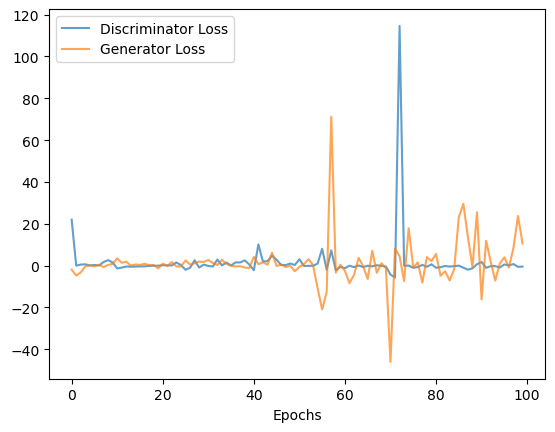
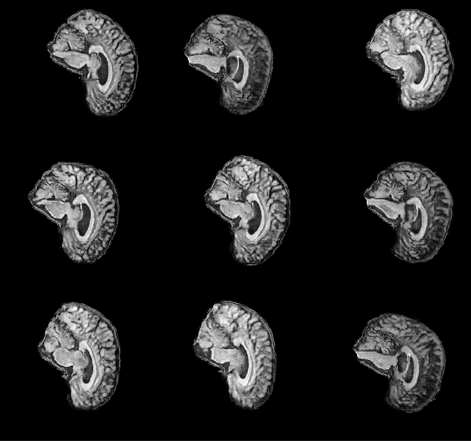
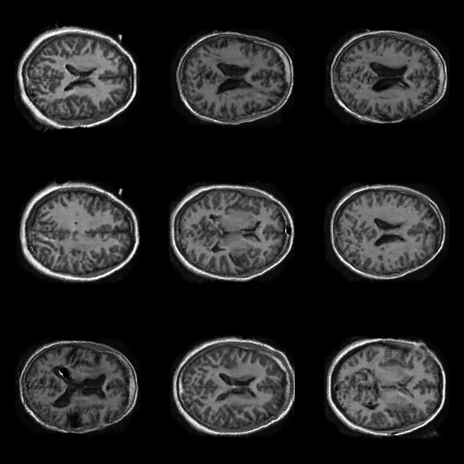
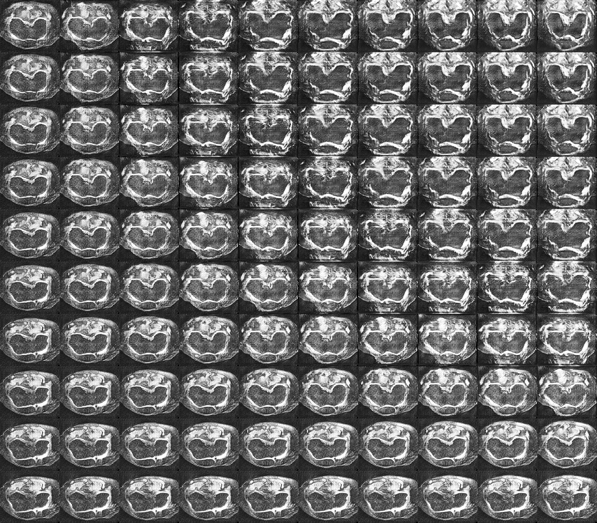

# StyleGAN Implementation
:wave: This StyleGAN implementation is submitted as a response to one of the assessments of COMP3710 of The University of Queensland (UQ), semester 2, 2022 :+1:. 

The task is "generative model of one of the OASIS brain, ADNI brain or the OAI AKOA knee data set using a variant of StyleGAN".

## Development Environment
 - Python version: 3.8.13
 - Tensorflow version: 2.8.0
 - IDE: VSCode 1.71.2

## Training Dataset
All three training image sets were black and white, preprocessed, provided by the lecturer, downloaded from UQ BlackBoard, detailed below：
 - OASIS brain, 11328 images, resolution 256 x 256.
 - ANDI brain (NC), 11120 images, resolution 256 x 240.
 - OAI AKOA knee, 18680 images, resolution 260 x 228.

## Code Structure
This implementation consists of 6 python files,
 - `clayers.py` customized layers, including classes and functions of layers operations, also callbacks.
 - `config.py`  the config file.
 - `dataset.py` includes a class that loads the training dataset.
 - `modules.py` the StyleGAN model implementation, uses components defined in clayers.py.
 - `predict.py` includes functions that load the trained model and generate images.
 - `train.py`   includes training procedures and necessary callback definitions.

## How to train your own images?
### Before training
A few parameters have to be specified in `config.py`.

| Variable            | Description                                                 | Example
| -------------       | -------------                                               |------------- 
| CHANNELS            | Number of channels of training images.                      | 1
| LDIM                | Dimension of latent vectors.                                | 128
| SRES                | Starting resolution, 4 or 8 suggested.                      | 4
| TRES                | Target resolution, must be the power of 2.                  | 256
| BSIZE               | Batch size of each resolution training.                     | (32, 32, 32, 32, 16, 8, 4)
| FILTERS             | Number of filters of each resolution.       | (256, 256, 256, 256, 128, 64, 32)
| EPOCHS              | Number of epochs to train for each resolution.              | {0:50, 1:(40,10), 2:(40,10), 3:(40,10), 4:(40,20), 5:(40,20), 6:(40,20)}
| INPUT_IMAGE_FOLDER  | Folder of training images.                                  | D:\ADNI_AD_NC_2D
| NSAMPLES            | Number of images to generate when training.| 25
| OUT_ROOT            | Root folder that contains training outputs.                 | D:\output

> **Note** `OUT_ROOT` folder must not exist. Training will create `OUT_ROOT` folder and 4 sub-folders in it. They are,
 - **ckpts** for saving checkpoints
 - **images** for saving progressive images
 - **log** for saving los loss files
 - **models** for saving model plots

### Start training
Training can be run by simply nevigating to the project root folder and executing **`python train.py`**.

### During training
`NSAMPLES` sample images will be generated after each epoch under the folder `IMAGE_DIR` as configured in `config.py`. 4 model plots, fade-in discrimator, stabilized discriminator, fade-in generator, stabilized generator will be generated in `MODEL_DIR` for each resolution training. Weights will be saved in `CKPTS_DIR` after each resolution training.

### After training
Two csv files, dloss.csv and gloss.csv, of log of training loss will be generated in `LOG_DIR`, from which plots can be generated.

## The Model
My model is built based on [<ins>Progressive Growing GAN</ins>](https://arxiv.org/abs/1710.10196), where each resolution is trained before a higher resolution block fades in (see [<ins>here</ins>](https://github.com/KaiatUQ/StyleGAN/blob/e7d4111eae9fadbe16f9431b2524d6f1093f9627/modules.py#L152)). Most of architecture follows the [<ins>StyleGAN</ins>](https://arxiv.org/abs/1812.04948) paper but with small variations.

### Overall Structure
The structure of the model is given below.

    <kbd></dbd>

A few points to note,
 - latent vector z is passed through fully connected layers to generate w (see [<ins>here</ins>](https://github.com/KaiatUQ/StyleGAN/blob/e7d4111eae9fadbe16f9431b2524d6f1093f9627/modules.py#L30) and [<ins>here</ins>](https://github.com/KaiatUQ/StyleGAN/blob/e7d4111eae9fadbe16f9431b2524d6f1093f9627/modules.py#L196)).
 - w is transformed and injected 2 times in each resolution block (see [<ins>here</ins>](https://github.com/KaiatUQ/StyleGAN/blob/e7d4111eae9fadbe16f9431b2524d6f1093f9627/modules.py#L136)).
 - number of fully connected layers is 8, w and z have the same dimension.
 - Input of 'Synthesis network' is constant (see [<ins>here</ins>](https://github.com/KaiatUQ/StyleGAN/blob/e7d4111eae9fadbe16f9431b2524d6f1093f9627/modules.py#L186)).
 - a noise vector is injected 2 times in each resolution block (see [<ins>here</ins>](https://github.com/KaiatUQ/StyleGAN/blob/e7d4111eae9fadbe16f9431b2524d6f1093f9627/modules.py#L130)).
 - AdaIN (see [<ins>here</ins>](https://github.com/KaiatUQ/StyleGAN/blob/645897586b76a0b96dc23ec2ddb7ac442f33d445/clayers.py#L66)) takes 2 inputs, result of conv3x3 + noise and a style vector (see [<ins>here</ins>](https://github.com/KaiatUQ/StyleGAN/blob/e7d4111eae9fadbe16f9431b2524d6f1093f9627/modules.py#L136)).
 - Loss function uses the [<ins>Wasserstein Distance</ins>](https://arxiv.org/abs/1701.07875) for gradient stability (see [<ins>here</ins>](https://github.com/KaiatUQ/StyleGAN/blob/1b779b71d95165d94be52a9f77d3d5b272634be0/modules.py#L192)).
 - Model is trained progressively.

### Model Variations
Original paper aims to generate photo realistic images of resolution 1024 x 1024. The dimension of image in my training datasets is much smaller (256 x 256 1 appox) and is in grayscale so my model is a simplified version of StyleGAN, to avoid unnecessary complication which saves training time.

    <table>
        <tr><th></th><th>My Model</th><th>Original Model</th>
        <tr><td>Dimension of latent vector</td><td>200</td><td>512</td></tr>
        <tr><td>Image channel</td><td>1</td><td>3</td></tr>
        <tr><td>Target resolution</td><td>256 x 256</td><td>1024 x 1024</td></tr>
        <tr><td>Number of filters</td><td>256, ..., 32</td><td>512, ..., 32</td></tr>
        <tr><td>Number of FC layers</td><td>depth of model (6)</td><td>8</td></tr>
        <tr><td>Upsampling method</td><td>Upsample2D</td><td>Bilinear</td></tr>
    </table>

## A Training Example

Below is a training trail in my experiment. Out of the three datasets, the OASIS is the easiest to train, but the model is also the easiest to collapse. While AKOA is relatively difficult to train since the trianing images are quite noisy.

### Settings
 - Starting resolution: 4x4.
 - Target resolution: 256x256.
 - Latent vector dimemsion: 200.
 - Batch size: 16, 16, 8, 8, 8, 4, 4.
 - Epochs: 10, 15, 15, 15, 15, 15, 15.
 - Training images: 4800 selected.

### Evolution

    <kbd></kbd>

### Loss plot
Both discriminator and generator converges well in the lower dimensions, but fluctuated at higher dimensions. Most significant changes in loss were observed when model grew, as highlighted in below plot.

    <kbd>

## Other Results

### Generated images of the three datasets.

    <table border='0'>
        <tr>
            <td></td>
            <td></td>
            <td></td>
        </tr>
        <tr align='center'>
            <td>ADNI</td>
            <td>OASIS</td>
            <td>ADNI</td>
        </tr>
    </table>

### Bilinear interpolation.

    <kbd></dbd>

## Reference
* A Style-Based GANs, 2019. [<ins>https://arxiv.org/abs/1812.04948</ins>](https://arxiv.org/abs/1812.04948)
* Progressive Growing of GANs, 2018. [<ins>https://arxiv.org/abs/1710.10196</ins>](https://arxiv.org/abs/1710.10196)
* Wasserstein GAN, 2017. [<ins>https://arxiv.org/abs/1701.07875</ins>](https://arxiv.org/abs/1701.07875)
