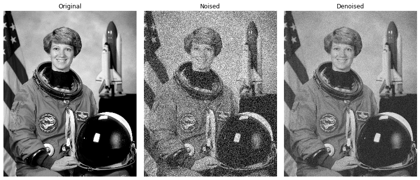
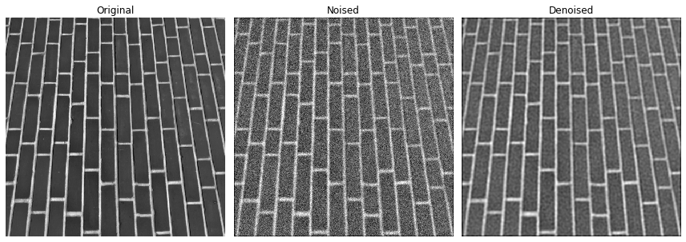
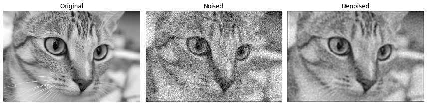

# Unsupervised Wiener-Hunt Deconvolution

In mathematics, Wiener deconvolution is an application of the Wiener filter to the noise problems inherent in deconvolution. It works in the frequency domain, attempting to minimize the impact of deconvolved noise at frequencies which have a poor signal-to-noise ratio.

The Wiener deconvolution method has widespread use in image deconvolution applications, as the frequency spectrum of most visual images is fairly well behaved and may be estimated easily.

Wiener deconvolution is named after Norbert Wiener.




# Dependencies:
Python 3.7.3

Tensorflow 1.14.0


# How to Use
### unsupervised_wiener(image, psf, reg=None, user_params=None, is_real=True, clip=True)

**image : (M, N) ndarray**

The input degraded image.

**psf : ndarray**

The impulse response (input image's space) or the transfer function (Fourier space). Both are accepted. The transfer function is automatically recognized as being complex.

**reg : ndarray, optional**

The regularisation operator. The Laplacian by default. It can be an impulse response or a transfer function, as for the psf. user_params : dict, optional Dictionary of parameters for the Gibbs sampler.

**clip : boolean, optional**

True by default. If true, pixel values of the result above 1 or under -1 are thresholded for skimage pipeline compatibility.

### Example
```
from scipy.signal import convolve2d as conv2
import numpy as np
import matplotlib.pyplot as plt
from unspvd_wiener import unsupervised_wiener
from skimage import color
from PIL import Image

img = color.rgb2gray(np.asarray(Image.open("resources/chelsea.png")))
psf = np.ones((5, 5)) / 25
noised_img = conv2(img, psf, 'same')
noised_img += 0.5 * noised_img.std() * np.random.standard_normal(noised_img.shape)
deconvolved, _ = unsupervised_wiener(img, psf)
```
# References
[Wikipedia](https://en.wikipedia.org/wiki/Wiener_deconvolution)

[scikit-image](https://scikit-image.org/docs/dev/api/skimage.restoration.html#skimage.restoration.unsupervised_wiener)

[image_quad_norm, ir2tf and laplacian](https://github.com/scikit-image/scikit-image/blob/master/skimage/restoration/uft.py)

[unsupervised_wiener](https://github.com/scikit-image/scikit-image/blob/master/skimage/restoration/deconvolution.py)
