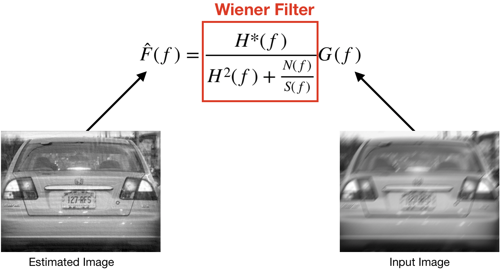
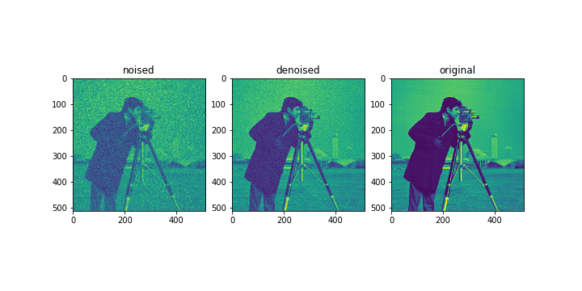

# Wiener Deconvolution
[](https://travis-ci.org/microwen/PatternFlow)

Deconvolution is a method of restoring data processed by convolution, it is also a convolution process. It is widely used in signal processing and image processing. For example, Wiener deconvolution is significantly effective for image denoising. Wiener deconvolution processes data by applying the Wiener filter.


# How it works
The goal of Wiener Deconvolution is to restore the input image to the original image. The Wiener filter minimizes the mean square error between the original image and the estimate image. The smaller the mean square error, the better the noise filtering effect. In order to minimize the mean square error, the key is to find the impulse response. If the Wiener-Hopf equation can be satisfied, the Wiener filter can be optimized. Once we have obtained the optimized Wiener filter, we can apply the convolution with the Wiener filter to the input image to get an estimated denoised image.


# Installation

##### Dependencies:
- Python 3.6
- Tensorflow 1.10

Use Git to clone the repository,
```sh
git clone https://github.com/microwen/PatternFlow.git
```
Or [Download](https://github.com/microwen/PatternFlow/archive/topic-algorithms.zip).

Add the module directory to syspath.
```python
from sys import path
path.append("PATH/TO/Wiener_deconv")
```

# How to use

This wiener(image, psf, balance, reg, is_real) function requires 3 compulsory parameters and 2 optional parameters.

**image**: The image needs to be process.

**psf**: Point Spread Function.

**balance**: Balance between the data adequacy and the prior adequacy. (fine-tune parameter)

reg: The regularisation operator, The Laplacian by default.

is_real: Specify if ``psf`` and ``reg`` are provided with hermitian hypothesis, True by default. 

### Examples

Here's an example of how to use wiener deconvolution.
```python
from wiener import wiener
import numpy as np
psf = np.ones((5, 5)) / 25 # Point Spread Function
img_denoised = wiener(img_noise, psf, 2) # Apply wiener deconvolution to 'img_noise'
```
Another example for 'camera' from [scikit-image](https://scikit-image.org/docs/dev/api/skimage.data.html).
```sh
python PATH/TO/wiener_deconv/main.py
```

