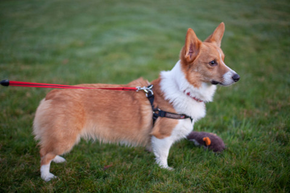
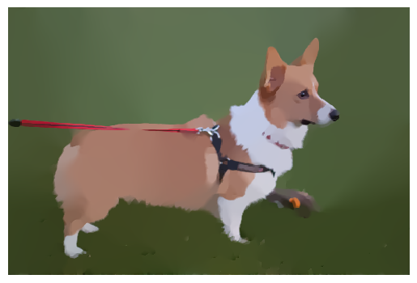

# L0 Gradient Minimization applied to Image Smoothing.

**Author**: Jameson Nguyen (Student num: 44276498)

**Course**: COMP3710 Pattern Recognition and Analysis

**University**: University of Queensland, Brisbane, Australia


## L0 Image Smoothing
This algorithm is ported using tensorflow 2.0 functions.

L0 Gradient Minimization applies the aforementioned technique on an image, using 
fast fourier transforms to solve sub-problems towards finding structures in an image [1]. 
The algorithm itself globally controls the number of non-zero gradients 
"resulted to approximate prominent structures in a structure sparsity 
management manner" (Xu et al, [1]). According to the authors, the method 
does not depend on local features and can globally locate important edges [1]. 

The technique is highly effective in smoothing images but preserving important edge structures.
In short - the gardients of the image are minimised (which is a convex optimsation problem) 
such that non-major structures are smoothed out depending on the intensity of the smoothing
factor [1]. It is very possible to smooth out the entire image too much, however this can be
balanced with a lambda hyper parameter which allows for a nice smoothing effect on images while 
preserving the main features (see examples).

The implementation presented is applied on 2D 3-channel images, an example has been
provided in the image called bengalcat.jpg.

For more information I would recommend the [authors website](http://www.cse.cuhk.edu.hk/~leojia/projects/L0smoothing/).


## Dependencies
* Tensorflow >= 2.0.0
* imageio
* matplotlib


## Usage
Note, the algorithm may take time depending on what image you use. With an NVIDIA 1070 GPU
the smoothing took approximately 5 minutes.

In the general case you only need to load an image in as a numpy array. 
The image will be saved in the current directory.

```python
    import imageio
    import matplotlib.pyplot as plt
    from l0_image_smoothing import l0_image_smoother

    img = imageio.imread('image.jpg')  # Or any other method to get numpy array.
    smoothed_image = l0_image_smoother(img, _lambda, kappa, beta_max)
    plt.imshow(smoothed_image)
    plt.axis('off')
    plt.savefig("smoothed.png", bbox_inches='tight')
```

Alternatively use the provided driver script:

```
    python -m driver.py -img corgi.jpg
```

By default parameters lambda=2e-2, kappa=2.0, beta_max=1e5. These can be set manually:
* -l float/e-notation for lambda
* -k float
* -b int/e-notation for beta_max

Example:

```
    python -m driver.py -img corgi.jpg -l 1e-2 -k 1.5 -b 1e4
```


## Example Result
<p align="center">
  
  
</p>


## Acknowledgements
Original authors of algorithm and provided matlab code:

[1]. L. Xu, C. Lu, Y. Xu, and J. Jia, "Image Smoothing via L0 Gradient Minimization", 
ACM Transactions on Graphics, Vol. 30, No. 5 (SIGGRAPH Asia 2011), Dec 2011

Numpy version of matlabs psf2otf function which was adapted specifically for this algorithm.

[2]. Alexandre Boucaud, “pypher: Python PSF Homogenization kERnels”. Zenodo, 02-Sep-2016.

Images:
<p style="font-size: 0.9rem;font-style: italic;"><a href="https://www.flickr.com/photos/13101664@N03/11127631543">"Corgi"</a><span>by <a href="https://www.flickr.com/photos/13101664@N03">camknows</a></span> is licensed under <a href="https://creativecommons.org/licenses/by-nc-sa/2.0/?ref=ccsearch&atype=html" style="margin-right: 5px;">CC BY-NC-SA 2.0</a><a href="https://creativecommons.org/licenses/by-nc-sa/2.0/?ref=ccsearch&atype=html" target="_blank" rel="noopener noreferrer" style="display: inline-block;white-space: none;opacity: .7;margin-top: 2px;margin-left: 3px;height: 22px !important;"></a></p>

