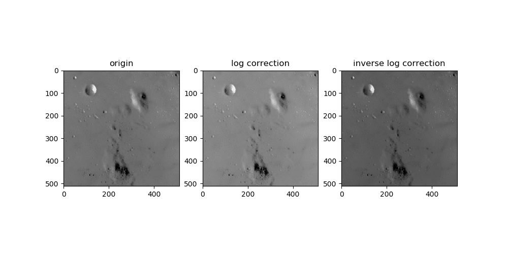

## Logarithmic Correction algorithm from scikit-image exposure module

### Dependencies:
- Python 3.7
- Tensorflow 2.0

### How it works
Applies Logarithmic correction on the input image.

The algorithm firstly convert the ndarray into Tensor 
then using ``tf.debugging.assert_non_negative`` to make sure all the input value are positive.
 
The next thing is to normalize the input by divided by 255, and then apply the formula below

``O = gain*log(1 + I)``

For inverse logarithmic correction, the equation is
``O = gain*(2**I - 1)``

where O is Output, I is Input or Image.

The last, undo the normalization by multiply 255 and convert the Tensor to ndarray.


### Description of the Algorithm
This function is defined as ``adjust_log(image, gain=1, inv=False)``, 
required one compulsory parameter and 2 optional parameters.

**image** The input ndarray image

gain The constant multiplier. Default value is 1

inv Specify whether performs inverse logarithmic correction. Default is False


### Examples
Here's an example of how to use ``adjust_log`` function
```python
import matplotlib.pyplot as plt
from skimage import data
from correction import adjust_log
img = data.camera()
inv_img = adjust_log(img)
plt.add_subplot(1, 2, 1)
plt.title("original")
plt.imshow(img)
plt.add_subplot(1, 2, 2)
plt.title("log correction")
plt.imshow(inv_img)
```

Or use command line to run the main.py script
```shell script
python main.py
```



### Author
- Yufeng Liu
