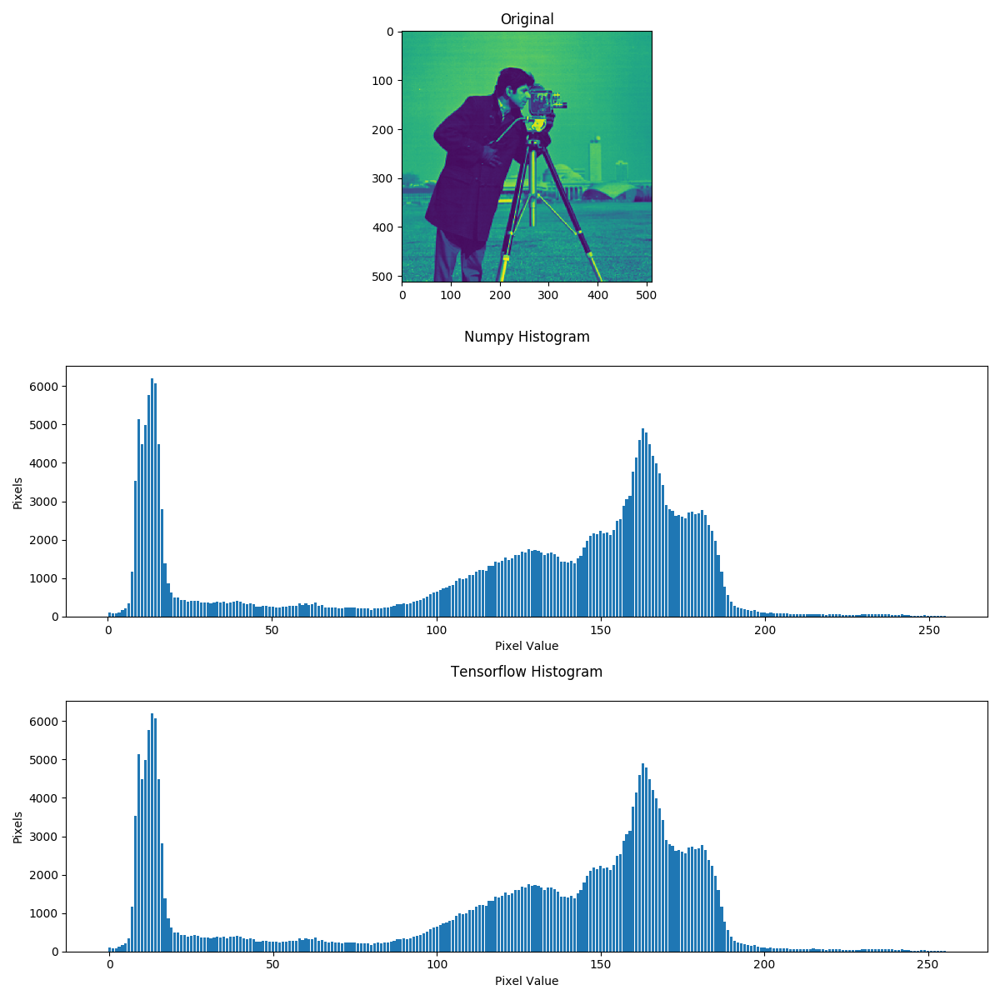

# Skimage Exposure Histogram

Tensorflow version of the Histogram algorithm belonging to Skimage Exposure module

https://scikit-image.org/docs/stable/api/skimage.exposure.html#skimage.exposure.histogram

This function returns the histogram of an image. An  histogram as a graph or plot, which gives you an overall idea about the intensity distribution of an image. It is a plot with pixel values (ranging from 0 to 255, not always) in X-axis and corresponding number of pixels in the image on Y-axis.

Unlike numpy.histogram, this function returns the centers of bins and does not rebin integer arrays. For integer arrays, each integer value has its own bin, which improves speed and intensity-resolution.

## Run the algorithm

It is possible to test the algorithm by running the main.py script without any arguments.

```
python3 main.py
```

### Example
```
from skimage import data, img_as_float
from histogram import histogram
import numpy as np

image = img_as_float(data.camera())
np.histogram(image, bins=2)
>>> (array([107432, 154712]), array([ 0. ,  0.5,  1. ]))
histogram(image, nbins=2)
>>> (array([107432, 154712]), array([ 0.25,  0.75]))
```

## Results

The driver script load an image and generates its histogram first using numpy histogram function and then also with the tensorflow version.

Eventually, the two obtained histograms are plotted and is possible to see that they are equal.




## Authors

* ** Umberto Pietroni** - [umbertopietroni](https://github.com/umbertopietroni)

