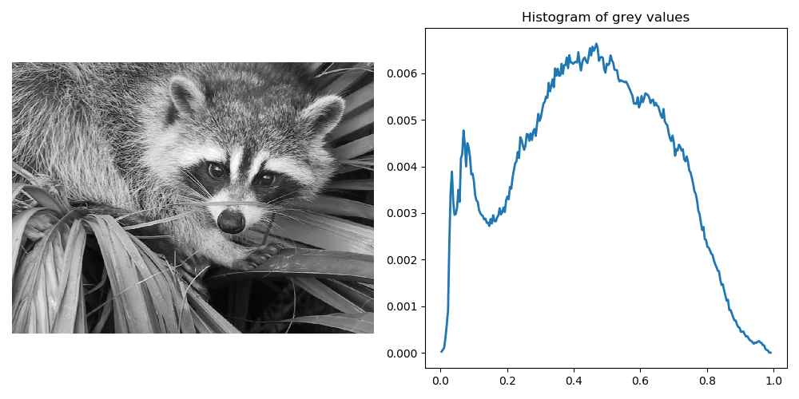
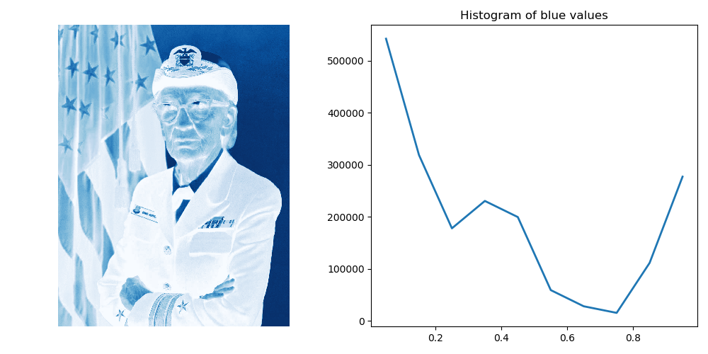

# Exposure Histrogram

This module allows the creation of histograms of an image with various arguments.
It works with only a single channel of image, typically greyscale. Each value in
the image tensor is put its respective bucket, which are determined by the arguments.

Below is an example output from `main.py --normalize`.




## Requirements

For the implementation, the only requirement is `tensorflow`.

It was written with `tensorflow==2.0.0`, it may work with earlier or later versions,
but not garauntee is made.

For the CLI program, there are two additional dependencies: `scipy==1.3.1`, and `matplotlib==3.1.1`,
similar to tensorflow, it may work with different versions, but no garauntee is made.

`scipy` is purely used for providing a default image if none is provided (raccoon face).

`matplotlib` is used for plotting the result.

## API Usage

`histgram(image, [nbins], [source_range], [normalize])`:

Arguments:
 - `image: tf.Tensor` - the target image
 - `nbins: int` - (default 256) The number of bins, ignored for integer images.
 - `source_range: str`
   - 'image' (default) determines the range from the input image.
   - 'dtype' determines the range from the expected range of the images of that data type.
 - `normalize: bool` - (default False) If True, normalizes the result.

Return value:
 - `(values, centers)` - A tuple of the values and the bucket centers
 
Examples (Basic):
```
histogram(img)  # Use defaults
histogram(img, nbins=10)  # Less bins
histogram(img, source_range='dtype')  # Use dtype range
histogram(img, normalize=True)  # Normalize the result
```

Examples (Advanced):
```
histogram(rgb_img[:,:,1])  # Histogram of the red channel
histogram(tf.image.convert_image_dtype(int_img, tf.float32), nbins=10)  # Convert image to float to use nbins
```

## CLI Usage

`main.py --help`:
```
usage: main.py [-h] [--channel CHANNEL] [-o OUT] [-n NBINS]
               [--source-range SOURCE_RANGE] [--normalize]
               [image]

Show the histogram for an image

positional arguments:
  image                 an image path

optional arguments:
  -h, --help            show this help message and exit
  --channel CHANNEL     channel of the image, grey/r/g/b
  -o OUT, --out OUT     path of the output file
  -n NBINS, --nbins NBINS
                        number of bins for histogram
  --source-range SOURCE_RANGE
                        'image' (default) determines the range from the input
                        image. 'dtype' determines the range from the expected
                        range of the images of that data type.
  --normalize           normalize the histogram by the sum of its values.
```

Most of these arguments have a 1:1 mapping with the API arguments.
The CLI will ensure that the image is a float image, so that you can always
specify `nbins`. The CLI has 3 new arguments:
 - `-h`/`--help` - get the help text as shown above. This is similar to `help(histogram)`.
 - `--channel` - this allows you to select the channel of the image to use.
 - `-o`/`--out` - this allows you to specify the output filename

Examples:
```
main.py hopper.jpg --channel=b --nbins=10 -o example_blue_output.png
```

