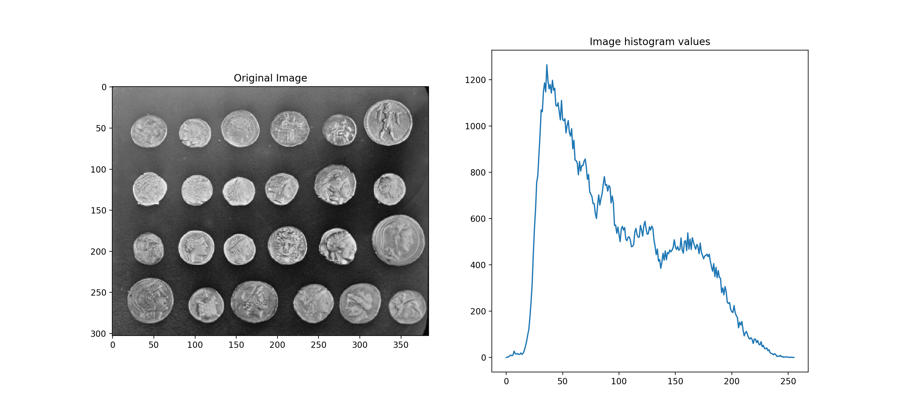
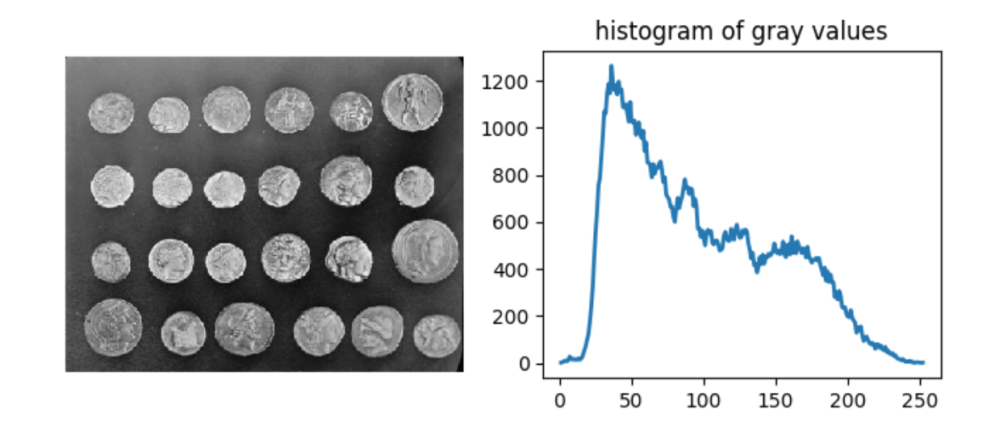

# Tensorflow implementation of gaining a histogram of an image

The histogram produced is a representation of the tonal distribution of the flattened image.
For each tonal value, the count of the number of pixels for this tonal value is computed.  
Note that for colour images, each channel should be independently input to gain a histogram for each colour channel. 

The algorithm works by first flattening the image to a one dimensional array of values. For
colour images, this is applied to a given channel. Next, the range of values is determined
based on the input parameter `source_range`. The flattened image is casted to float values 
and input into Tensorflow's histogram value and bin functions. The bin centres are then 
computed from the bin edges. Lastly, if the `normalize` parameter is set True, then each value is  normalized by the sum of the all the values. 

# Examples
### Algorithm output
 

### Comparison to skimage histogram algorithm:
 

# Usage
### Dependencies
Tensorflow, version 1.13.1

### Example usage
hist = ImageHistogram(image, nbins=256, source_range='image', normalize=False)

values = hist.hist

### Parameters
img (array) - Input image.

nbins (int, optional) - Number of bins for the histogram

source_range (string, optional)- ‘image’ (default) determines the range from the input image. ‘dtype’ determines the range from the expected range of the images of that data type.

normalize (bool, optional) - normalize the histogram if True (by the sum of values)

### Return
hist (ImageHistogram class instance) - The generated histogram. Use values = hist.hist to get values of histogram.

