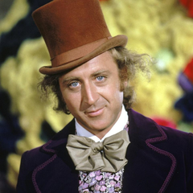
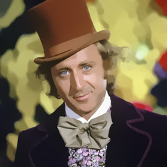
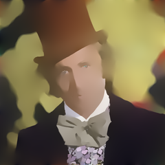

# L0 Gradient Smoothing

L0 gradient smoothing is a way to smooth images by limiting the number of non-zero gradients. It stands out 
from other smoothing methods thanks to its edge preserving properties which makes it useful for applications
such as edge extraction and JPEG artifact removal [1].

The process works by restricting the number of non-zero gradients that the image can contain. This is achieved
by the progressive removal of low amplitude structures in the image. Gradients are calculated as 
the colour difference between neighbouring pixels. The minimisation of the L0 gradients is essentially an 
optimisation problem and thus it is possible to control the amount of smoothing by stopping the optimisation at a 
specified point.

## Dependencies
TensorFlow >= 2.0.0

## Example Usage

1. Load the desired data into either a numpy array or Tensor
    * An arbitrary number of channels is supported
    * The last dimension should be the channels
    * Greyscale images do not need to have a channel dimension
    * The data should be scaled to be within the range [0, 1]
    
    ```python
    import numpy as np
    from PIL import Image
    
    image = Image.open('path/to/image/file') # Image loading
    image_data = np.array(image) / 255. # Scaling
    ```

2. Pass the image data to the l0_gradient_smoothing function
    * You can also specify additional parameters such as the smoothing factor
    * See the function docstring for information on what each parameter does

    ```python
    smoothed_result = l0_gradient_smoothing(image_data, smoothing_factor=0.015)
    ```
    
## Example Output
Input                      |  Output (default parameters)     | Output (smoothing_factor = 0.1)
:-------------------------:|:--------------------------------:|:---------------------------------:
   |   |  
     
# References

The implementation in this module is based heavily on the code available here:
https://github.com/t-suzuki/l0_gradient_minimization_test

Student Number: 44303394   

[1] Xu, L., Lu, C., Xu, Y. and Jia, J. (2011). Image smoothing via L0 gradient minimization. *Proceedings of the 2011 SIGGRAPH Asia Conference on - SA '11.*