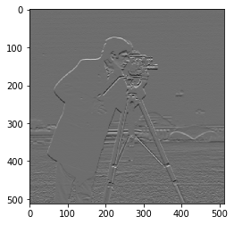
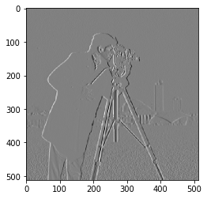
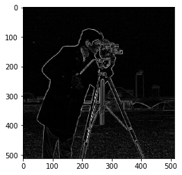

# Sobel Transform

*Author*: Vaibhavi Sanjeet Itkyal     *Last update*: 17/10/2019

The presented module uses an image from *skimage* dataset, computes and displays it's horizontal, vertical or magnitude of the edges.
The user has a choice to view either horizontal edges, vertical edges or magnitude of the edges of the image.

Currently the program uses an example of *camera* image from *skimage* dataset. 

# Algorithm 
The Sobel operator basically can be used for the edge detection of an image. The operator uses two 3x3 kernels which are convolved with the input image and calculates the approximations of the derivatives, i.e vertical as well as horizontal changes. Existence of an underlying differentiable intensity function which has been sampled at the image points, is one of our important assumptions. Hence, the Sobel operator basically is a *discrete differentiation operator* which computes an approximation of the gradient of the image intensity function.

**Input parameter** : Image to process (2-D Array)

**Returns** : Sobel Edge Map (2-D Array)

**Sobel Horizontal Edges**

Horizontal kernel : 

                    1    2    1
                    0    0    0
                   -1   -2   -1

**Sobel Vertical Edges**

Vertical kernel : 

                    1    0   -1
                    2    0   -2
                    1    0   -1

**Magnitude of edges using Sobel Transform**

Square root of the sum of the squares of the horizontal and vertical Sobels to get a magnitude.  

# Results

Sobel Horizontal Edges

Sobel Vertical Edges

Sobel Edges Magnitude

# References
https://scikit-image.org/docs/stable/api/skimage.filters.html#skimage.filters.sobel
https://en.wikipedia.org/wiki/Sobel_operator
