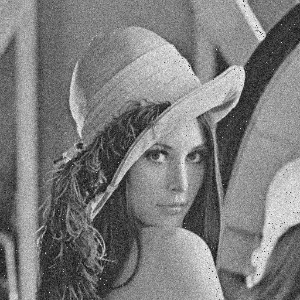
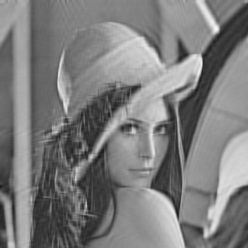

# Pixel-Based Visual Information Fidelity (PB-VIF)
_Author: Antoine DELPLACE_  
_Last update: 30/09/2019_

Visual Infomation Fidelity (VIF) is a measure that evaluates the relative quality of a compressed or altered image compared to the original figure. It uses the Human Visual System (HVS) representation and a Gaussian Scale Mixture (GSM) model in the wavelet domain to create the index (see Method Description).

## Usage
### Dependencies
- Python 3.6
- Tensorflow 1.13 -- `vif.py`
- Numpy 1.16 -- `main.py`
- Imageio 2.5 -- `main.py`
- Tabulate 0.8.5 -- `main.py`

### Built-in driver `main.py`
The `main()` function imports the images, performs a grayscale conversion, calls the function `pbvif()` of the `vif` module and returns a formatted table with the results.
```sh
main.py reference_image_filename query_image_filename1 query_image_filename2 query_image_filename3 ...
```

### Function pbvif in `vif.py`
```
pbvif(ref, query_tab, max_scale=4, var_noise=2.0, mode='nearest')
    Computes the Pixel-Based Visual Information Fidelity (PB-VIF) using Tensorflow

    Parameters
    ----------
    ref       : 2-dimension grayscaled image reference.
    query_tab : list containing the 2-dimension grayscaled images to be compared with.
    max_scale : Number of subbands to extract information (Default: 4)
    var_noise : Variance of additive noise (HVS model parameter, Default: 2.0)
    mode      : mode used for padding convolutions (Default: "nearest")
        - "nearest"   : the input is extended by replicating the last pixel
        - "symmetric" : the input is extended by reflecting about the edge of the last pixel
        - "constant"  : the input is extended by filling all values beyond the edge with zeros

    Return
    ----------
    Pixel-Based Visual Information Fidelity (float between 0 and 1)
```

### Example
```sh
main.py lena_ref.bmp lena_gauss_noise.bmp lena_low_pass_filter.bmp lena_jpeg.jpg lena_ref.bmp
```

|  |  |  |  |  
|:--:|:--:|:--:|:--:|  
| *Image with Gaussian noise* | *Low-pass filtered image* | *JPEG image* | *Reference image* |  

```sh
| Image                    |    pbvif |
|--------------------------|----------|
| lena_gauss_noise.bmp     | 0.226277 |
| lena_low_pass_filter.bmp | 0.385636 |
| lena_jpeg.jpg            | 0.837977 |
| lena_ref.bmp             | 1        |
```

## Method Description
The method uses the following framework. The Source Model is defined with , the wavelet coefficients for a given subband. The Gaussian Scale Mixture model gives the decomposition  with , a positive scalar and , a Gaussian vector with zero mean and co-variance .  

The Distortion Model defines the distorted image random field  as the product of the source by the scalar field  with an additive Gaussian noise  of mean zero and co-variance .  

Finally, the Human Visual System (HVS) model adds a white Gaussian noise to both the source and the distorted images to model visual uncertainty:  and  with  and  of mean zero and co-variance .  

The VIF index can then be computed using  as the maximum likelihood estimate of  given  and  :

  

  


## References
1. Hamid R. Sheikh and Alan C. Bovik. "Image information and visual quality". In: *IEEE Trans. Image Processing.* 2004, pp. 430–444.
2. Pedro Garcia-Freitas. "PyMetrikz: Python Visual Quality Metrics Package". [Bitbucket repository](https://bitbucket.org/kuraiev/pymetrikz/). 2014
3. Wikipedia. "Visual Information Fidelity". \[[accessed 30 September 2019](https://en.wikipedia.org/wiki/Visual_Information_Fidelity)\]