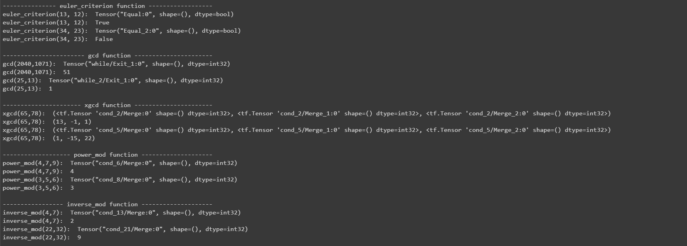
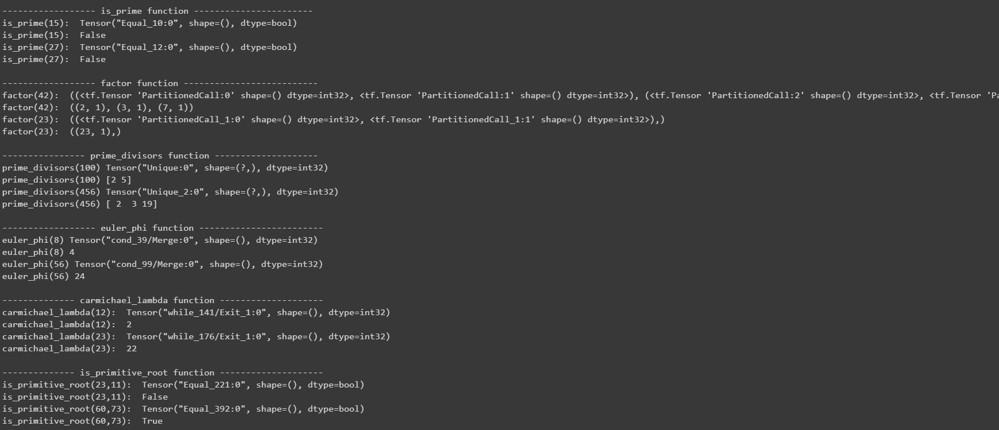
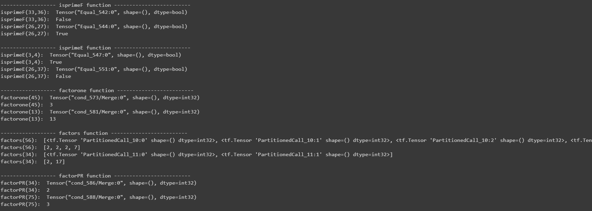
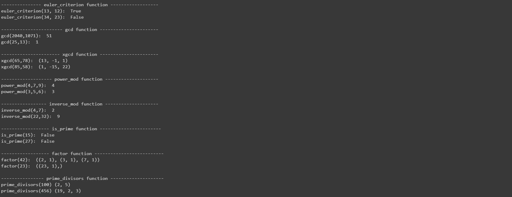
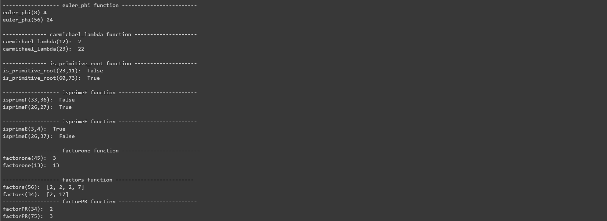

# Number Theory Tensorflow 

Implement the number theory with Tensorflow

## Description
Number theory is one of the most important branches in the field of mathematics. At the same time, there are many mathematicians who have made great contributions, such as Pythagoras, Euclid, Pierre DE Fermat, etc. Numbthy.py contains basic numerical algorithms that allow us to call these equations to get the values we want. For example, we can find the greatest common divisor of two Numbers, determine whether a number is prime, find a prime factor of a number, and so on. (details as follows)

### Details
The numberThy fold currently include:
* numbthy.py: Basic number theory function
* Readme.md: A file describe the numbthy.py
	
Functions implemented in numbthy.py are:
* euler_criterion(a, p) - Euler's Criterion will check if a is a quadratic residue mod p. 
			- Test whether a ** ((p-1)//2) % p==1
* gcd(a,b) - Return the greatest common divisor of a and b.
* xgcd(a,b) - Returns a tuple of form (g,x,y), where g is gcd(a,b) and
    			x,y satisfy the equation g = ax + by.
* power_mod(b,e,n) - Return the b^e mod n 
* inverse_mod(a,n) - Return 1/a mod n. 
* is_prime(n) - Test whether the number n is prime, if yes,return true, else, return false 
* factor(n) - Return a tuple of the prime factors of n with exponents 
* euler_phi(n) - Return the number of coprime of n 
* carmichael_lambda(n) - the Carmichael function λ takes a positive integer n and 
    			returns the least positive integer k so that the k-th power 
    			of each integer coprime to n equals 1 modulo n. 
* prime_divisors(n) - call function factors and return a tuple of prime dividors of n. 
* is_primitive_root(g,n) - call functions gcd(g,n) and prime_divisors(order),then test whether g is primitive. 
* sqrtmod(a,n) - call function tonelli(n,p) to compute sqrt(a) mod n 
* TSRsqrtmod(a,grpord,n) - tensorflow cannot calculate nagetive power 2^(-1)
    			 also, the data type is int32, therefore, the result of 2^(-1) is not 0.5, is 0
    			 hence, this function cannot return a correct answer 
* isprimeF(n,b) - Test whether number n is prime or a Fermat pseudoprime to base b, return True or False. 
* isprimeE(n,b) - Test whether n is prime or an Euler pseudoprime to base b, return True or False. 
* factorone(n) - Find and return a prime factor of n 
* factors(n) - Return a list of the prime factors of n. 
* factorPR(n) - Find and return a factor of n using the Pollard Rho method. 

### Sample result Image 
* Image of Tensorflow code 

* Image of source code

## Author
* Xuannan Huang (45047257)
	
## Acknowledgments 
* Source code: 
	* [Number-Theory-Python -- Robert-Campbell-256](https://github.com/Robert-Campbell-256/Number-Theory-Python/blob/master/numbthy.py)
