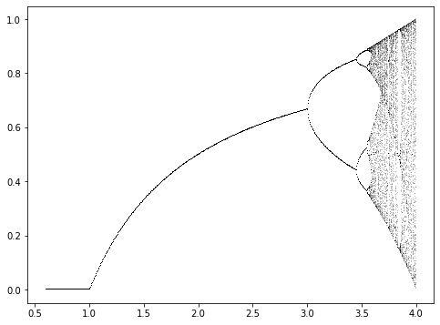

# 	Feigenbaum attractor fractal
_Author: Chen Xu_
_Last update: 11/10/2020_

The presented module computes and prints the 	Feigenbaum attractor exponent in the **AB sequence** configuration.

## Result Figure

## References
[https://en.wikipedia.org/wiki/Logistic_map](https://en.wikipedia.org/wiki/Logistic_map) - Visited on 11/10/2020
