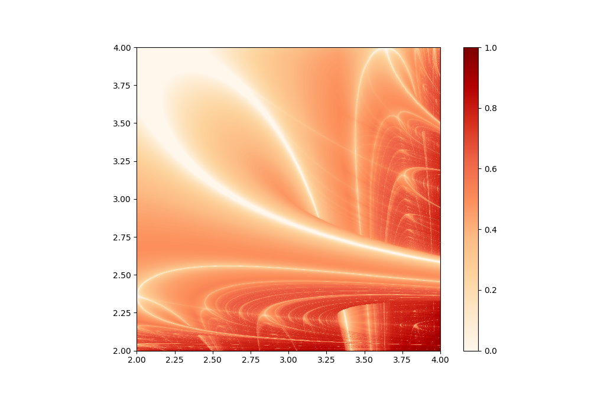

# Lyapunov fractal
_Author: Antoine DELPLACE_
_Last update: 19/09/2019_

The presented module computes and prints the Lyapunov exponent in the **AB sequence** configuration.

## Result Figure

## References
[https://en.wikipedia.org/wiki/Lyapunov_fractal](https://en.wikipedia.org/wiki/Lyapunov_fractal) - Visited on 19/09/2019