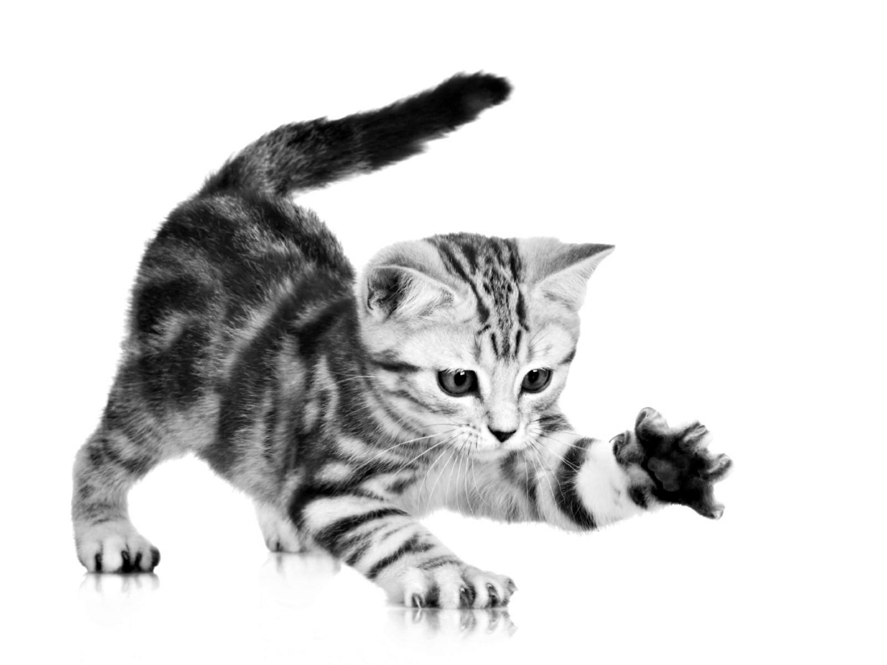

# A 2D Gaussian filter function for Tensorflow

This project is an attempt to port the Gaussian filter algorithm from the [filtering module of Scikit-Image](https://scikit-image.org/docs/stable/api/skimage.filters.html) to Tensorflow. The source code of skimage.filters.gaussian(image[, sigma, …]) can be found [here](https://github.com/scikit-image/scikit-image/blob/v0.16.1/skimage/filters/_gaussian.py#L12). The algorithm is used to apply a multidimensional Gaussian filter to an image. This has the effect of blurring the image relative to the specifications of the Gaussian kernel. The code for the filter in the Scikit-Image module is relatively complex, but it can be done in very few lines with Tensorflow. The basic idea was to create a Gaussian kernel and convolve this kernel with the image to be filtered. This implementation is however not multidimensional, it will only work for two dimensions. 

### How it works
The algorithm is implemented as a simple convolution filtering function and works by creating a Gaussian kernel with desired specifications in two dimensions. This is done with a helper-function that is called from the convolve-function. With the image and the Gaussian kernel as inputs, the convolve function completes the filtering of the image. It does so by using [tf.nn.conv2d](https://www.tensorflow.org/api_docs/python/tf/nn/conv2d) to compute a convolution given a four dimensional input and filters tensors. 

### Example usage
An example of how to use the filter can be found in the tester_drive.py file. The results of running this function on a black and white image of a kitten can be seen below.

### Comments
Plot twist: it does not work. As you can se by the the example images, it does instead apply a colour filter on the image. I have so far not a good explanation for this, but managed to achieve both yellow and green colours by varying the mean and standard deviation of the gaussian kernel. 

### Figures

