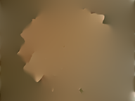

# L0 Norm Gradient Smoothing 


# Description
The L0 Norm Gradient Smoothing algorithm takes images to produce a smoother version of the original image, depending on certain parameters. 

This is useful for image processing and yadeeyadeeya

## How it works 
//insert brainfreeze math

 
 
 
 
 


# Usage 
## Dependencies 
The algorithm is implemented in python version 3. The following python libraries are required to run the module: 

* `tensorflow 2.0` version 2.0 is required for fourier transform calculations. 
* `numpy` for I\O uses, to load and save arrays to and from images 
* `PIL` the image library, for image loading and saving 

## How to run
The script may be run through commandline as such for example:

```
python3 L0_gradient_smoothing_tf.py -d example/dahlia.png -o example/out.png  -l 2e-3 -k 2.0 -b 10000
```

The commandline arguments are described as such: 
```
  -h, --help            show this help message and exit
  -d FILE, --inputimgdir FILE
                        Directory path for input image
  -o FILE, --outdir FILE
                        Directory path for output image
  -l FLOAT, --lamdaval FLOAT
                        lambda parameter
  -k FLOAT, --kappa FLOAT
                        kappa parameter
  -b FLOAT, --beta_max FLOAT
                        beta max parameter
```

Below is the input `dahlia.png` for the example usage (left) and the output of the L0 Norm Gradient Smoothing algorithm (right): 

 


Otherwise, the method `l0_calc` (found in `L0_gradient_smoothing_tf.py`) takes in a numpy array of the loaded image to compute the smoothed image output array, as well as the relevant parameters: 

* `image_array` loaded image array
* `lambda` determines how 'fine' the smoothing is. Smaller values of lambda give a more detailed image
* `kappa` multiplying factor for the initial beta value, used determine the number of iterations in combination with `beta_max`. 
* `beta_max` max value for beta to reach before reaching the end of the algorithm. 
