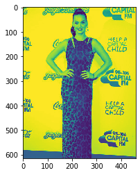
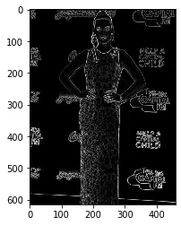

**Sobel Transform in tensorflow**

Based on skimage.filters.sobel

**Pre-requisites**

* Tensorflow

* Numpy

* skimage

**Demo**

Tensorflow implementation of sobel transform. 
It outputs the edge map of the given image. 
Given below is a picture of katy perry and the corresponding edge detection image.

    

Here we are considering only 1 of the channel of the input image to do edge detection, because the edges associated with all the channels will be same.

**Sobel Transform**

Sobel Transform is a edge detection algorithm used mainly in the fields of computer vision and image processing.
It creates an edge map from it's corresponding input image.
It is based on convolution of the image with the appropriate kernels (called Sobel kernels), to give the resultant edge maps.
At each point in the image, Sobel transform results in the corresponding gradient vector, computing an approximation for the gradient of the image intensity function.

**Kernels used**

Here we have used 2 kernels, one for horizontal edges and the other for vertical edges.

**Sobel_h (detects horizontal edges) = [ [1,2,1], [0,0,0], [-1,-2,-1] ] ** 

**Sobel_v (detects vertical edges) = [ [1,0,-1], [2,0,-2], [1,0,-1] ] ** 

**Working Principle**

* The "Sobel" function returns a 4D tensor of shape (1, img_height, img_width, 1), i.e. the edge map of the image.
* Square root of the squares of the horizontal and vertical edges are taken to get a magnitude i.e. somewhat insensitive to direction.
