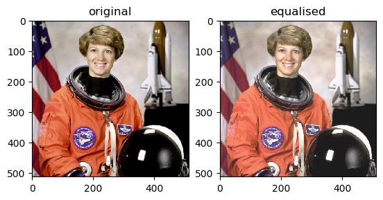

# Histogram Equalisation
This directory contains a Tensorflow implementation of the histogram equalisation algorithm.

## Description

Histogram equalisation is an image processing technique used to enhance contrast in images.
It is most commonly used when image data is represented by close contrast values.

A histogram of an image is the distribution of its tonal intensity. 
Images with close contrast values will produce a histogram with a high narrow peaks.
You can see this quite clearly in the image of the moon's surface below. 

The goal of equalisation is to effectively spread out this histogram so that a wider
range of pixel intensities are present. Notice the difference between the histograms below, before
and after equalisation. 

This technique has a variety of applications, although it can sometimes produce unrealistic image qualities.
Some example applications are:
* Improving medical images
* Adjusting under/over-exposed photographs
* Improving thermal and satellite images

## Algorithm

The algorithm works by first producing a histogram of the provided image. This histogram, by default,
has 256 bins and represents the density of pixel intensities. From this histogram, the algorithm
produces a cumulative distribution function (cdf), and normalises it. Following this, the cdf is used
as an intensity transformation function and a new set of pixel values are interpolated. These new 
interpolated pixel values are then reshaped and returned as an equalised image.  

## Implementation
equalize_hist(image, nbins=256, mask=None)

    Returns an image after histogram equalisation

    Parameters
    -----------
    image : array
        Image to be equalised
    nbins : int optional
        Number of bins for the histogram
    mask: array optional
        Array of bools (as 1s & 0s) which restricts the areas used
        to calculate the histogram

    Returns:
    -----------
    output : array
        Float32 array representing the equalised image

## Getting Started

#### Dependencies
* Python 3.6
* Tensorflow 1.14
* Tensorflow-probability 0.7

#### Installation

* git clone https://github.com/drussell13/PatternFlow.git

#### Simple Example
    
    from skimage import data
    import matplotlib.pyplot as plt
    from equalize_hist import equalize_hist
    
    img = data.moon()
    img_eq = equalize_hist(img)
    
    fig = plt.figure()
    axl = fig.add_subplot(1, 2, 1)
    axl.imshow(img)
    axl.title.set_text('original')
    axl = fig.add_subplot(1, 2, 2)
    axl.imshow(img_eq)
    axl.title.set_text('equalised')
    
    plt.show()
    

## Examples

#### Colour Images

    from skimage import data
    import matplotlib.pyplot as plt
    from equalize_hist import equalize_hist
    
    img = data.astronaut()
    img_eq = equalize_hist(img)
    
    fig = plt.figure()
    axl = fig.add_subplot(1, 2, 1)
    axl.imshow(img)
    axl.title.set_text('original')
    axl = fig.add_subplot(1, 2, 2)
    axl.imshow(img_eq)
    axl.title.set_text('equalised')
    
    plt.show()
    

    
#### Applying a Mask
    
    from skimage import data
    import numpy as np
    import matplotlib.pyplot as plt
    from equalize_hist import equalize_hist
    
    img = data.moon()
    image_mask = np.zeros(img.shape)
    image_mask[256:, 0:] = 1
    img_eq = equalize_hist(img, mask=image_mask)
    
    fig = plt.figure()
    axl = fig.add_subplot(1, 2, 1)
    axl.imshow(img)
    axl.title.set_text('original')
    axl = fig.add_subplot(1, 2, 2)
    axl.imshow(img_eq)
    axl.title.set_text('equalised')
    
    plt.show()
    

## References

* https://github.com/scikit-image/scikit-image/blob/master/skimage/exposure/exposure.py#L187
* http://www.janeriksolem.net/histogram-equalization-with-python-and.html
* https://en.wikipedia.org/wiki/Histogram_equalization#Implementation
