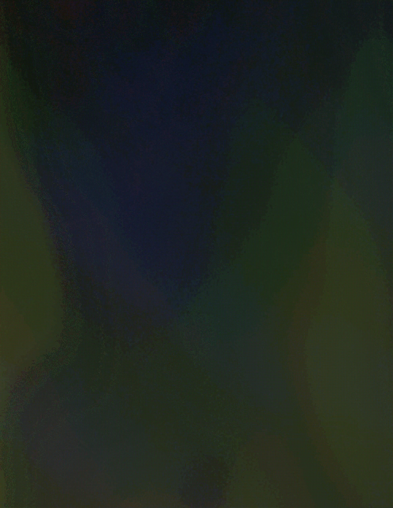

# rank_order

This is a tensorflow implementation of skimage.filters.rank_order algorithm.
The module computes an image of the same shape as an input image,
where each pixel is the index of the original pixel value.
the indexes are in the ascending order i.e. from 0 to n-1, where n
is the number of unique values in original image.

## example:
original image: 
rank_order image: 

*(Photo by Colin Horn on Unsplash)*

