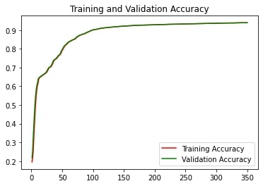
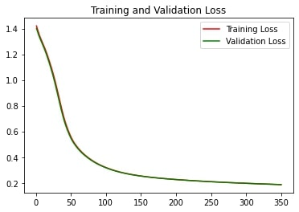
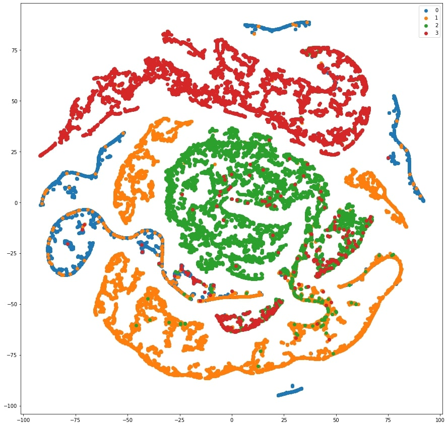
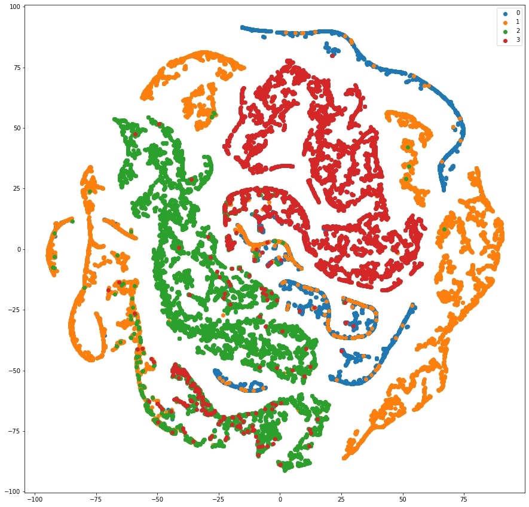

# Graph Convolutional Network (GCN) for  classifying the Facebook Large Page-Page Network Dataset

**Author**: Remington Greenhill-Brown  
**SN**: 44343309
## What is a GCN and why use it here?
A Graph Convolutional Network, or GCN, is a form of semi-supervised convolutional neural network designed to operate specifically on data stored in a graph structure (Thomas, K, et. al., 2016). GCNs are used in the same way as a relatively standard Convolutional Neural Network (CNN), where features are pulled from data and classified. What differentiates GCNs, is that they are are able to operate in non-Euclidean space. Operating in non-Euclidean space is essential to GCN functionality as graphs are typically characterised by somewhat arbitrary connections between nodes (Lin, et. al., 2021). This particular implementation of GCN is used to classify website data from a series of verified Facebook sites. The model created here can then be used to classify more Facebook sites. 
## Data Preprocessing
### Train-Validation-Test Split
An 80%-10%-10% split was chosen as it is a commonly used split, and utilising a high quantity of training data allows a model to better categorise data (Baheti, 2022). Using a 10% split for both validation and testing data ensures there is enough data left over to adequately validate and test model performance, while, as stated before, leaving enough data for training  
to generate better predictions.
### Preprocessing Method
Data is first loaded into separate variables for edges, features, and labels. 
* Data is split between train-validation-test;
* All labels are one-hot-encoded;
* An adjacency matrix is created based on the input edges and is arranged in a spar.se coordinate matrix;
* The adjacency matrix is normalised using scikit-learn's 'normalize' method; and,
* Train, test, and validation label sets are individually one-hot-encoded.

## The Algorithm Method
Typical to Convolutional Neural Networks, and by extension, Graph Convolution Neural Networks, the algorithm used is composed of a series of layers that data is pushed through to perform classification. In sticking with the normal operation of CNNs in Tensorflow, Keras' Model and Layer classes were utilised to create the aforementioned layers. No dropout was used in model creation, as through testing it was determined that the Facebook Large Page-Page dataset was not large enough to warrant dropout. Notably, accuracy would decrease if/when dropout was added. The activation function "Rectified Linear Unit" (ReLU) was used for all but the last of the model layers, as Softmax was used there to map outputs to usable values.  

It should be noted here that the "training" folder contains the pretrained model for use in predict.py. It was decided that this was the best way to store weights for later use, and to save time in re-running the model when users are making predictions.

## Inputs, Outputs, and Plots of Results
### Inputs
Typical input to the GCN is an .npz file containing data in 128 dim formats, arranged by classes and nodes. For instance, the dataset used for model training is stored in a file named "facebook.npz" and contains the Facebook Large Page-Page dataset.
### Outputs
#### Performance in Training
The model achieves roughly 94% accuracy in both training and validation (Figure 1). Gradual increases are observed even at 350 epochs. 

  
*Figure 1: Accuracy plot of training and validation data*

The model suffers from loss initially at 1.4 before decreasing to roughly 0.18 by around 350 epochs (Figure 2). It can be observed that the trend is decreasing further. Increased training length likely would reduce loss further.

  
*Figure 2: Loss plot of training and validation data*

A TSNE plot was generated based upon the test set data and demonstrated that the model was able to effectively classify the data (Figure 3).

  
*Figure 3: TSNE plot of test data*
#### Performance in Prediction
As no model is run during prediction (the one run in training was saved and loaded instead), the accuracy and losses are the same. As demonstrated by the TSNE plot below, the model is able to effectively categorise the entire Facebook Large Page-Page dataset when it is fed in (Figure 4)

  
*Figure 4: TSNE plot of entire Facebook Large Page-Page Dataset when passed through the model*

## Dependencies 
* Python 3.7.15
* TensorFlow 2.9.2
* Keras 2.9.0
* Numpy 1.21.6
* Scipy 1.7.3
* Scikit-learn 0.20.1
* matplotlib 3.2.2
## References
Baheti, P. (2022, October 07). _Train Test Validation Split: How To & Best Practices_. Retrieved from V7 Labs: https://www.v7labs.com/blog/train-validation-test-set#:~:text=In%20general%2C%20putting%2080%25%20of,dimension%20of%20the%20data%2C%20etc.

Lin, Chia-Hung & Lin, Yu-Chien & Wu, Yen-Jung & Chung, Wei-Ho & Lee, Ta-Sung. (2021). A Survey on Deep Learning-Based Vehicular Communication Applications. _Journal of Signal Processing Systems_. 93. 10.1007/s11265-020-01587-2. 

Thomas, Kipf, T. N., & Welling, M. (2016). _Semi-Supervised Classification with Graph Convolutional Networks_. Retrieved from Papers With Code: https://paperswithcode.com/method/gcn#:~:text=A%20Graph%20Convolutional%20Network%2C%20or,which%20operate%20directly%20on%20graphs.
