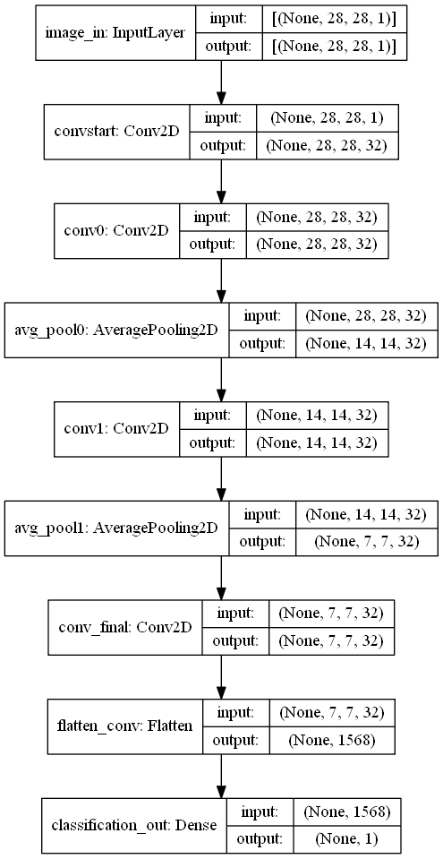

# **COMP3710 Report**
The goal of this project was to use use Tensorflow2 to implement the generative StyleGAN
model and train it on the following datasets:
1. MNIST Digits (TODO: ref)
2. CelebA Faces (TODO: ref)
3. OAI AKOA Knee MRI's (TODO: ref)
4. OASIS Brain MRI's (TODO: ref)

StyleGAN1[1]
was used, as opposed to StyleGAN2[2]
or StyleGAN3[3].

The implemented StyleGAN1 model architecture is based on the structure shown in the original paper:

The fully expanded layer structure can be seen in the appendix in image form, as a result of calls to the Tensorflow plot_model()
function, and also in text form in [driver.ipynb](driver.ipynb) as a result of calls to model.summary().

>## **Dependencies:**
- Python = 3.8
- Tensorflow = 2.5
- Tensorflow Datasets = 4.4
- IPython = 7.22
- Matplotlib = 3.3.4

>## **Problem Description**:
Problem 7 was to create a generative model of the OASIS Brain[4]
or OAI AKOA Knee[5]
dataset using StyleGAN1 or StyleGAN2, that is able to produce a "reasonably clear image".

Being relatively new to Generative Adversarial Networks, I felt StyleGAN1 was a good choice.
I focused on the OAI AKOA Knee dataset, though for simplicity of testing I started by focusing only on the MNIST Digit dataset, before moving on to
the CelebA Faces dataset, and then on to the Knee MRI dataset, and finally I attempted the Brain dataset,
though it proved to be by far the most difficult.

The main features of StyleGAN, that separate it from other GAN models, include:
1. Mapping network, to separate the manifold or something?
2. AdaIN to ?
3. Noise addition (transformed) to each layer, to make fine detail.
4. ?

>## **Data Split**:
...

>## **Evaluation Method**:
The simplest method of evaluating GAN output is by visual inspection of the fake images generated by the network.

We can also evaluate whether the generator and discriminator are diverging by observing their relative losses. 
Ideally we want their losses to remain in the vicinity of 0.5 to 1.0, and if they exceed these values in either direction, then we can say that either the Generator or the Discriminator has become weak relative to the other.

>## **Output and Performance**:
### MNIST Digits Output

[Click here to view the animated version of this graph.](https://www.youtube.com/watch?v=3I84iE2FjPg)

### CelebA Faces Output

[Click here to view the animated version of this graph.](https://www.youtube.com/watch?v=zU0e2sPdgKU)

### OAI AKOA Knee MRI Output

[Click here to view the animated version of this graph.](https://www.youtube.com/watch?v=RTc3cfCKPXE)

### OASIS Brain MRI Output

[Click here to view the animated version of this graph.](https://www.youtube.com/watch?v=ORD4px9rJyE)

>## **Appendix**:

>## **Bibliography**:
[1]: https://arxiv.org/abs/1812.04948
[2]: https://arxiv.org/abs/1912.04958
[3]: https://arxiv.org/abs/2106.12423
[4]: https://www.oasis-brains.org/
[5]: https://nda.nih.gov/oai