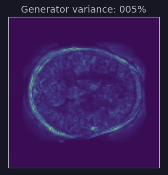

# **COMP3710 Report**
The goal of this project was to use Tensorflow2 to implement the generative StyleGAN
model and train it separately on the following datasets, in this order:
1. MNIST Digits[1]
2. CelebA Faces[2]
3. OAI AKOA Knee MRI's[3]
4. OASIS Brain MRI's[4]

This order of datasets was chosen as it represents an increasing order of difficulty, 
and iterative improvements to the model could be made as the difficulty of the datasets increased.
However, emphasis was placed on the OAI AKOA Knee dataset.

>## **Dependencies:**
- Python = 3.8
- Tensorflow = 2.5
- Tensorflow Datasets = 4.4
- IPython = 7.22
- Matplotlib = 3.3.4

>## **Problem Description**:
Of the available 7 tasks I chose task number 7:

StyleGAN1[5]
was chosen, as opposed to StyleGAN2[6]
or StyleGAN3[7], due to its relative simplicity and greater accessibility to beginners such as myself.
Both the brain and knee datasets were attempted, though the OAI AKOA Knee dataset was the focus, due to the higher variance among the samples.

>## **Algorithm Description**:
The implemented StyleGAN1 model architecture is based on the structure described in the original paper:

The main features of StyleGAN that separate it from other GAN models include:
1. The addition of a mapping network that takes in a latent vector *z* and maps it to an intermediate latent *w*.
The purpose of the mapping network is to disentangle the latent vector space to represent a more uniform
distribution.
2. Each latent *w* has a learned affine transformation *A* applied to it, wherein each feature of *w* is scaled by
a learned weight, to give us style *y = (ys, yb)*.
3. The output the 2D Convolution layer is passed to an Adaptive Instance Normalisation layer, which also receives
scale *ys* and bias *yb*. Each individual scale and bias value is applied to each individual
feature of the convolutional output, thus applying the style *y* to the normalised convolutional output.
4. A gaussian noise input is added to each convolutional output, at the dimensionality of each block.
The noise is scaled by a learned per-channel scaling factor _B_, before being added to the convolutional output.
This results in greater fine stochastic detail in the final image.

The original purpose of Generative Adversarial Networks is to generate unique samples that closely resemble
the source samples but do not overlap with them, i.e. new samples in the style of the source. Through the aforementioned
changes StyleGAN gives us finer control over image generation, allowing us to combine and manipulate styles
in order to receive images with specific characteristics. It achieves this by using a mapping network to
disentangle the latent vector *z*, retrieve intermediate latent vector *w* and transform it into style *y*,
and apply these styles to each block, wherein styles applied to earlier blocks affect large scale features and
styles applied to later blocks affect more fine-grained detail.

The fully expanded synthesis network structure as used in my implementation can be seen in the appendix _a_ in
image form, as a result of calls to the Tensorflow `plot_model()`
function, and also in text form in [driver.ipynb](driver.ipynb) as a result of calls to `model.summary()`.
The discriminator network can be seen in appendix _b_.

>## **Data Split**:
When training a GAN, samples of real images are passed to the discriminator along with fake images generated by
the synthesis network. It is the job of the discriminator to identify which images are real and which are fake.
The discriminator is trained by its losses when deciding between real and fake, and the generator is trained by
the inverse of the discriminator's loss when deciding on the fake images.

Due to this approach, there is no need for any training, testing or validation splits in this task.
Where possible, if multiple splits were provided, they were combined into an all-encompassing training set, in
order to give the model more data to learn from.

>## **Evaluation Method**:
The simplest method of evaluating GAN output is by visual inspection of the fake images generated by the network.
To that end, I have visualised the generator outputs throughout training so their evolution can be inspected,
along with the following measures:

### Adversarial Balance
We can evaluate whether the generator and discriminator are diverging by observing their relative losses. 
Ideally we want their losses to remain in the vicinity of 0.5 to 1.0, and if one exceeds these values in either
direction, then we can say that either the generator or the discriminator has become weak relative to the other.
If this trend continues, and the losses continue to diverge, then the adversaries will stop being able to learn
anything from each other in subsequent iterations. To show this, I have introduced a measure called 
Adversarial Balance, that comprises a weighted moving average between the losses of the generator and
discriminator.  
  
We want to see this balance remain in the center, and not move too far up or down.
This can be seen in action in the animated versions of the output graphs.
The implementation can be found in `_update_avg_losses()` in [model.py](model.py).

### Generator Variance
Another measure I have implemented here is the variance among the generated samples.
First, a measure of the variance in the source data is obtained. Then during training the variance among the
generated samples is obtained. This variance is then converted to a fraction of the variance in the source
dataset, giving us our generator variance percentage.  

  
Ideally we want our generator's variance to remain close to 100% of the dataset variance throughout training.  

  
If our variance drops too low, it is a very strong indicator that the model has undergone mode collapse,
and further training will not improve it.

Live examples of these can be seen in the animated graphs, below. The implementation can be found in
`_calculate_variance()` in [model.py](model.py).

>## **Output and Performance**:
### MNIST Digits Output

[Click here to view the animated version of this graph.](https://www.youtube.com/watch?v=3I84iE2FjPg)

Excellent results were achieved for MNIST Digits, with good balance and variance maintained throughout training.

### CelebA Faces Output

[Click here to view the animated version of this graph.](https://www.youtube.com/watch?v=zU0e2sPdgKU)

Excellent results were also achieved for the CelebA dataset, though due to time constraints only
5 epochs were trained. Good variance and balance were maintained throughout, which demonstrates that
further training would have continued to improve the output.

### OAI AKOA Knee MRI Output

[Click here to view the animated version of this graph.](https://www.youtube.com/watch?v=RTc3cfCKPXE)

Good results were achieved with the OAI Knee dataset. However, while balance and variance were maintained,
it appears that convergence was reached as early as epoch 20, with further epochs only continuing to reduce
the gap between generator and discriminator loss. Due to this, further training may not improve results,
as there is not much more that the adversaries can learn from each other.

### OASIS Brain MRI Output

[Click here to view the animated version of this graph.](https://www.youtube.com/watch?v=ORD4px9rJyE)

Mediocre results were achieved with the OASIS Brains dataset. While high variance and good balance were maintained
for 20 epochs, after epoch 20 the adversaries start to diverge. This resulted in a weakening of the generator over time,
and eventual mode collapse, with the generator variance going as low as ~13% towards the end. We can visually confirm
mode collapse, as all generated samples begin to look the same when the variance drops.

The implementation of this graph layout can be found in `_plot_gan_progress()` in [model.py](model.py).

>## **Appendix**:
#### a) Generator Model Architecture  

#### b) Discriminator Model Architecture  

>## **References**:
[1]: http://yann.lecun.com/exdb/mnist/
[2]: https://mmlab.ie.cuhk.edu.hk/projects/CelebA.html
[3]: https://nda.nih.gov/oai
[4]: https://www.oasis-brains.org/
[5]: https://arxiv.org/abs/1812.04948
[6]: https://arxiv.org/abs/1912.04958
[7]: https://arxiv.org/abs/2106.12423

- StyleGAN1 Paper: https://arxiv.org/abs/1812.04948
- StyleGAN2 Paper: https://arxiv.org/abs/1912.04958
- StyleGAN3 Paper: https://arxiv.org/abs/2106.12423
- MNIST Digits dataset: http://yann.lecun.com/exdb/mnist/
- CelebA Faces dataset: https://mmlab.ie.cuhk.edu.hk/projects/CelebA.html
- OAI MRI dataset: https://nda.nih.gov/oai
- OASIS Brain MRI dataset: https://www.oasis-brains.org/
- Introduction to StyleGAN: https://machinelearningmastery.com/introduction-to-style-generative-adversarial-network-stylegan/
- StyleGAN - A Style-Based Generator Architecture for Generative Adversarial Networks: https://www.section.io/engineering-education/stylegan-a-style-based-generator-architecture-for-gans/
- AI generated faces - StyleGAN explained: https://www.youtube.com/watch?v=4LNO8nLxF4Y
- StyleGan | Lecture 71 (Part 1) | Applied Deep Learning: https://www.youtube.com/watch?v=hfFAUFsglLc