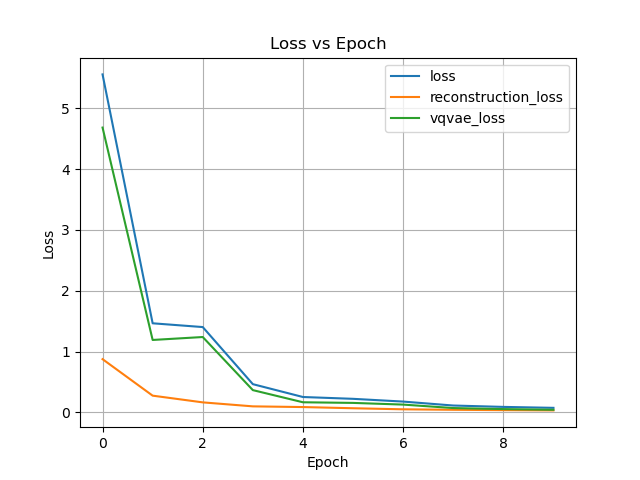
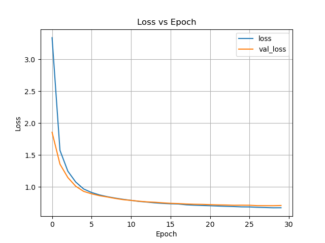
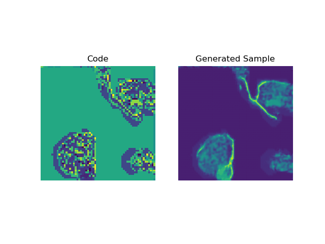
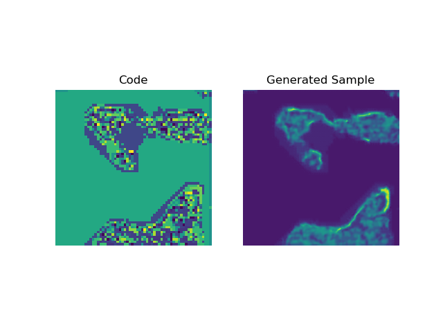

# COMP3710 PatternFlow Report
## Alon Nusem - s4480158
### Project: VQVAE on the Oasis brain dataset

## Project Overview
### The VQVAE Model
A variational autoencoder is an auto encoder with modifier training that ensures a latent space is generated with better properties than just a regular autoencoder. This can help avoid overfitting and is done by returning a distribution over the latent space and adding a loss function term based on regularisation [1]. 

A vector quantized vae is a form of vae that uses vector quantisation to obtain this discrete latent representation.

This model in essence is a more effective way to compress, and then uncompress data into a latent space and restore it with signicant accuracy, aiming for a structured similarity over 0.6.

### The Dateset
The dataset being used for this analysis is the OASIS brain data set, captured during the OASIS brain study. This is an expansive dataset seperated into 544 test images, 1,120 validation images, and 9,664 training images of cross sectional MRI images of brains.

### The Goal
Using a vector quantized variational autoencoder, the dataset can be analysed and reduced into a more dense latent space. Training this VQVAE allows the model to essentially compress and then uncompress inputs accurately. Following this, a generational network can be designed, and by combining this network, feeding its output into the decoder from the VQVAE, new images can be created from this latent space.

## Results
After training the VQVAE on a subset of the training dataset, the model was evaluated on an unseen section of the test datset. Below is a sample of 8 brains after being reconstructed from encoding, vector quantization, and decoding after 10 epochs.

During this run, a SSIM of 0.91 on a sample 500 of the test dataset images. This can be re-evaluated in the predict script. While running the training the following loss plots were produced:

VQVAE:\

PixelCNN:\

Both of these come to a plateau which suggests that there likely isn't much that more epochs of training would do. Adding more data may benefit but I touch on this in the final section.

However while these models seem to train well and VQVAE does function, there must be some issue either with pixelCNN or the generation code as new brains cannot be produced well

I'm not sure where this implementation went wrong and it requires further analysis but it does illustrate how a low dimensionality code can be transformed into a arguably more brainlike reproduction.

## How to setup this project
### Dependancies
- Python 3.9
- tensorflow=2.10.0
- tensorflow-probability=0.18.0
- scikit-image=0.18.1
- matplotlib-base=3.3.4
- numpy-base=1.21.5
- pillow=9.0.1

### Steps for reproducing
1. Setup a new conda environment with the dependancies listed above.
2. Download the dataset from https://cloudstor.aarnet.edu.au/plus/s/tByzSZzvvVh0hZA (This is a preprocessed set from the OASIS dataset, it also includes segmentation masks but that isn't necessary for us)
3. Extract the dataset into a folder labelled data in the 44801582_OASIS_VAE directory
4. Use train.py to train vqvae or pixelcnn
5. Use prediction.py to generate new brains (default run uses samples provided, adjustment is needed if you want to use your own model results)

## How to improve on these results (and issues)
First thing is that the current implementation of dataset is not great. It loads everything into a numpy array which is super space intensive and makes training crash unless you limit the input data size. This needs updating as it would improve training process dramatically.

The pixelCNN and VQVAE could both be improved, model wise they are not very complex implementations of their base form, better performance is possible.

## Resources
[1] https://towardsdatascience.com/understanding-variational-autoencoders-vaes-f70510919f73

[] https://github.com/ritheshkumar95/pytorch-vqvae

[] https://keras.io/examples/generative/vq_vae/