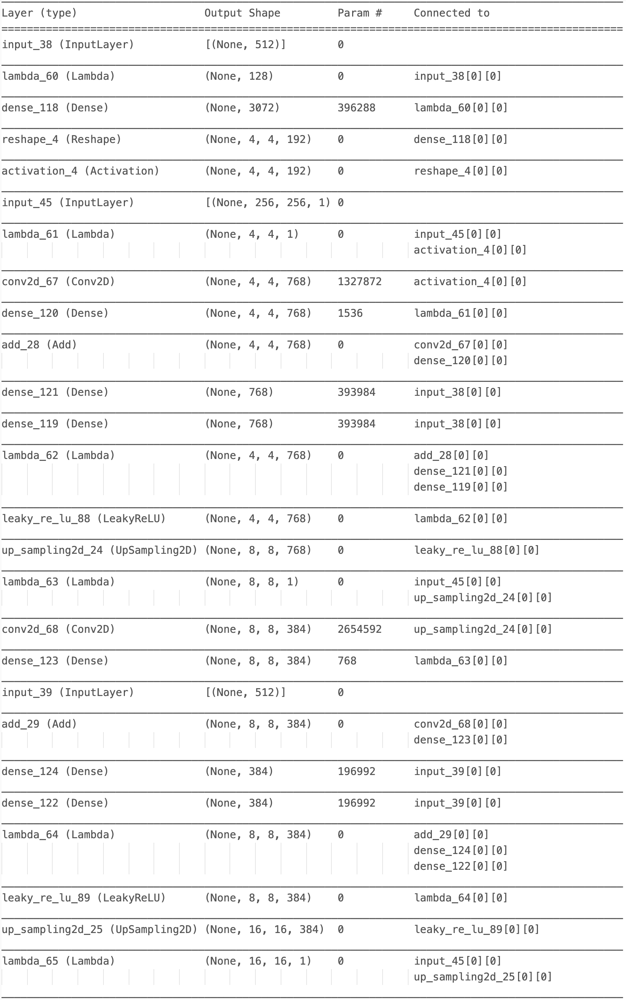
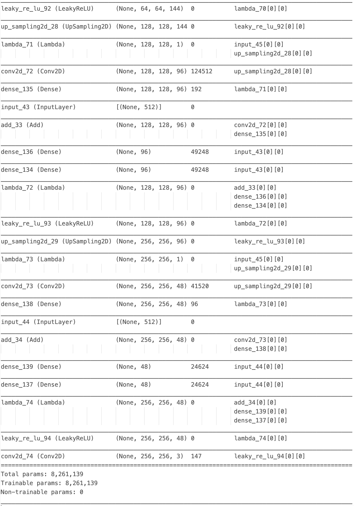
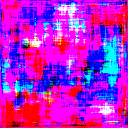
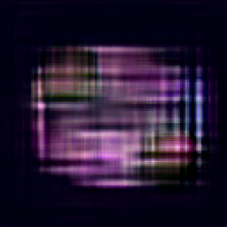

StyleGAN
========
Generative model of the [OASIS brain](https://www.oasis-brains.org/) data set using [StyleGAN](https://arxiv.org/pdf/1812.04948v2.pdf)

**Author:** *Avinash Chandra(45005172)*

* [StyleGAN Architecture](#StyleGAN-Architecture) 
* [Report's StyleGAN Design](#Reports's-StyleGAN-Design) 
    + [GAN](#1.-GAN)
    + [StyleGAN Training](#2.-StyleGAN-Training)
    + [Data Processing](#3.-Data-Processing)
* [Executing Code](#Executing-Code) 
* [Results](#Results) 
* [References](#References)

## StyleGAN Architecture

Generative Adversarial Networks (GANs) are used to generate high-quality synthetic images. 

Tradidional GANs have two components namely, Generator and Discriminator. Generator takes a point in latent space as input and generates specified image as output while, the Discriminator diffrentiate real images from the fake or generated ones (positive values for real and negative values for fake images). The Generator and Discriminator works in adversery with each other while training, hence the name Generative Adverserial Network.

A technique called Progressive Growing GAN (PGGAN) is employed to generate large/high-quality images by progressively incresing the number of layers while training.

The StyleGAN incorporates progressive growing generator of the PGGAN along with some more modifications in the generator. The modifications to a traditional generator are as follows:
* Baseline Progressive GAN
* \+ Tuning (including bilinear upsampling)
* \+ Mapping and styles  
* \- Traditional Inputs
* \+ Mixing regularization

    

    <em> Figure 1: Traditional vs StyleGAN Generator Architecture </em>
     
    <em> In traditional generator, latent vectors directly pass into the block   while in StyleGAN, latent vectors after normalisation pass through   the mapping network followed by being transformed (Affline   Transformation) and passed to generator and noise B is added after the   instance normalisation (AdaIN) </em>

## Report's StyleGAN Design 
Official StyleGAN on Tensorflow was done by [NVLabs(NVIDIA Corporation)](https://github.com/NVlabs/stylegan). StyleGAN implementation for this report is inspired by the [StyleGAN implementation by Keras](https://keras.io/examples/generative/stylegan/). 
The goal for this implementation is to produce 256x256 images trained on preprocessed [OASIS brain](https://www.oasis-brains.org/) dataset provided by the University.
 
The implementation for the report is based on Tensorflow2.X. 
Keras on top of the Tensorflow is used for modeling the StyleGAN.
Some of the notable components of report's StyleGAN implementation are listed below. However, every other components including ones listed below are commented in the Jupyter notebook file [styleGAN.ipynb](styleGAN.ipynb)

### 1. GAN
A baseline DCGAN is used with few custom layers added in the Generator, while the Discriminirator remains fairly normal. The repeated segments of Generator and Discriminator are made by Generator and Discriminator blocks respectively.

#### 1.1 Generator
The main changes to a DCGAN are made by adding 8 layers for style mapping and addition of AdaIN (Adaptive Normalisation) in each Generator Block. The idea behind Style mapping is to reduce chances of mixing of styles of different images, for instance, in case of generating faces we don't want skin of an old person and an infant to be mixed. While, the AdaIN applies latent vector in each block of the generator. Biliner upsampling is also incorporated in the GAN blocks which is done in all but the first generator block.
Picture below summarises the Generator model. 

    
    
    
     
    <em>Figure 2: Generator Model Summary</em>

#### 1.2 Discriminator
The discriminator is a fairly typical DCGAN discriminator, downsampling is done in all but the last discriminator block. Figure below summarises the Discriminator model.

 
    
     
    <em>Figure 3: Discriminator Model Summary</em>

### 2. StyleGAN Training
In the training of StyleGAN Mixing regularization and GP Loss has been incorporated. For mixing regularzation two noise vectors have been generated for the training with one having more prevelence than other (Probalility = 0.9). 
The Gradient penalty loss is added to the discriminator loss, the rationale behind incorporating this loss to prevent discriminator dictating generator to make big changes hence resulting in [mode collapse](https://developers.google.com/machine-learning/gan/problems).

### 3. Data Processing
For the training, the images in training directory are converted to numpy array and are trained in batch of 12 images. For saving the generated images [Pillow](https://pillow.readthedocs.io/en/stable/) a fork of python imaging library has been used.

## Executing Code
The code can be executed by executing the "Train Model" code block in [styleGAN.ipynb](styleGAN.ipynb). Before the training, png files from source directory needs to be converted to numpy array by passing data directory path as an argument to function [convert_to_npy](), which will then save the data as .npy file in the directory [OASIS-Brain-npy](OASIS-Brain-npy). A detailed comment on useage is provided in the markdown parts of [styleGAN.ipynb](styleGAN.ipynb).

## Results
The model trained for around 50000 epoches generating 90 images of 256x256 each. Training took ~10 hours on NVIDIA GTX1080. Few of the generated images are listed below. The sample images are also in the [Generated-img](Generated-img) directory.
#### Without Training:

    
     
    <em>Figure 4: Generated image without training</em>

#### Early stages of training:

    
    
    
    
     
    <em>Figure 5: Generated images in early stages of training</em>

#### Later stages of training:

    
    
    
    
     
    <em>Figure 6: Generated images in later stages of training</em>

## References
* [https://www.oasis-brains.org/](https://www.oasis-brains.org/)
* [https://arxiv.org/pdf/1812.04948v2.pdf](https://arxiv.org/pdf/1812.04948v2.pdf)
* [https://github.com/NVlabs/stylegan](https://github.com/NVlabs/stylegan)
* [https://keras.io/examples/generative/stylegan/](https://keras.io/examples/generative/stylegan/)
* [https://developers.google.com/machine-learning/gan/problems](https://developers.google.com/machine-learning/gan/problems)
* [https://pillow.readthedocs.io/en/stable/](https://pillow.readthedocs.io/en/stable/)

