# Vector Quantized Variational Autoencoders (VQ-VAE) on OASIS brain dataset.
Create a generative model of the OASIS brain data set using a VQ-VAE that has a “reasonably clear image” and a Structured Similarity (SSIM) of over 0.6. 
This implementation trains a VQ-VAE based on convolutional layers and uses a PixelCNN prior to generate images. 
Example outputs and plots of the images generated by the model are provided.
 
 
## The Algorithm
### VQ-VAE model
The VQ-VAE is a type of variational autoencoder first proposed by Oord et.al. [1] in 2018. It is consist of three parts:
1. An encoder - A convolutional network do the downsampling to extract features from the original image.
2. Lantent space - A customized layer that mantains a trainable discreate codebook.  
   - Different from traditional VAEs which have a continuous latent space sampled from a noraml distribution, VQ-VAE has a discrete latent space, where a trainable discrete codebook is maintaned. The codebook has *n* latent embedding vectors, each with a dimension of *D*. The dimension *D* here should equal to the number of filters in the output from encoder.
   - The output from the encoder is passed to the latent space and the Euclidean distances between it (encoder ouptput) and each latent embedding vector are computed.
   - Feed the latent embedding vector closest to (with minimum distance computed) the encoder output in the codebook as the input to the decoder.
3. An decoder - A convolutional network do the upsampling to reconstruct the original image.

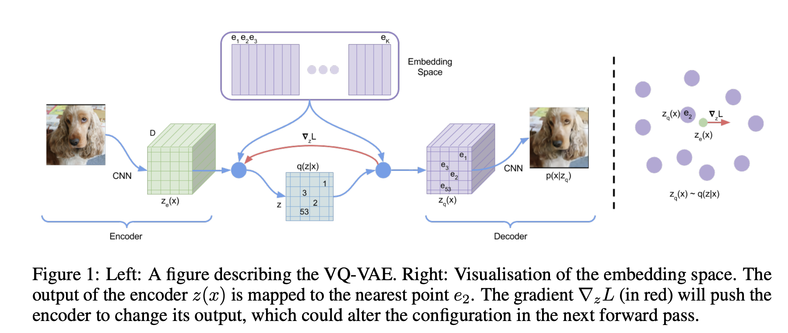

### PixelCNN model
After the VQ-VAE is trained, a PixelCNN prior is trained to generate images. 
It is an auto-regressive generative model that generates images pixel by pixel. The value of the current pixel is generated based on the value of previously generated pixels (via the masked convolutional layer). 
 
There are two types of masks. 
1. **Mask Type A**: Zeroing the central pixel and all the pixel after the central pixel in the mask. 
2. **Mask Type B**: Zeroing all the pixel after the central pixel in the mask.  

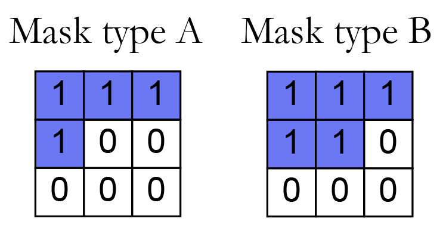

Mask Type A is only applied to the first convolutional layer and it avoids the model accessing information of unpredicted pixels.  
Mask Type B is applied to all the subsequent convolutional layers. It allows the connection from a pixel to itself by releasing the block on the central pixel. 
Below is the architecture proposed by Oord et.al.[3] in 2016. My implementation is based on it with some modifications, which will be discussed in the implementation section below. 

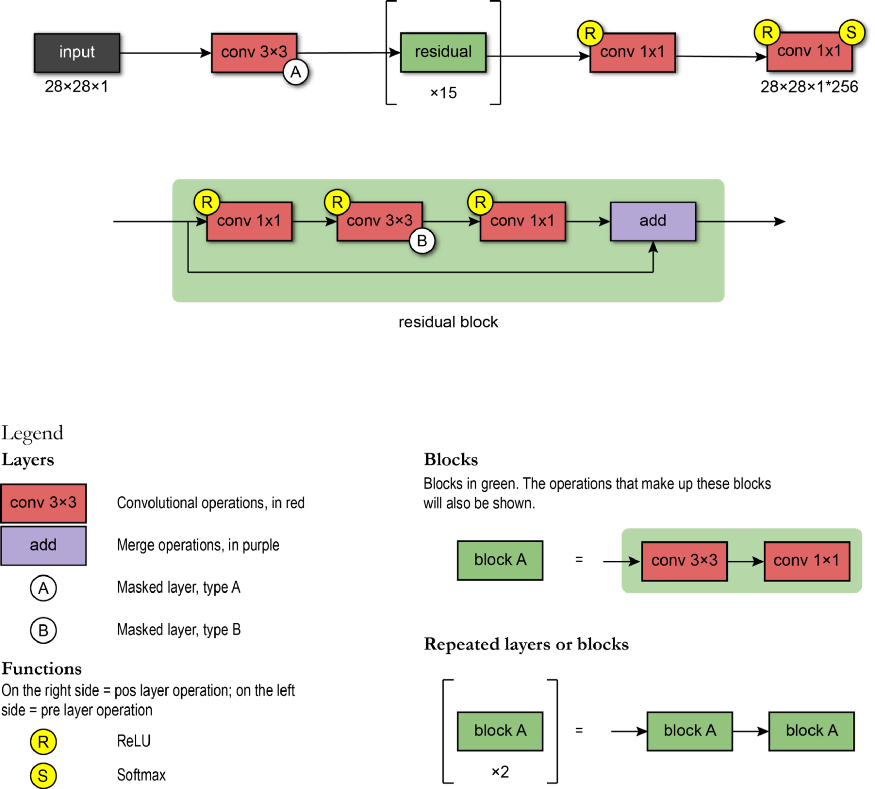

After the pixelcnn is trained, it is used to generate images on a pixel-by-pixel basis. Zeros are feed to the model to retrieve the pixel value probabilities for the next
pixel. Given the probabiltiy, we sample a value from it and update the image with the sampled values. Repeate it for all the pixels to generate a complete image.
## Implementation
### Dataset
The OASIS brain dataset is provided by the course. It contains 9664 training images, 1120 validation images and 544 test images.  
The size of these images are 256x256 and are greyscale with pixel values ranging from 0 to 255. Below are some training samples from the training dataset: 
 

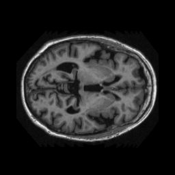
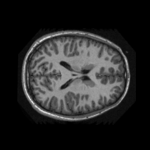
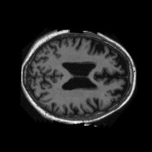
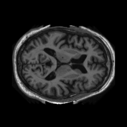
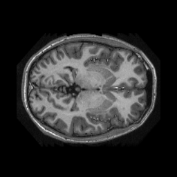

 
During the training process, validation datasete is also passed to the model for hyperparameter tuning and reduces overfitting. 

### Modules:
Modules are stored in modules folder. 
**vqvae.py**: script to build the vqvae model. 
The *encoder* is consist of four Conv2D layers: 
- first layer: filters = 32, kernal size = 3, strides = 2, activation function = ReLU.
- second layer: filters = 64, kernal size = 3, strides = 2, activation function = ReLU.
- third layer: filters = 128, kernal size = 3, strides = 2, activation function = ReLU.
- forth layer: filters = 256, kernal size = 1. 

The *latent space* contains 256 latent embedding vectors, each with a dimension of 256.  
The *decoder* is consist of four Conv2DTranspose layers: 
- first layer: filters = 256, kernal size = 3, strides = 2, activation function = ReLU.
- second layer: filters = 128, kernal size = 3, strides = 2, activation function = ReLU.
- third layer: filters = 64, kernal size = 3, strides = 2, activation function = ReLU.
- forth layer: filters = 1, kernal size = 3.
 
**pixelcnn.py**: script to build the pixelcnn model. It's structure is as below: 
- A masked convolution layer (type A), filters = 128, kernel_size = 7, strides = 1, activation = ReLU, followed by a batch normalization layer.
- Then, 7 residuals blocks were used. Each block has the following structure. The sum of the input data and output from the layers are added together as the output of the residual block:
  - a convolutional layer with filters = 128, kernel_size = 1, activation function = ReLU.
  - a batch normalization layer.
  - a masked convolutional layer (type B), filters = 64, kernel_size = 3, activation function = ReLU.
  - a batch normalization layer.
  - a convolutional layer with filters = 128, kernel_size = 1, activation function = ReLU.
  - a batch normalization layer. 
- A masked convolution layer (type B), filters = 128, kernel_size = 1, strides = 1, activation = ReLU, followed by a batch normalization layer.
- A masked convolution layer (type B), filters = 128, kernel_size = 1, strides = 1, activation = ReLU, followed by a batch normalization layer.
- An output convolutional layer (Conv2D) with filters = 256, kernel_size = 1, strides = 1. 

**dataset.py**: script to preprocess and load the dataset.
 
**tools.py**: script to plot images and calculate structured similarity (ssim).
 

### Denpendencies:
- tensorflow = 2.7.0
- matplotlib = 3.4.2
- PIL (Python Imaging Library) = 8.3.1
- tensorflow probability = 0.14.1
- numpy = 1.20.3
- random
- os
### Driver script (main.ipynb)
1. Read filenames from the dataset and store the file paths to the images.
   - Images are in directory 'keras_png_slices_data' outside the repo, in folders called 'keras_png_slices_train','keras_png_slices_test' and 'keras_png_slices_validate'  respectively. This is a link to the dataset: https://cloudstor.aarnet.edu.au/plus/s/tByzSZzvvVh0hZA
2. Load the input images of the VQ-VAE model from dataset using generators. 
   - For each image, normalise the pixel values to range [0,1] and resize the image array by adding one additional dimension (color channel). The preprocessing is done inside the generator so the output of the generator are formatted and can be directly pass to the models to train.
3. Train the VQ-VAE model in batch size of 8 for 20 epoches with Adam optimizer. Below are some reconstruction result on the test dataset.

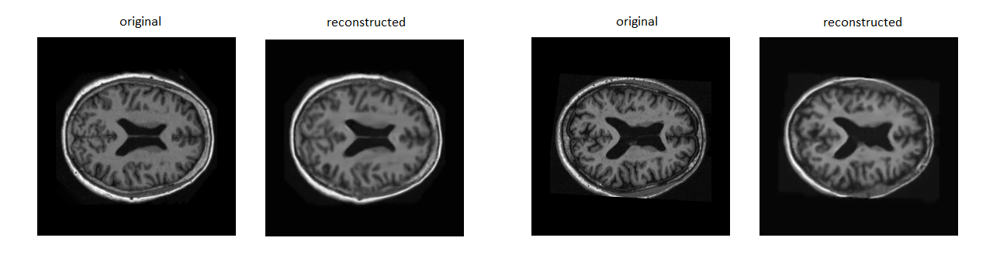

4. Compute the structed similarity of the model and the overall ssim is 0.9886 (4 d.p.).

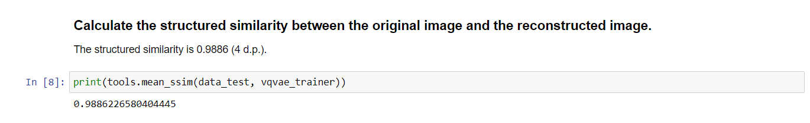

5. Load the inputs of the PixelCNN model from dataset using generators.
   - For each image, pass it to the trained vqvae encoder and map the output from the encoder to the closest latent embedding vector in the latent space in one-hot encoded format. The preprocessing is also done inside the generator.
6. Train the PixelCNN in batch size of 32 for 600 epoches with Adam optimizer.
7. Used the trained PixelCNN to generate images. Some of the results with learning rates = 0.0001, 0.0003 and 0.0005 are stored in the images folder respectively(e.g. adam optimizer with learning rate 0.0003 is stored in images/lr = 0.0003). Below are some iamges generated by the PixelCNN: 

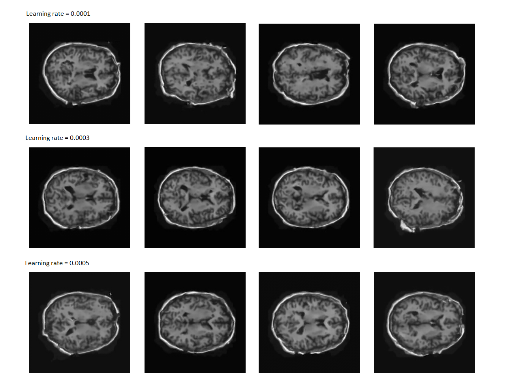

## Reference
[1]A.v Oord, O. Vinyals and K. Kavukcuoglu, "Neural Discrete Representation Learning", 2018, arXiv:1711.00937v2. [Online]. Available: https://arxiv.org/abs/1711.00937. 
[2]S. Paul, "Vector-Quantized Variational Autoencoders", 2021, [Online]. Available: https://keras.io/examples/generative/vq_vae/. 
[3]A.v.Oord, N. Kalchbrenner, O. Vinyals, et.al., "Conditional Image Generation with PixelCNN Decoders", 2016, arXiv:1606.05328v2. [Online]. Available: https://arxiv.org/abs/1606.05328. 
[4]W.h Pinaya, "Autoregressive Models — PixelCNN", 2020, [Online]. Available: https://towardsdatascience.com/autoregressive-models-pixelcnn-e30734ede0c1.
