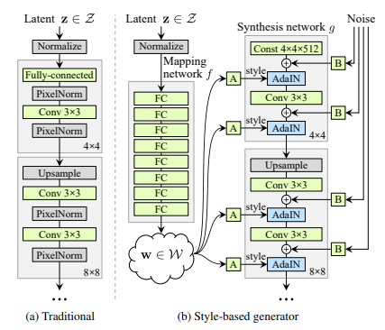
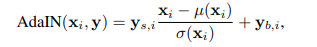
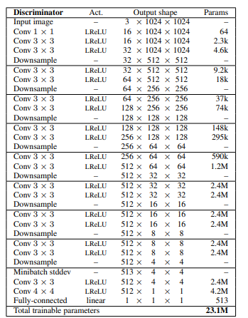
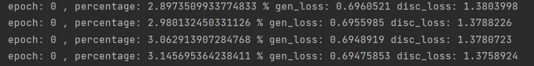
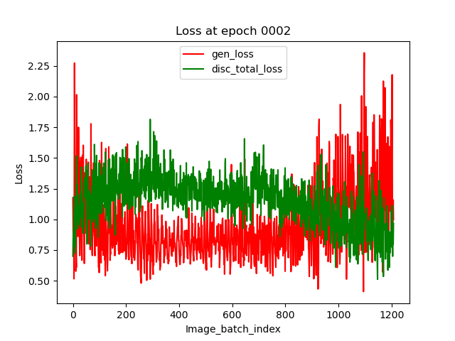
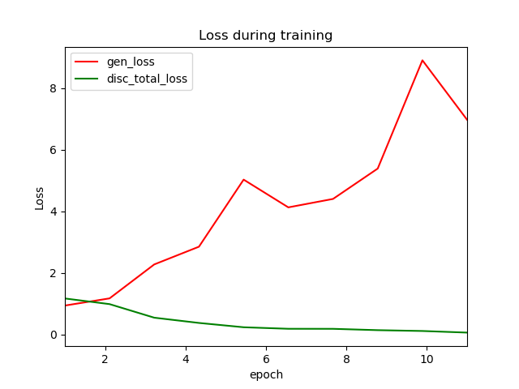
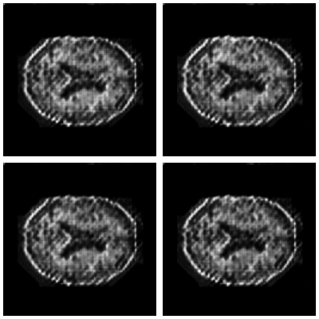

# Style-Based Generative Adversarial Networks (StyleGAN) - 45183735
This StyleGAN model is implemented by using tensorflow for the OASIS brain dataset which provide a "reasonably clear image". 
The structure of this model is from the original StyleGan paper. [here](https://arxiv.org/pdf/1812.04948.pdf)
## Description of the Algorithm
StyleGAN is one of the state-of-the-art extension for the Generative Adversarial Networks (GAN) which use for generating
high-quality images. it also contains two model generator model and discriminator model, generator model will learn 
to create a fake image cheat the discriminator, and the discriminator is a classifier to identify the real and fake 
images. StyleGAN make an improvement for the generator model and does not modify the discriminator model.





### Generator model
The generator model for StyleGAN include two part, Mapping network and Synthesis network,
Compare to the traditional generator, Sytle-based generator map the Latent input z through the mapping network to an 
intermediate latent space w instead of feeds directly into the input layer only. 
and then feeds into the adaptive instance normalisation at each convolution layer in the synthesis network.
the formula of the AdaIN is provide in above picture. the noise will add as a source of variation for each 
section of the generator model.


### Discriminator model

As StyleGAN does not change anything about the discriminator, it still uses the discriminator model 
in Progressive Growing of GAN (PGGAN). Therefore, the discriminator structure include two convolution layer
with LeakReLU activation in each section of the network. the aim of discriminator is to distinguish the fake and real images.

## Environment and Dataset Setup
### Dependencies
  - Tensorflow 2.10.0
  - numpy 1.23.3
  - matplotlib 3.5.2
  - python 3.10.6
  
### Dataset preparation
The Preprocessed OASIS MRI Dataset need to be extracted to the same level as the ```train.py```.

## Training / Predicting
### Training the model

Run this code to train the model:

```python train.py```

or if you want to choose the number of epochs, run this code:

```python train.py -e EPOCHS```

Note: Replace EPOCHS to the number you choose.

The training step will generate an image and a plot of loss for each epoch. During the training, it will print the progress of the training.


### Prediction using the trained model
After the model training is finished, it will generate a checkpoint folder and do not remove it.
the prediction will use the latest trained model and will generate an image for the prediction.
To make a prediction, run this code:

```python predict.py```

## Result

### Training



### Visualise the loss for each training epoch



### Visualise the loss for entire training step



### Prediction output


## Reference
[1] TensorFlow. 2022. Deep Convolutional Generative Adversarial Network  |  TensorFlow Core. [online] Available at: <https://www.tensorflow.org/tutorials/generative/dcgan> [Accessed 11 October 2022].

[2] Karras, T., Laine, S. and Aila, T., 2019. A Style-Based Generator Architecture for Generative Adversarial Networks. [online] arXiv.org. Available at: <https://arxiv.org/abs/1812.04948> [Accessed 9 October 2022].

[3] Karras, T., Aila, T., Laine, S. and Lehtinen, J., 2018. Progressive Growing of GANs for Improved Quality, Stability, and Variation. [online] arXiv.org. Available at: <https://arxiv.org/abs/1710.10196> [Accessed 10 October 2022].