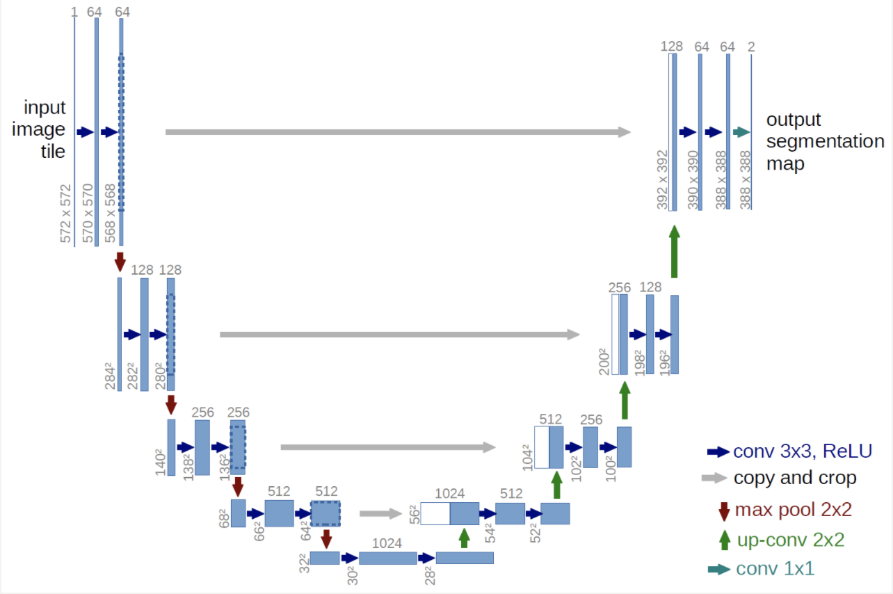
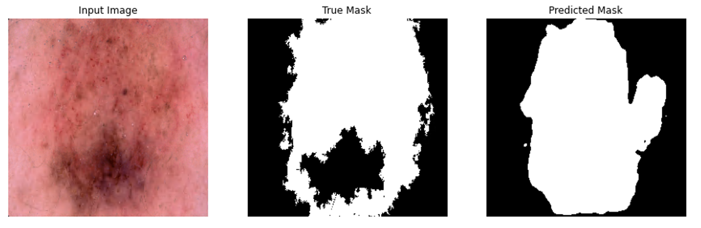
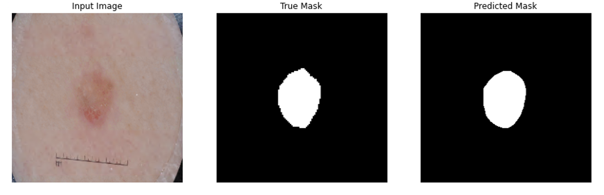
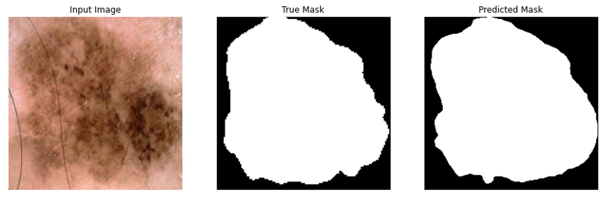
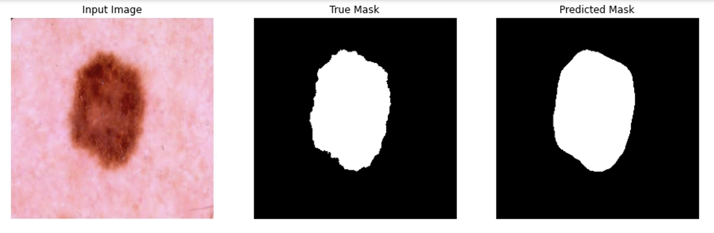

# Segmentation on the ISICs data set with the UNet 
This is the report of the last assignment of course COMP3710.

## Requirment
Segment the ISICs data set with the UNet with all labels having a minimum Dice similarity coefficient of 0.7 on the test set.

## Algorithm -- UNet
This UNet is developed by N. Navab, J. Hornegger, W. M. Wells, and A. F. Frangi. The UNet is convolutional network architecture for fast and precise segmentation of images. Up to now it has outperformed the prior best method (a sliding-window convolutional network) on the ISBI challenge for segmentation of neuronal structures in electron microscopic stacks. A U-Net consists of an encoder (downsampler) and decoder (upsampler). In-order to learn robust features, and reduce the number of trainable parameters, a pretrained model can be used as the encoder. Here in my project I borrowed it to do skin cancer image segmentation. 

U-net architecture (example for 32x32 pixels in the lowest resolution). Each blue box corresponds to a multi-channel feature map. The number of channels is denoted on top of the box. The x-y-size is provided at the lower left edge of the box. White boxes represent copied feature maps. The arrows denote the different operations.

## Python Code to Build the network

    def model():
        input_layer = tf.keras.layers.Input(shape=(256,256,3))

        x = Conv2D(64,(3,3), activation='relu', padding='same')(input_layer)
        x1 = Conv2D(64,(3,3), activation='relu', padding='same')(x)
        x = MaxPooling2D((2,2), padding='same')(x1)
        x = Conv2D(128,(3,3), activation='relu', padding='same')(x)
        x2 = Conv2D(128,(3,3), activation='relu', padding='same')(x)
        x = MaxPooling2D((2,2), padding='same')(x2)
        x = Conv2D(256,(3,3), activation='relu', padding='same')(x)
        x3 = Conv2D(256,(3,3), activation='relu', padding='same')(x)
        x = MaxPooling2D((2,2), padding='same')(x3)
        x = Conv2D(512,(3,3), activation='relu', padding='same')(x)
        x4 = Conv2D(512,(3,3), activation='relu', padding='same')(x)
        x = MaxPooling2D((2,2), padding='same')(x)
        x = Conv2D(1024,(3,3), activation='relu', padding='same')(x)
        encoded = Conv2D(1024,(3,3), activation='relu', padding='same')(x)

        u4 = UpSampling2D((2,2))(encoded)
        x = concatenate([x4, u4])
        x = Conv2D(1024,(3,3), activation='relu', padding='same')(x)
        x = Conv2D(512,(3,3), activation='relu', padding='same')(x)
        u3 = UpSampling2D((2,2))(x)
        x = concatenate([x3, u3])
        x = Conv2D(512,(3,3), activation='relu', padding='same')(x)
        x = Conv2D(256,(3,3), activation='relu', padding='same')(x)
        u2 = UpSampling2D((2,2))(x)
        x = concatenate([x2, u2])
        x = Conv2D(256,(3,3), activation='relu', padding='same')(x)
        x = Conv2D(128,(3,3), activation='relu', padding='same')(x)
        u1 = UpSampling2D((2,2))(x)
        x = concatenate([x1, u1])
        x = Conv2D(128,(3,3), activation='relu', padding='same')(x)
        x = Conv2D(64,(3,3), activation='relu', padding='same')(x)
        x = Conv2D(64,(3,3), activation='relu', padding='same')(x)

        decoded = Conv2D(1,(1,1), activation='sigmoid')(x)

        autoencoder = Model(input_layer, decoded)
        return autoencoder

## Dependency

* Python = 3.7
* Tensorflow = 2.1.0

## Dataset

The given data are separated in two different folders, one contains the input images (original skin RGB images), the other contains the ground truth images (segment images). There are 2594 images in total. Images are in different size.

## Data Split

For this project I split the original input images into training set and testing set with split ratio 0.2. When training the model, I set the validation ratio to 0.2.

## Image Resize

As images are in different sizes, I resized all images to (256, 256).

## Measurement

In this project, a 0.7 dice similarity coefficient is required. The formula of it is shown below. X and Y stands for the prediction and ground truth.

## Prediction

## Dice similarity coefficient

For this prodiction, the dice coefficient is 0.84.

## Reference

* [1] O. Ronneberger, P. Fischer, and T. Brox, “U-Net: Convolutional Networks for Biomedical Image Segmentation,” in Medical Image Computing and Computer-Assisted Intervention – MICCAI 2015, ser. Lecture Notes in
Computer Science, N. Navab, J. Hornegger, W. M. Wells, and A. F. Frangi, Eds. Cham: Springer International Publishing, 2015, pp. 234–241.

## Author

Name: Yi Yang

Student ID : 45209484
