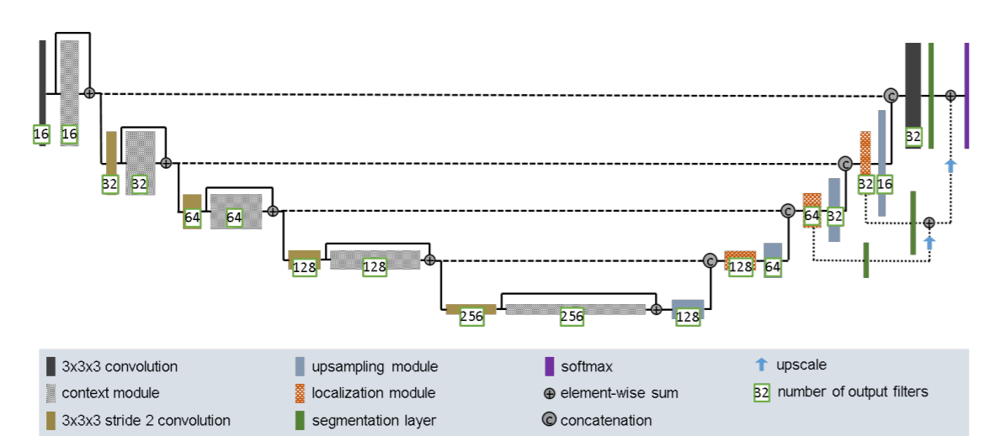
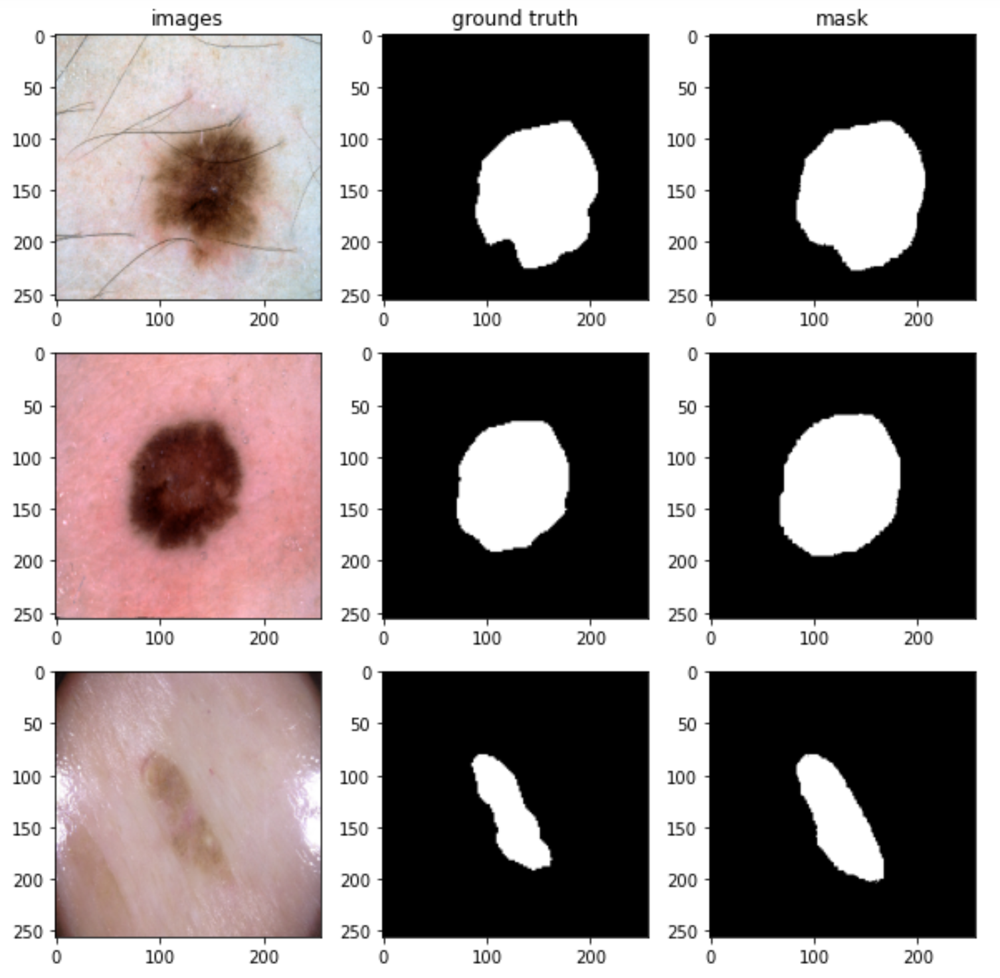
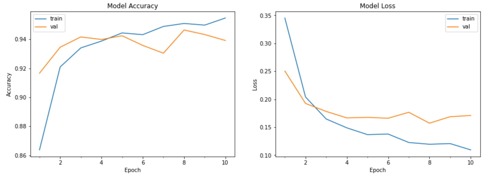

## Improved UNet 

#### Introduction

For this work,I built an improved UNet model and performed image segmentation on the ISICs dataset, which is an image of skin cancer. Next, I will introduce the structure of the model, the training process and training results of the model, and finally I will show the predicted images to compare with the ground truth.

#### Model architecture

 I divided the data set into training set ,validation set and test set whose proportions are 6:2:2 respectively. At the same time, the images were normalized and resized into 256 * 256 * 1 and 256 * 256 * 3. When processing the mask images, I rounded all the values of the images to 0 and 1. The structure of the improved UNet has been shown below.



Improved UNet is roughly divided into two parts like ordinary UNet, encoding and decoding. The difference is that each layer of the decoder part in the improved UNet contains a convolutional layer and a context module, and the input of the next layer is the sum of the previous layer. A context module also called pre-activation residual which contains 7 layers that are two instance normalization layers, two activation layers "LeakyReLU" with a negative slope of $10^{-2}$, 2 convolution layers and one dropout layer with 0.3 droupout. However, the upsampling module of the decoding part replaces the previous transpose convolutional layer. The newly added localization module consist of  3x3 convolution and 1x1 convolution and it can combine the features from concatenation and also reduce the number of features. This model also contain segmentation layers which are 1 * 1 2D convolution layer and upscale layers which are upsampling2D layers. For output layer is a  1 * 1 2D convolution layer and activation function is sigmoid. 

#### Training and prediction Procedure

My network architecture is trained using 256*256 voxels and randomly sampled patches with a batch size of 16. I train for a total of 10 epochs. I use the Adam optimizer for training, the initial learning rate is $10^{-4}$. Then I make a prediction on test set and I got the plots.



#### Evaluation 

The final trend of loss and acurracy is used to determine whether the model converges. The plot of model accuracy and loss are shown below. Apparently, accuracy becomes higher and loss becomes lower.



I choose the dice coefficient value as a metric to evaluate the image segmentation model, because this metric can get the ratio of the same pixels between the ground truth and the predicted images. At the same time, the closer the value is to 1, the more similar the image is. Finally, my dice coefficient value on test set is 0.83. 

#### Dependencies

1. Python 3.7
2. Tensorflow-gpu 2.1.0
3. Keras
4. Matplotlib
5. Tensorflow_addons (used in instance normalization), ```conda install -c esri tensorflow-addons```