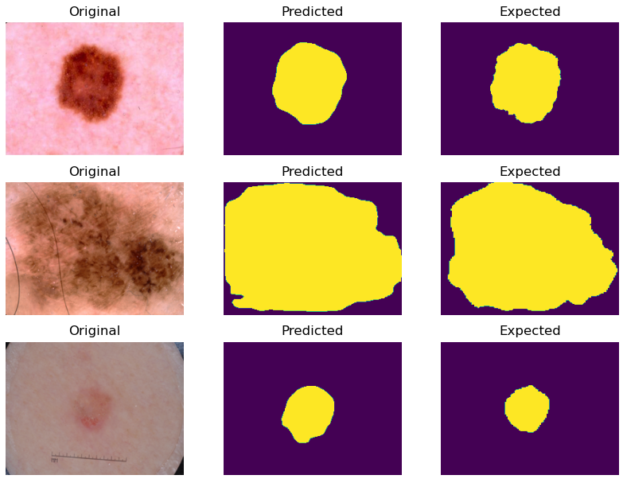
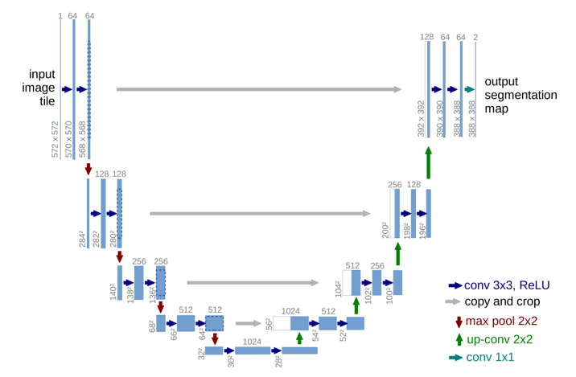

# UNet Image Segmentation of the ISIC 2018 Challenge Dataset

## The Dataset

The ISIC 2018 Challenge tasked participants with developing image analysis tools to enable automated segmentation, classification and diagnosis of melanoma from dermoscopic images.  The challenge comprised of three tasks: Lesion Segmentation, Lesion Attribute Detection and Disease Classification.  This model aims to complete task 1: Lesion Segmentation.  An example of a lesion and its ground-truth segmentation and UNet predicted segmentation is shown below.

## The Model

A UNet is a type of convolutional neural network which uses a U-shaped encoder-decoder structure.  It includes a contracting path (which follows the typical architecture of a convolutional network), followed by an expansive path which upsamples the pooled data back to its original shape.  UNets have seen success particularly when dealing with biomedical segmentation problems - which makes it a good choice to handle the ISIC 2018 dataset.  A visualisation of the structure is shown below.

# Dependencies

## To use the model.py file

* Python 3.7.9
* Tensorflow 2.1.0

## To run the driver.py script

* Python 3.7.9
* Tensorflow 2.1.0
* Scikit-learn 0.23.2
* Numpy 1.19.1
* Matplotlib 3.3.1
* Pillow 7.2.0

To run the driver script, the ISIC 2018 challenge data must be downloaded - the download link is <https://cloudstor.aarnet.edu.au/sender/?s=download&token=505165ed-736e-4fc5-8183-755722949d34>.  
There should be two folders of images, titled "ISIC2018_Task1_Training_GroundTruth_x2" and "ISIC2018_Task1-2_Training_Input_x2" - both need to be unzipped in the same directory as the driver.py file.

# Usage

## How to use model.py

### make_model()

Returns a Keras model with the UNet convolutional neural network structure.  The model follows the architecture shown by the image above - with a contracting and expansive path.  It is compiled with the Adam optimiser, a binary cross-entropy loss function and uses the Dice similarity coefficient as a metric.

The contracting path has four repeated applications of two 3x3 unpadded convolutions (each followed by a ReLU), and a 2x2 max pooling operation.  After each downsampling step, the number of feature channels is doubled.

The expansive path uses four repeated applications of two 3x3 unpadded convolutions with ReLU activation functions, followed by a 2x2 upsampling operation.  After each upsampling step, the number of feature channels is halved.  After the four upsamples, a final 1x1 convolution with a softmax activation function is applied to statistically categorise the binary value of each pixel for the output.

The model takes as input an array of RGB image data with shape (batch_size, 192, 256, 3) and predicts a segmented binary one-hot encoded image of shape (192, 256, 2).

## How to use driver.py

If all dependencies are installed and the images have been downloaded and arranged as explained above, running this script will:

* Split the images into sets for training, validation and testing
* Assign a generator with a batch size of 4 images to each set
* Train the model from model.py over 20 epochs using the training and validation sets
* Evaluate the trained model using the test set
* Display a pyplot of some images segmented by the model and a comparison to what was expected.

# References

[U-Net: Convolutional Networks for Biomedical Image Segmentation](https://arxiv.org/pdf/1505.04597.pdf)

[Brain Tumor Segmentation and Radiomics Survival Prediction: Contribution to the BRATS 2017 Challenge](https://arxiv.org/pdf/1802.10508v1.pdf)

[ISIC 2018: Skin Lesion Analysis Towards Melanoma Detection](https://challenge2018.isic-archive.com/)
