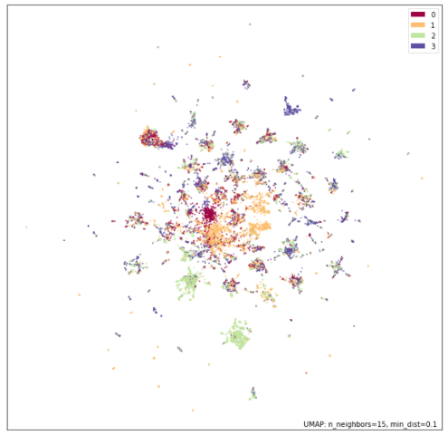

# Facebook Graph Convolutional Model (GCM)
## Introduction
This model performs supervised multi-class classification
on the [Facebook Large Page-Page Dataset](https://snap.stanford.edu/data/facebook-large-page-page-network.html). The dataset is a
graph network such that:

- Each node (n=22470) represented a verified Facebook page
- Each edge (m=171002) represented a mutual 'like' between two pages. Edges are not weighted.
- Each node had 128 features extracted from the 'page description' of 
  the given page. Descriptions were written by page owners.
  
The task was to classify each page into a category based on the
node's features, and the features of its nearest neighbours. 

The possible page categories: politicians, governmental organisations, television shows, and companies.

## The Solution
The algorithm trains a Graph Convolutional Model (GCM) neural network 
and applies it to predict the most likely category for the given nodes. Additional Feed Forward Networks (FFNs) are used to learn and apply preprocessing and
postprocessing to the inputs and outputs.

**Architecture**

The model consists of:

- Preprocessing FFN
  - Batch normalisation layer
  - Dropout layer
  - 32-node Dense layer
    
- x3 GCM layers w/ skip connections
- Postprocessing FFN
  - Batch normalisation layer
  - Dropout layer
  - 32-node Dense layer
  
- 4-node Dense layer w/ softmax (for predictions)


**How the model works**

The model works by feeding features of each node through FFNs to produce unique 
representations for each node (i.e. 'messages'). The model then applies three Graph Convolutional Layers
(GCLs) that retrieve and aggregate (by mean) the representations of any 
neighbouring nodes. Multiple GCLs means the node will have 
access to information about not just its neighbours (in iteration 1), but also the 
neighbours of _those_ neighbours (in the iteration 2), and so on.

All this information is concatenated to produce a lengthy, high-dimension array 
(or 'embedding') that represents the important information about the node and its
nearest neighbours, to be used in the final prediction. Because the embeddings can
be quite long, they are passed through another FFN that reduces each embedding to a 
32-dimension representation (just like in preprocessing). Finally, this is passed 
through a 4-node Dense layer which then calculates the probability (using Softmax) of 
each node belonging to each of the four possible page categories.

**More on Graph Convolutional Layers (GCLs)**

The key difference between GCMs and other convolutional models is the input data type. 
Unlike images which have a consistent grid structure, graphs have no fixed structure nor any 
fixed number of neighbours. Yet, the model must find some way to consider the values of features
of neighbouring nodes, and consider how the nodes themselves are connected. The GCL does 
this by aggregating the values held by neighbouring nodes (i.e. any node with an edge
connecting it to the current node), and then concatenating it to ensure each node retains
information about itself and any values of its neighbours. Because only neighbouring nodes
are aggregated, this algorithm implicitly retains information about how each node is connected.

**Skip connections**

GCLs do preprocess and truncate its inputs, which can cause an 'information
bottleneck' that causes important features extracted in earlier layers to be obscured
and lost over consecutive convolutions. Thus, this model implements skip connections 
between GCLs that combine the input and truncated output messages. This means nodes
will retain information about inputs that might otherwise be lost during processing.

**Dropout Layers**

Dropout layers exist in the FFNs to mitigate overfitting. These layers cut nodes and in
effect introduce noise into the sample, thus the model does not have access to complete
data during training (which can be memorised!).

## Output and Performance

The model necessitates that the entire graph (i.e. edges, node features, etc) is used in
training the model. However, we still must split the Dataset into a training and test set
to prevent data leakage. We do this by withholding the ground truth values for one third of 
the nodes (i.e. the test set) during training.

Below is a UMAP representation of the data set. We note some clustering of page categories.



Some example 'node id' inputs:

```
tf.Tensor([ 3969  6829 14595 ...  7335  9164 14887], shape=(7416,), dtype=int32)
```

The 'features' input:
```
tf.Tensor(
[[-0.26257643 -0.27648264 -0.26235026 ... -0.21514018 -0.3759032
  -0.22383557]
 [-0.26257643 -0.27648264 -0.26235026 ... -0.21514018 -0.36413375
  -0.12863389]
 [-0.26257643 -0.26505256 -0.26235026 ... -0.21514018 -0.3759032
  -0.22383557]
 ...
 [-0.26257643 -0.27648264 -0.26235026 ... -0.18038896 -0.37209702
  -0.22261272]
 [-0.26257643 -0.27648264 -0.26235026 ... -0.21514018 -0.3759032
  -0.21814811]
 [-0.23227507 -0.27648264 -0.26235026 ... -0.19585785 -0.3759032
  -0.2212746 ]], shape=(22470, 128), dtype=float32)
```

The 'edges' input:
```
tf.Tensor(
[[    0 18427     1 ...  5563 22425 22425]
 [18427     0 21708 ...  5563 22425 22425]], shape=(2, 342004), dtype=int64)
```

Some example outputs:
```
232/232 [==============================] - 5s 22ms/step
Total Testing 7416
Predictions [1, 3, 3, 1, 2, 1, 2, 2, 2, ... 2, 1, 2, 3]
Which Correct: tf.Tensor([ True  True  True ...  True False  True], shape=(7416,), dtype=bool)
Total Correct: 6927
Accuracy: 0.9340614886731392
```

We note a high accuracy score, likely due to the use of FFNs to 
re-project representations and skip connections to retain information that could be lost in this
process.


The above accuracy and loss curves show that after Epoch 10, the model makes marginal
but steady improvement over time (acc: 0.89 to 0.93 by Epoch 110). This is possibly
because feature data was not normalised, meaning layers would need to do additional
work to learn any underlying distributions of the data. A batch normalisation layer
would more efficiently learn this distribution and would likely learning time.

## Dependencies
- python = 3.7
- keras = 2.9.0
- matplotlib = 3.5.3
- numpy = 1.21.5
- scikit_learn = 1.1.2
- tensorflow = 2.9.1
- umap = 0.1.1
- umap_learn = 0.5.3

## References
- Node Classification with Graph Neural Networks: https://keras.io/examples/graph/gnn_citations/
- Graph Neural Networks - a perspective from the ground up: https://www.youtube.com/watch?v=GXhBEj1ZtE8
- Facebook Large Page-Page Network - https://snap.stanford.edu/data/facebook-large-page-page-network.html


  