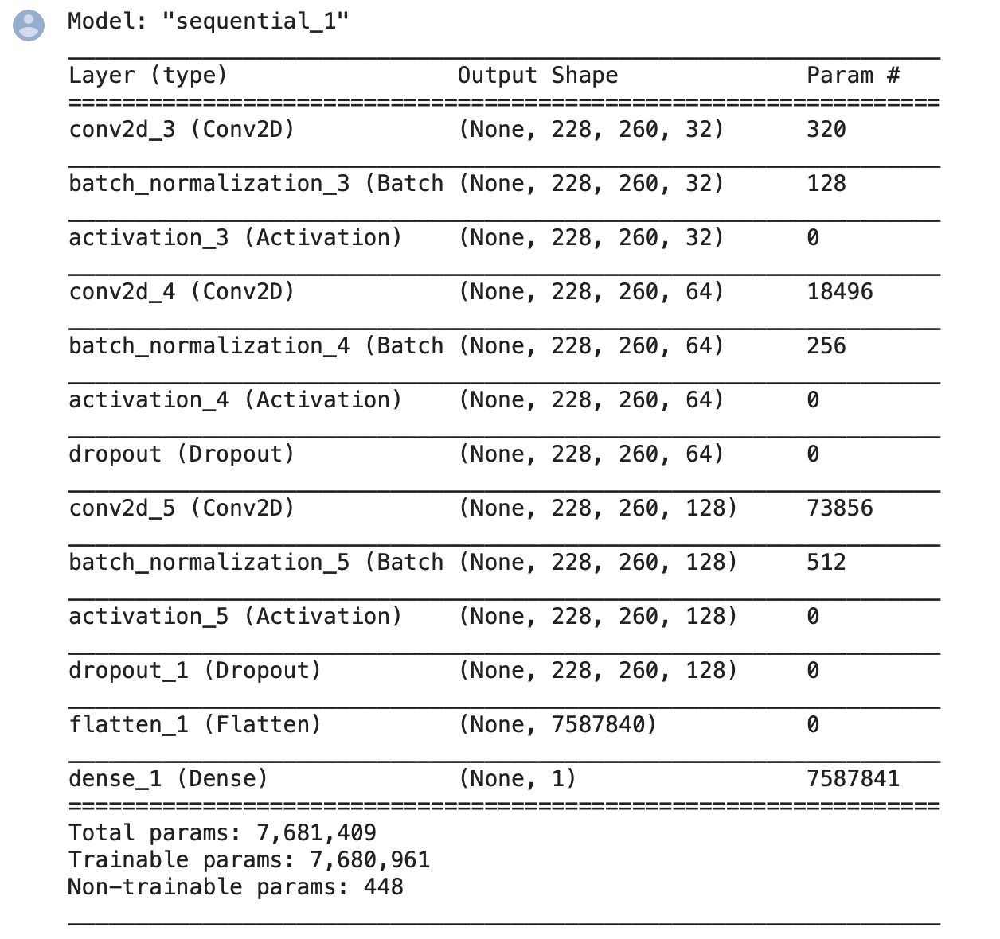
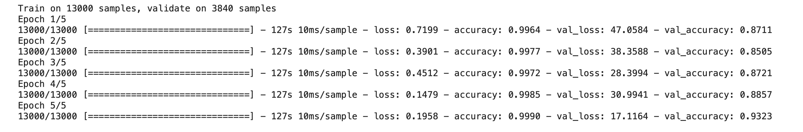
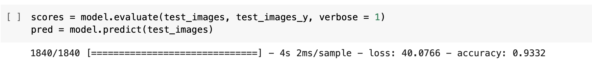
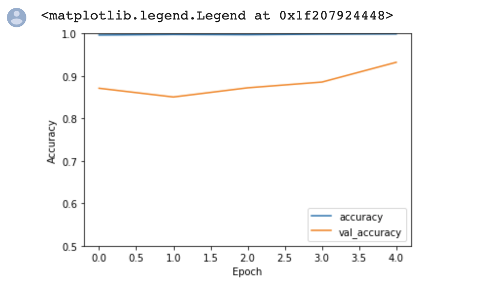
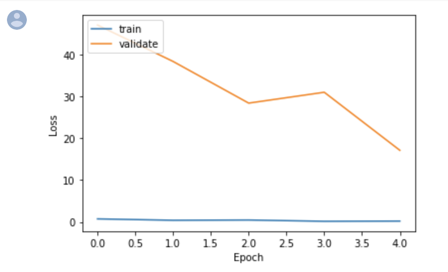
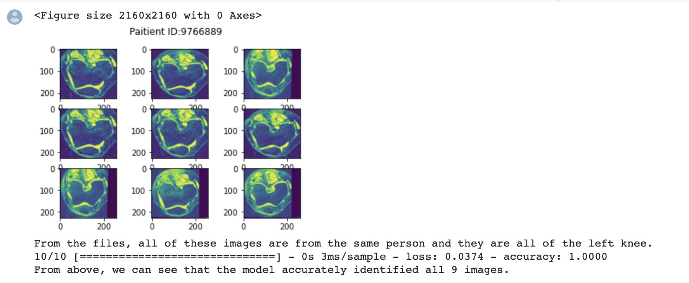
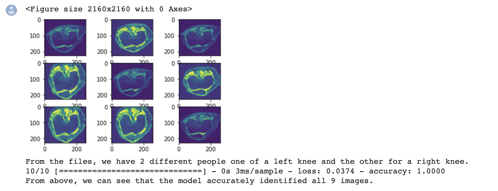

# README (Jonathan Godbold, 45339747)
Algorithm implemented for Task 2: Classify laterality (left or right sided knee) of the OAI AKOA knee data set having a minimum accuracy of 0.9 on the test set. [Easy Difficulty]

Main executable can be run from execute_script_45339747.py which calls:
* generator_script_45339747.py
* layers_script_45339747.py
* results_script_45339747.py

The script generator_script_45339747.py imports the AKOA OASIS dataset.
* Function generate_paths() parses the dataset and adds every unique patient ID to a list. Split the data into three sets: training set, validation set and testing set. Since there are 101 total patients, the data was split into sets of 70, 20 and 21, where there were 70 patients for testing, 20 patients for validation and 21 patients for testing. This was required to prevent data leakage when building the model. 
* Function generate_sets() parses the dataset and uses the list of unique IDs to get which images belong to which patient and add them to their respective set depending on their position in the unique list of IDs (train, validate, test).
* Function load_data() loads the respective images for the files in the lists above using NumPy. Note this function loads 3 of the same images due to the image format of the MRI scans supplied (this issue is resolved in the following function).
* Function loadLables() creates a set of labels for each training, validation and test sets. It does this by reading through the list of files and if the file name contains RIGHT, a 1 is allocated or if the file name contains LEFT, a 0 is allocated.
* Function formatData() normalizes and formats the data. Begin by dividing each of the training, validation and testing sets by 255, so that the sigmoid activation function in the model can interpret these values. Convert each of the Y labels in NumPy arrays as they are currently just default lists. Each of the X and Y sets were then converted to tensors for training, validation and testing.

The script layers_script_45339747.py builds a model to solve the problem.
* Function addLayer() adds a convolutional 2D layer to the model with input specified for kernel size, filters, activation function, loss, learning rate, input shape, and batch normalization.
* Function buildNetwork() creates a sequential model using keras with relu activation function for the 2D convolutional layers and sigmoid activation for the dense layer.
* Function compile_and_run() compiles and runs the model with training data and validation data.

The script results_layer_45339747.py displays the results using NumPy after the model has finished training.
* Function plotResults() displays various results from model training. First is validation loss compared to training loss. Second is loss with respect to Epoch. Finally the script outputs two NumPy models, one with one patient consisting of only left knee images and the models result on this data, and the second consisting of two patients, patient one with left knee images, patient 2 with right knee images, and the models results on these images.

The script execute_script_45339747.py is the driver script and executes the above scripts sequentially.

# Dependencies
* Functions requires Tensorflow 2.0 or higher to run & Keras.
* generator_script_4533974.py requires PIL to format data, OS for path names, and NumPy to formate data.
* layers_script_45339747.py requires no extra libraries.
* results_script_45339747.py requires NumPy and Matplotlib to display results.

# Example Outputs
* Example output from model.summary():

* Example output from training the model:

* Example output from testing the model:

* Accuracy plotted against validation accuracy with respect to epoch:

* Training loss against validation loss with respect to each epoch:

* Example 1: Patient ID 9766889 had 10 images (9 displayed) from the testing set. When we pull the corresponding labels for these images we see that they are all left knees, so we would expect our model to get approximately 93% of the images labelled accurately. From below, our model got each image correct which is very close to how we expected it to perform.

* Example 2: Two patients chosen at random from the test set. Patient 1 with images of the left knee, Patient 2 with images of the right knee. 

# Justification of Data Split
The data consisted of approximately 18 000 images with 101 different patients. To avoid data leakage (a common issue in classification tasks in medical imaging), the data was split into three groups: training, validation and testing. Training consisted of 70 patients, validation consisted of 20 patients and testing consisted of 21 patients. Their respective labels were loaded into the respective sets based on the keywords RIGHT or LEFT in the image file for each patient. This was a very successful split of the data as the model did not over-or-underfit the data and finished with 99.99% accuracy after training, and 93.32% accuracy when testing and 93.23% accuracy on the validation set. This means the model is performing successfully. 