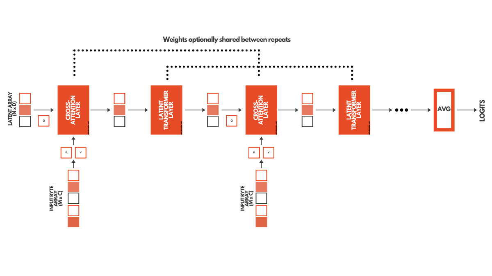

# Perceiver Model tensorflow implementation
### Author: Daniel Jones
### Description & Model explanation

The code contained in [Perceiver: General Perception with Iterative Attention](https://arxiv.org/abs/2103.03206) describes the application of the Perceiver Model. Here a perceiver model is built for lateral classification of knees from the OAI AKOA knee image dataset. This model mitigates the O(M^2) and memory bottlenecks which may occur when using transformers. This is accomplished by incorporating a cross-attention module which projects inputs onto a fixed-dimensional latent bottleneck, before utilising a stack of transformers to iterate over the latent data. In doing so, the model also iterates over the inputted data by alternating cross-attention and latent transformer blocks. A large benefit of this is the generalisation of the model to different input data types e.g. audio, photos, video.

### Data 
An important note for this data set - some training images are very similar due to them coming from the same patient. To avoid an unfair advantage the training and test splits were done carefully to ensure that each patient was only in one of the two groups. An 80/20 train/test split was used.

The script expects the Data files to be contained in ./AKOA_Analysis/AKOA_Analysis, with the images labelled as provided.

### Usage

Two files are included in this project
process_data.py - handles data grabbing
perceiver.py - build the perceiver model and plot results

Constants at the beginnging of perceiver.py establish the hyper-peramaters of the model. Calling `python ./perceiver.py`

### Dependencies
Tensorflow
Numpy
Matplotlib
Tensorflow_addons

### Results Plot
In an example running of the model, it achieved a final accuracy of 93%
