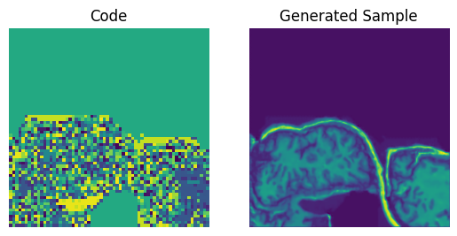

# Generative model of the preprocessed OASIS brain dataset 
The vector quantified variational auto encoder (VQ-VAE) is a variation on the traditional variational autoencoder (VAE). This model was first described in the paper "Neural Discrete Representation Learning", by van der Oord et al., in 2017. 
## Traditional VAEs
A traditional variational autoencoder network consists of three key components: the encoder, a latent space, and a decoder network. The encoder effectively compresses the data to obtain the latent space representation, which is then decoded by the decoder network. An image of a traditional VAE network is shown below

Source: https://miro.medium.com/max/1400/1*Qd1xKV9o-AnWtfIDhhNdFg@2x.png

## VQ-VAEs
The VQ-VAE differs from a traditional VAE by using a discretised version of the latent space; continuous encoder outputs are mapped (in the latent embedding space) to a series of K embedding vectors (each with dimensionality D). This mapping is done by means of a nearest-neighbour lookup (i.e., using the L2-norm). The vq encoding of the image is the input to the decoder network. 
These embedding vectors themselves are part of the learning process; the vectors are adjusted according to the l2 error terms (i.e., they are moved to more closely fit the data). 
The encoder/decoder networks learn in tandem; the encoder learns to produce optimal encodings for images, and the decoder learns to decode these, to produce accurate reconstructions from the encodings. The structure of a VQ-VAE is displayed below: 

Source: "Neural Discrete Representation Learning", by van der Oord et al., 2017.

The general intention of using the VQVAE (and, more generally, VAEs) is often for generative tasks. The purpose of this implementation was to produce novel images which replicate the appearance of the supplied dataset (in this case, the OASIS dataset). This is achieved by:
1) Training the VQ-VAE (i.e., the encoder, decoder and vector-quantiser) until reconstructed images are suitably accurate (this includes adjusting hyperparameters related to the latent space, and potentially layers within the encoder/decoder)
2) Training a model to produce latent-space encodings using sampled latent vectors
3) Sampling latent-space vectors, passing these into the model trained in (2) to produce latent-space encodings with similar structure to the actual encodings
4) Pass the created encodings to the VQ-VAE decoder to produce an image from the encoding.

For the purpose of this implementation, a PixelCNN (as per the original paper) has been utilised for (2). This model is described below.
## Pixel CNN
The PixelCNN model was described in "Conditional Image Generation with PixelCNN Decoders" in 2016 by van der Oord et al. The primary goal of the PixelCNN in this case is (as described above) to learn the distribution of encoded samples (based on the encodings of the training dataset), and use this to generate new/novel encoded representations, which can then be decoded by the decoder of the VQ-VAE. The PixelCNN is regarded as an auto-regressive model; outputs are generated by sliding a convolutional kernal over the input images (from left to right). This is achieved on a pixel-by-pixel basis; the PixelCNN generates each new pixel of the image based on the pixels which come before it (in a left to right ordering, see image). 

Source: https://towardsdatascience.com/autoregressive-models-pixelcnn-e30734ede0c1

Critically, a standard convolutional kernal in the Conv2D layer considers all of the pixels surrounding the pixel to be generated, and therefore considers pixels which come after the new pixel. This issue is overcome through the use of masking. The first type of mask (type A) is used in the first convolutional layer of the network and considers only prior pixels. The second type (type B) is used in subsequent convolutional layers and considers both prior pixels and the newly generated pixel (i.e., accounts for the pixel prediction formed by the first layer). The below graphic descibes this.

Source: https://towardsdatascience.com/autoregressive-models-pixelcnn-e30734ede0c1

## Dataset - the preprocessed OASIS MRI dataset
The datset utilised was the preprocessed OASIS brain scan dataset supplied on the blackboard site (at this link: https://cloudstor.aarnet.edu.au/plus/s/tByzSZzvvVh0hZA/download). The dataset has been preprocessed, such that all scans are centered and 256*256 pixels. The dataset contains 9664 training images, 544 testing images and 1120 validation images. The images were normalised, by dividing all values by 255.

## The Model
The produced model was based on the open-source solution available in the Keras documentation (at https://keras.io/examples/generative/vq_vae/). Modifications to this code were made, to allow processing of the data on lower-spec hardware (it is able to run on a 6GB RTX3060 Laptop GPU) - this involved adaptation of the code to utilise batching and attempts at implementing mixed-precision. Additional modifications to the structure of the CNN and VQ-VAE were also trialled, including addition of Dropout and BatchNormalisation layers, in an attempt to battle poor generalisability.

### Encoder
The encoder was a simple 3-layer convolutional neural network. Each later consisted of a 3x3 convolutional kernal, with stride 2 to downsample (halve the size of the images through each layer). The number of filters was doubled on each layer (as is fairly common in encoders). The structure was:
- Conv2D: 32 filter depth, 3x3, stride 2, relu activation (output: 128x128x32)
- Conv2D: 64 filter depth, 3x3, stride 2, relu activation (output: 64x64x64)
- Conv2D: {latent_dim} filter depth, 1x1, stride 1, relu activation (output: 64x64x{latent_dim})

Where latent_dim is the dimensionality of the latent space (e.g., images are compressed to latent_dim*latent_dim)

### Decoder
The decoder was also simple 3-layer convolutional neural network. Each later consisted of a 3x3 transposed convolutional kernal, with stride 2 (double the size of the images through each layer). The number of filters was doubled on each layer (as is fairly common in decoders). The structure was:
- Conv2D: 64 filter depth, 3x3, stride 2, relu activation (output: 128x128x64)
- Conv2D: 32 filter depth, 3x3, stride 2, relu activation (output: 256x256x32)
- Conv2D: 1 filter depth, 3x3, stride 1 (output: 256x256x1)

### Vector Quantiser
The VQ layer simply maps the flattened output of the encoder to the nearest codebook vector (according to the L2 distance). Losses for this layer are calculated based on distance to codebook vectors. 

### PixelCNN
The PixelCNN used featured 2x residual blocks and 2x masked convolutional layers:
                                                                       
- Masked convolutional layer: Type 'A' masking, 7x7 kernal (as per paper)
- 2x ResBlock Layers. These residual blocks were built using:
    - A Conv2D block
    - A masked convolutional later (type 'B' masking) with 3x3 kernel, and 64 filters. 
    - This was followed by a batch normalisation block (this was found to have a slightly beneficial impact on performance during training). 
    - This was followed by a standard Conv2D layer.
- 2x Masked convolutional layers. These layers were all type 'B' masked with 128 filters, stride 1, etc. Each of these was followed by BatchNormalisation layer (for reasons above) and a Dropout layer (0.3 dropout rate) - used in an attempt to reduce overfitting and improve performance.

### Adjustments to accomodate lower performance hardware
Several adjustments were made and attempted to reduce the computational load:
- The data was imported as a BatchedDataset (allowing batches of computations to occur more efficiently than by supplying a numpy array)
- The Keras tutorial implementation of the PixelCNN did not permit the use of batching when sampling the indices. Thus, a new class for the PixelCNN was created, to implement a custom train_step function. Ultimately, this was not successful (performance was reduced), however I learnt a lot about subclassing keras.Model.
- The PixelCNN was trained on just 2000 samples, rather than the full 9000+ samples. This is likely to have contributed to disappointing performance of the generative model
- A batching function was created to manually batch the PixelCNN indices - this simply used a generator to create batches from the existing dataset
- Mixed precision was implemented (mixed float16), and worked with the VQ-VAE, however this was ultimately reverted, as it caused issues with the calculation of several model parameters within the subclassed models, and attempts to resolve these issues led to issues calculating the loss functions (thus training would fail).
- Model weight saving/loading was implemented to allow the model to be run quickly without having to train the model each time

### Tuning
Several hyperparameters within the code were tuned in an attempt to prodcue hgiher quality results, however the most significant impact was found by adjusting the dimensionality of the latent space; it was found that smaller dimensionality resulted in reduced performance on the reconstructions, however improved the performance of of the generative component of the task; this is likely because smaller latent space forces each embedding vector to represent a more significant (i.e., it forces the embedding vectors to model the images better)

## Performance
The VQ-VAE component of the generative task performed well; it was capable of reproducing the brain scans with a SSIM averaging well above 0.8 (typically, closer to 0.95 on the tested images). A series of images, alongside their respective reconstructions, are shown below. 

The latent space representations utilised to produce these images is also shown below.

The PixelCNN generative model did not perform as hoped; the randomly generated encodings did not replicate the structure of the encodings from the brain images, and therefore the decoded images did not closely resemble real brains. Some of the generated brain models are shown below.

Notably, it appears that some aspects were retained (the 'wrinkles' in grey matter, the defined outer ring, etc.), but the shape of the brains was not learnt effectively, even when the Pixel was trained for 600+ epochs. One potential reason for this is that the model could not be trained on the full 9000+ brains in the training set; only approx. 2000 were able to be run at a time. 

## Usage
The model can be run by operating the VQ-VAE_runner.ipynb jupyter notebook. 
If it is the first time running the notebook, ensure that:
- LOAD_WEIGHTS = False
- ROOT_DIR points to the directory containing the OASIS dataset

Running the entire notebook will train both the VQVAE and the PixelCNN (if LOAD_WEIGHTS = False), and output images of:
- The original vs. reconstructed images (with SSIM)
- The encoded vs. reconstructed images
- The generated encodings vs. generated reconstructions
If LOAD_WEIGHTS = False, plots and printouts relevant to the training of the model will be output, and model weights will be saved in a folder ./model_weights (VQVAE) and ./CNNmodel_weights (PixelCNN). 

The VQ-VAE is defined in VQ-VAE.py, along with relevant methods for trainining the model with relevant parameters. The
PixelCNN is located in 
## Dependencies
- tensorflow-gpu 2.9.1
- tensorflow-probability 0.17
- matplotlib 3.5.3
- Preprocessed OASIS brain dataset, found [here](https://cloudstor.aarnet.edu.au/plus/s/tByzSZzvvVh0hZA/download)