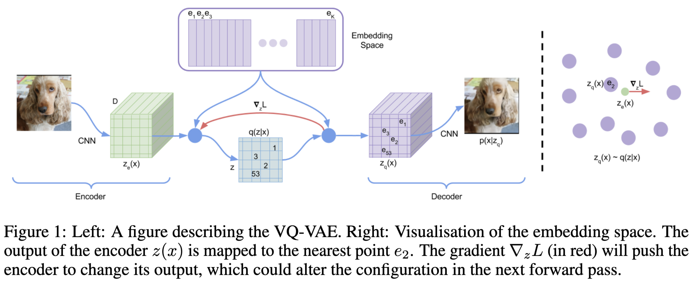

# VQ-VAE for creation of images using the OASIS Brain Dataset

***

This is our implementation of the vector quantised variable auto encoder as depicted in the paper by members of DeepMind (<https://arxiv.org/abs/1711.00937>).

We used [this implementation](https://github.com/MishaLaskin/vqvae) by [MishaLaskin](https://github.com/MishaLaskin/) as inspiration to gain an understanding of how the code works.

***

## Usage

***
#### Dependencies

- torch == 1.13.0.dev20220901
- torchvision == 0.14.0.dev20220901
- matplotlib == 3.6.0
- pillow == 9.2.0
- numpy == 1.23.3
- tqdm == 4.64.1

Can also create a conda environment from the provided environment.yml with command (WARNING: This environment is one that I use for general work and as such is bloated with libraries not necassary for this module)

```
conda env create -f environment.yml
```

or you can update the environment file with

```
conda env export > environment.yml
```

Main difference for this environment is that this script was created using the nightly version of pytorch so that I could make use of the Apple Silicon gpu and mps acceleration. If you wanted to use the normal version of pytorch prior to them making mps acceleration available then for every definition of `DEVICE` delete the `'mps' if torch.has_mps else`. This should allow for the code to function normally on a cuda gpu.

#### Reproducibility

To use this model for other datasets, place your data inside the data folder following pytorch documentation for producing a dataset using [ImageFolder](https://pytorch.org/vision/stable/generated/torchvision.datasets.ImageFolder.html#torchvision.datasets.ImageFolder).

***
## Training
***

#### VQ-VAE

The Vector Quantized - Variational Autoencoder (VQVAE) is a network that makes use of the concept of an autoencoder. A model composed of two separate models, an encoder and a decoder. The encoder takes in an image and compresses the information down to a smaller vector known as the latent space. The decoder then takes the information from the latent space and generates the original image again. This comes with some information loss but that is often negligible when both the encoder and decoder have been trained properly.

The vector quantisation component is the ability to then take this latent space and turn what were all continuous values into discrete values creating a codebook in place of the latent space and training the decoder on this instead. This has been found to produce clearer images, reducing the information loss.



Above describes the encoding process to a latent space as well as the quantisation step and then the decoding process.

The Models used for encoder and decoder as well as all other models can be found in the `modules` directory

Once an embedding space or codebook has been trained, we use a Pixel CNN to generate a codebook these generated codebooks are then parsed to the decoder to generate unique images. Typically the better trained the Pixel CNN the more unique items within the image are created.

My Pixel CNN model is defined as
