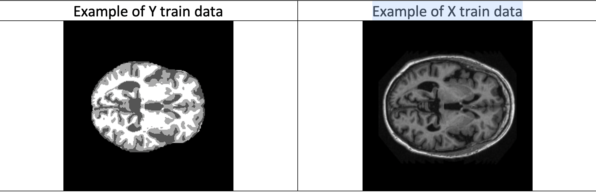
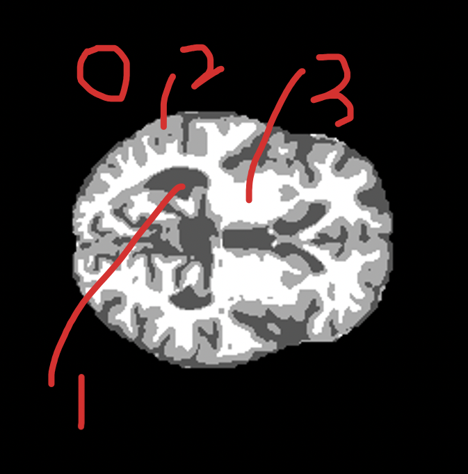
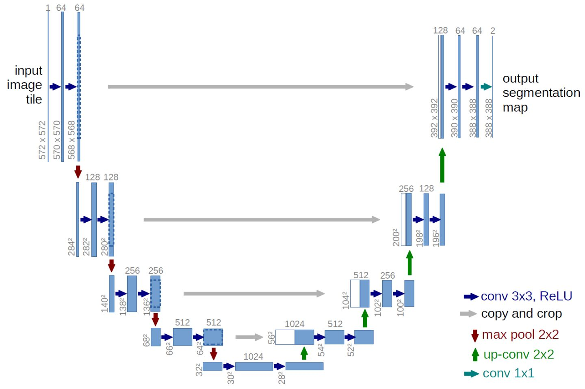
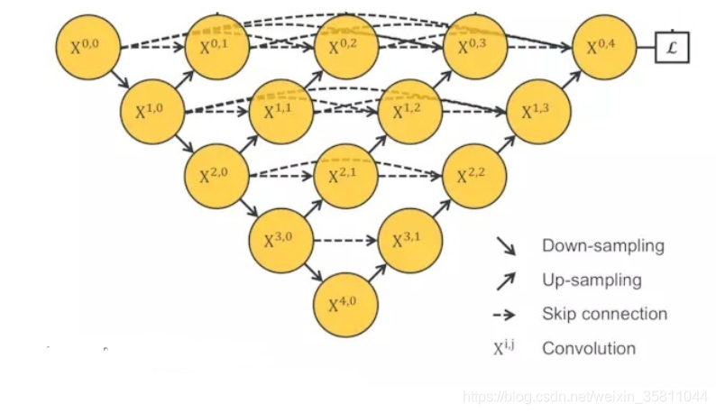
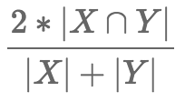
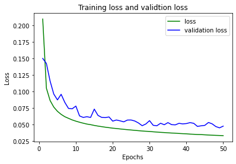

# Image Segmentation Task
Task: Segment the OASIS brain data set with an Improved UNet with all labels having a minimum Dice
similarity coefficient of 0.9 on the test set.

[Data resource](https://cloudstor.aarnet.edu.au/plus/s/n5aZ4XX1WBKp6HZ): magnetic resonance (MR) image of the brain from OASIS dataset.

# Load Dataset
x_train dataset has 9664 images which are 256*256 pixels(black and white photo)

x_test dataset has 544 images which are 256*256 pixels(black and white photo)

y_train (labels) has 9664 images which are 256*256 pixels(black and white photo)

y_test (labels) has 544 images which are 256*256 pixels(black and white photo)



# Data preparation

 Using **sorted function** to sort each dataset to make sure that each picture can correspond to the corresponding label. After that, using **reshape function** to make x_train data and x_test data into 4 dimensions for instance (9664,256,256,1) and (544,256,256,1), and then divide training data and test data by 255 to achieve **normalization**. In y_train data and y_test data has 4 unique number which are 0, 85, 170 and 255, and dividing y_train data and y_test_data by 85 to make 4 labels which are 1, 2, 3 and 4.


### 4 labels which are:
* 0 - Background
* 1 - CSF (cerebrospinal fluid)
* 2 - Gray matter
* 3 - White matter

# For example:


# Unet Model

The shape of Unet network structure is similar to U like the picture above. It contains convolution and pooling layer. The left half is the encoder which is down-sampling in the traditional classification network, and the right half is the decoder is the up-sampling. The gray arrow in the middle is a jump connection, which captures the shallow features with the deep features, because the shallow layer can usually capture some simple features of the image, such as borders and colors. The deep convolution operation captures some unexplainable abstract features of the image. It is best to use the shallow and deep at the same time, while also allowing the decoder to learn to lose relevant features in the encoder pooling downsampling.

# UNET++

* The blue and green parts are the parts added by Unet++ to UNet. There are L1, L2, L3 and L4 on the right, these are the settings of Unet++ for different depths of the network. The green arrow indicates up-sampling, the same as UNet, and the black down arrow indicates down-sampling, the same as UNet.
* The blue arrow indicates skip connection, and each level is a very standard DenseNet structure. Each prototype unit represents a series of operations of convolution + activation function.

# Prediction results
The plot below shows the prediction results and y_test_label truth pictures


# Dice_Cofficient
The Dice coefficient is a ensemble similarity measurement function, usually used to calculate the similarity of two samples, with a value range of [0,1]:

Where |X∩Y| is the intersection between X and Y, and |X| and |Y| sub-tables represent the number of elements of X and Y. Among them, the coefficient of the numerator is 2, because the denominator has repeated calculations of X and Reasons for common elements among Y.
# Dice Loss
Dice loss = 1 - dice_coefficient

The use of Dice Loss and the sample are extremely unbalanced. If Dice Loss is used under normal circumstances, it will have an adverse effect on back propagation and make training unstable.

Because the background color 0 accounts for more than 80%. It is a severely unbalanced data. So we need to use dice coefficient to evaluate the model.

# The result

dice_coefficient: 0.9552 which achieves our goal and the performance is good.

Using command below to save the best result
```python
model_checkpoint_callback = tf.keras.callbacks.ModelCheckpoint(
    filepath=checkpoint_path,
    save_weights_only=True,
    monitor='val_loss',
    mode='min',
    save_best_only=True)
```

Each label's dice coefficient score from 0 to 3:
[0.99867845, 0.9177439 , 0.9392264 , 0.9650791 ]


When the epoch increases, the distance between training loss and val_loss also increases, which means that the model will overfitting after keep training.

The plot below shows how dice_coefficient changes during training


