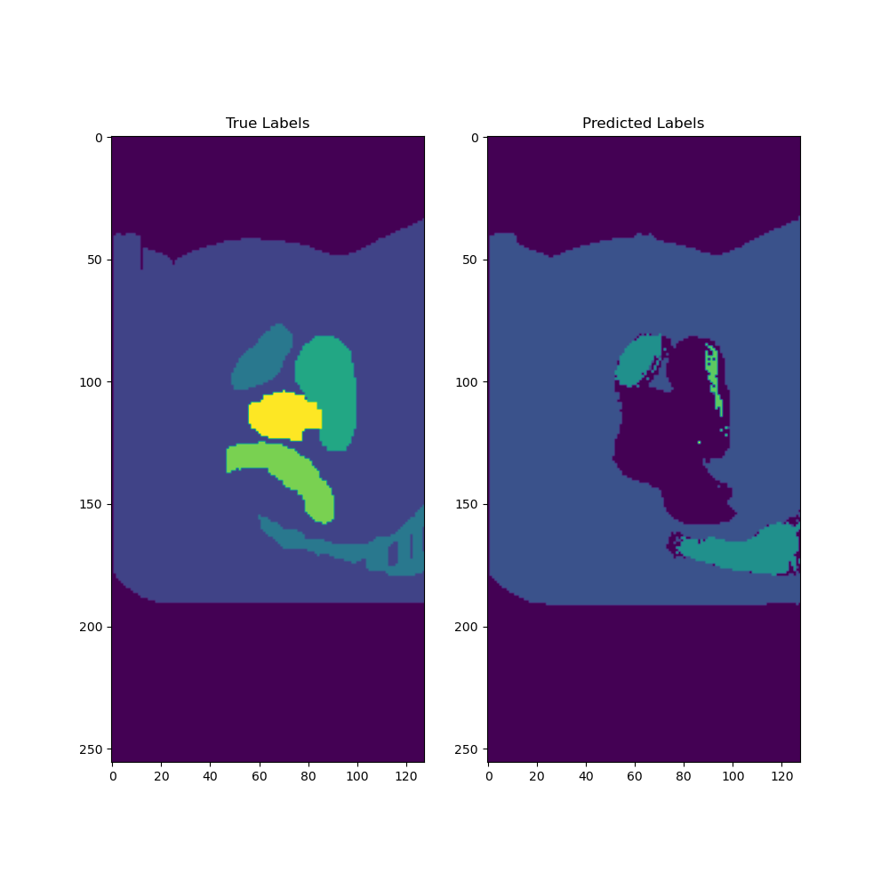

# Segmenting the Prostate 3D Data Set With a 3D U-Net
Joshua Knowles - 45525803

## Purpose

The purpose of this report was to build a deep learning model that takes a 3D MRI image of a male pelvis and segment the image into a number of classes.
The model used was based on the 3D U-Net model, described below.

## Dependencies

The following Python packages were used to load/process the data and train/test the model.

- [Tensorflow](https://www.tensorflow.org/) 2.4.1
- [NumPy](https://numpy.org/) 1.21.2
- [nibabel](https://nipy.org/nibabel/) 3.2.1
- [Matplotlib](https://matplotlib.org/) 3.4.3 (for plotting results only)
- [pyimgaug3d](https://github.com/SiyuLiu0329/pyimgaug3d)

## Model

The 3D U-Net model was implemented in Tensorflow as described in the paper [3D U-Net: Learning Dense Volumetric Segmentation from Sparse Annotation](https://arxiv.org/abs/1606.06650). However, the number of filters in each 3D convolution layer was reduced by a factor of 16.

## Data

The dataset used to train and test the model was the ["Labelled weekly MR images of the male pelvis"](https://data.csiro.au/collection/csiro:51392v2) dataset provided by CSIRO. This dataset comprises of 38 cases, each with a varying amount of observations over a number of weeks. Each feature and label are (256 x 256 x 128) 3D images, with the labels consisting of 6 classes.

## Training and Evaluation

In order to prevent leakage, the training and test datasets are split based on case numbers. Case numbers 4-34 were used for training the model, and case numbers 35-42 were used for testing the model.

`driver.py` trains the model and `test.py` tests the model on the latest model checkpoint. The paths set as global constants at the top of each file should be modified to the appropriate paths.

The metric used for training / validation and testing is the Sørensen–Dice coefficient (SDC).
For training / validation, the average SDC over all 6 labels was used as a metric.
For testing, the SDC for each class was calculated for the 21 test cases.

## Results

The model was trained for 13 epochs.
A plot of the average DSC on the validation data at each epoch is shown in the figure below.


Summary statistics of the DSC for each class of the 21 test cases are given below.
The model segmented the first 3 classes well, but the rest were unable to be segmented.

```
=== Label 1 ===
Minimum DSC: 0.9969531297683716
Maximum DSC: 0.99917072057724
Mean DSC: 0.9980386609122867

=== Label 2 ===
Minimum DSC: 0.9307863116264343
Maximum DSC: 0.9828008413314819
Mean DSC: 0.9752681794620696

=== Label 3 ===
Minimum DSC: 0.7267266511917114
Maximum DSC: 0.84760582447052
Mean DSC: 0.8218630154927572

=== Label 4 ===
Minimum DSC: 0.0
Maximum DSC: 0.1329772025346756
Mean DSC: 0.04745206642214076

=== Label 5 ===
Minimum DSC: 0.0
Maximum DSC: 0.0
Mean DSC: 0.0

=== Label 6 ===
Minimum DSC: 0.0
Maximum DSC: 0.0
Mean DSC: 0.0
```

Two examples of the true and predicted segmented images are shown below.
Unfortunately the colours for the predicted classes do not exactly match the true classes, but the segmentation can be identified.




## Discussion

Overall, the model performed relatively poorly and did not achieve the required 0.7 DSC for each class, but the results were beginning to show correct segmentation of the data. Perhaps training the model for more epochs would see further improvements, but there are a number of other improvements that could be made.

### Improvements

- Data augmentation was not used to produce more data to train the model. However, the methods used to apply pyimgaug3d's GridWarp augmentation to the original data and save the new augmented data are included in this code base. `driver.py` can be quickly updated to use this "new" data.
- Downsampling should have been used in order to train the model faster. The sizes of the MRI images were too large for the model to fit in memory on the cluster using the number of filters specified in the 3D U-Net paper. This would also allow the number of filters in the convolutional layers to be increased, likely improving the performance of the model.
- The plot of the average DSC at each epoch shows that improvements to the model were not slowing down, and hence training the model for longer likely would have helped.