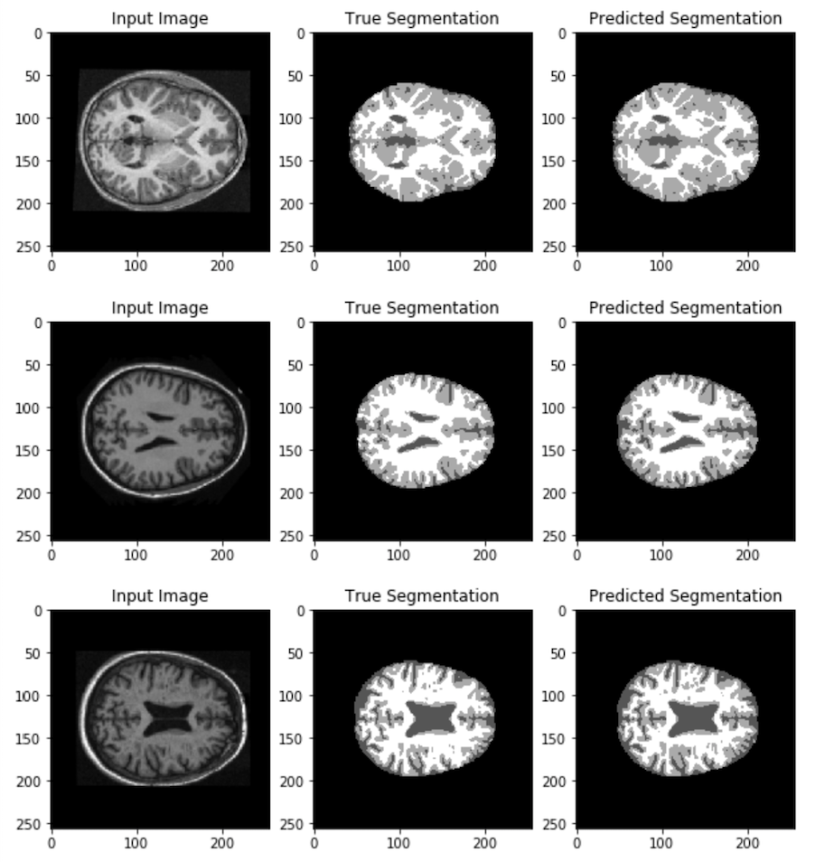

Aghnia Prawira (45610240)
# Segmenting the OASIS brain dataset with an Improved UNet

This script segments the OASIS brain dataset with an Improved UNet model. All labels should have a minimum Dice Similarity Coefficient of 0.9 on the test set.

## Improved UNet
The Improved UNet model is a variation on the standard UNet model as defined by "Brain Tumor Segmentation and Radiomics Survival Prediction: Contribution to the BRATS 2017 Challenge" [1].


## Dice Similarity Coefficient (DSC)
Dice similarity coefficient (DSC) is a statistic used to measure the similarity between a predicted image and the ground truth. It can be expressed as:

```
DSC = 2 * number of overlapping pixels / total number of pixels in both images
```

DSC is a good measure for images with class imbalance such as the OASIS brain dataset, where the background class is much larger than the other classes.

DSC of each label in a prediction set:
```
def dice_coefficient(y_true, y_pred):
    intersection = k.sum((y_true * y_pred), axis=[1,2,3])
    y_true_sum = k.sum(y_true, axis=[1,2,3])
    y_pred_sum = k.sum(y_pred, axis=[1,2,3])
    coefficient = (2.0 * intersection) / (y_true_sum + y_pred_sum)
    return coefficient
```

The DSC for **all** labels is simply the average of the above.

## Dependencies
- python (3.7.6)
- tensorflow (2.3.0)
- matplotlib (3.3.2)
- Preprocessed OASIS brain dataset from https://cloudstor.aarnet.edu.au/plus/s/n5aZ4XX1WBKp6HZ

## Usage
Run:
```
python driver_script.py
```
In this script, the assumed path to the dataset folder is `keras_png_slices_data/`.
Path can be changed in the `dataset_path` variable in `driver_script.py`.

Note that the script will only continue running after the generated plot window is closed. There are two generated plots in total: DSC plot and predicted images (see below).

## Result
Training is done with:
- 9664 training images
- 1120 validation images
- 544 testing images
- 8 epochs
- batch size 20

Output:

**Training and validation DSC**


**DSC on the testing set**


**Prediction result on the testing set**


## References
[1] F. Isensee, P. Kickingereder, W. Wick, M. Bendszus, and K. H. Maier-Hein, "Brain Tumor Segmentation and Radiomics Survival Prediction: Contribution to the BRATS 2017 Challenge," Feb. 2018. [Online]. Available:
https://arxiv.org/abs/1802.10508v1
