Name: Alexander Bayusuto Wanengkirtyo

Student ID: 45616738

# OASIS brain data set with an Improved UNet (1)

## Model:

 
	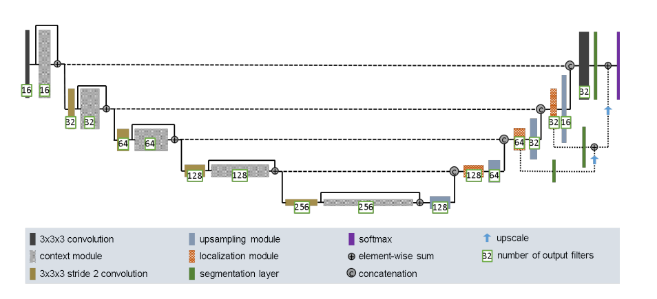

Following the UNET design[1] from <https://arxiv.org/pdf/1802.10508.pdf>. The UNET consists of 2 main parts, the left part considered as the contracting path where the resolution of the images are decreased. This is done by the convolutional layers with a stride of 2, essentially halving the resolution each time. This is followed by a context module which consists of 2 3x3x3 convolutional layers with a dropout layer in between the 2 to prevent overfitting. This repeats 3 more times. Afterwards is the second part, the right part is called the expansive part which reconstructs the image back to its original resolution. This is done by Upsampling the image. As it does this, the image is concatenated by a part from the contracted path in order to get a more accurate prediction of what it should look like. After a localization module is used, which consists of 2 more convolutional layers. This process is similarly repeated 3 more times in order to gain the original shape. While the paper states, "Throughout the network we use leaky ReLU nonlinearities with a negative slope of 10^−2 for all feature map computing convolutions", I applied only a few LeakyRelu at an alpha value as stated of 0.01 because when I it applied too many of them, it caused a Resource Error when training started. Therefore, I limited the calls of LeakyRelu to around the middle of the left part, the center and the middle of right part.

**Context Module**
- BatchNormalization
- Conv2D 3x3
- dropout layer (drop rate = 0.3)
- Conv2D 3x3
- Leaky ReLU nonlinearities with a negative slope of 10^−2 (sometimes)

**Localization Module**
- Conv2D 3x3 with Leaky ReLU as activation function
- Conv2D 1x1 with Leaky ReLU as activation function

## Training Parameters:
For the loss and metric I have changed it to use a Dice Coefficient as the problem demanded. 

Originally, I was using the DSC = (2|X intersect Y|) / (|X|+|Y|). 

 
	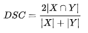
  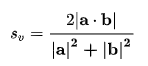

This however peaked at around 0.85, after changing it to the vector version of the formula s = (2|a .* b|)/(|a|^2+|b|^2) the dice coefficient finally broke past the 0.9 mark. The loss function was simply 1 - s. For the opitimizer, using the original adam optimizer was sufficient as before switch to the vector dice, changing the learning rate did not really help improve the limit of the dice coefficient. 

## Final Output of Dice Coefficient:
After 5 epochs, it seemed the limit of using my current model peaked at a dice coefficient of 0.9907 during training.

 
	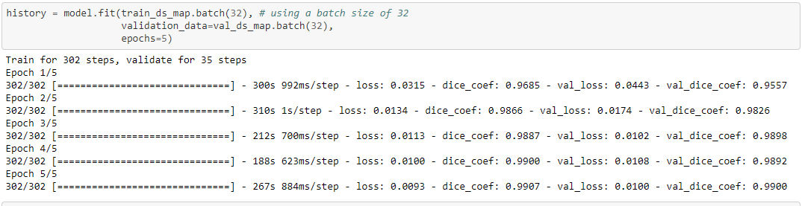

While evaluating using the test set, the dice coefficient was 0.9904.

 
	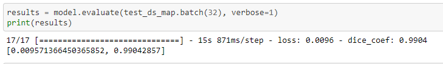

## Comparison between predicted and actual test data

<table>
  <tr>
    <th>Labels</th>
    <th>Predicted</th>
    <th>Test Segmented Image</th>
  </tr>
  <tr>
    <td>0 - Background</td>
    <td>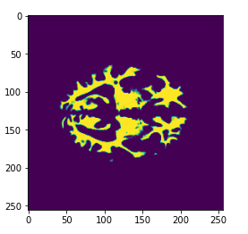</td>
    <td>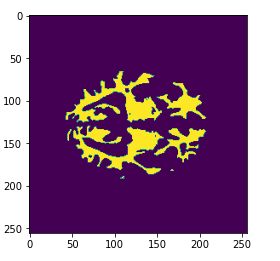</td>
  </tr>
  <tr>
    <td>1 - CSF</td>
    <td>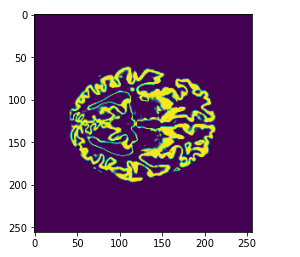</td>
    <td>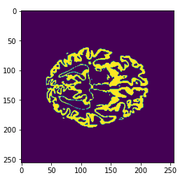</td>
  </tr>
  <tr>
    <td>2 - Gray matter</td>
    <td>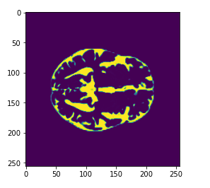</td>
    <td>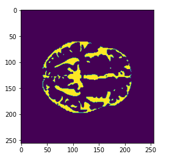</td>
  </tr>
  <tr>
    <td>3 - White matter</td>
    <td>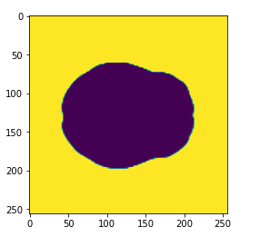</td>
    <td>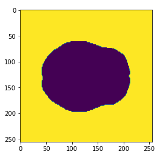</td>
  </tr>
  <tr>
    <td></td>
    <td>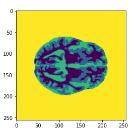</td>
    <td>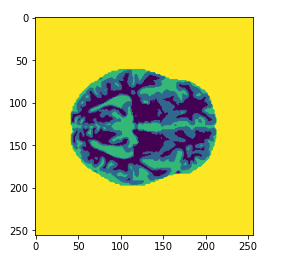</td>
  </tr>
</table>

From these comparisons, we can see that the predicted as a very high degree of similarity with the test images given its 0.9904 dice coefficient across all labels and the final output.

The plot of the model is in the Models_and_functions.ipynb file, plot of predictions vs test segmented images are in the Driver.ipynb and images.

## Dependancies:

- Python
- Tensorflow
- Matplotlib

## Reference:

[1] F. Isensee, P. Kickingereder, W. Wick, M. Bendszus, and K. H. Maier-Hein, “Brain Tumor Segmentation and
Radiomics Survival Prediction: Contribution to the BRATS 2017 Challenge,” Feb. 2018. [Online]. Available:
<https://arxiv.org/abs/1802.10508v1>
