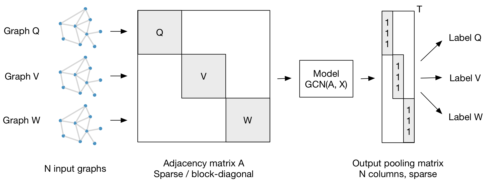
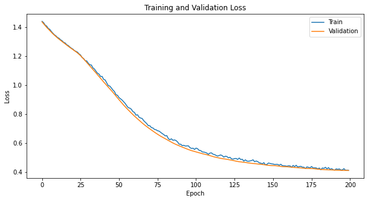
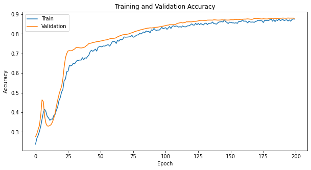
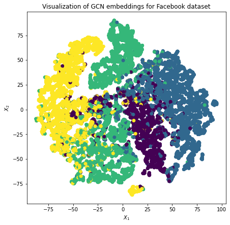

# Multi-layer GCN on Facebook Large Page-Page Network Dataset

## Introduction to GCN:
GCN is a neural network for a graph data. The graph consists of two components: nodes and edges. Each node in the graph have features. Our task is to label each node with given categorical class (Node Classification).

## How GCN Works in General:
1. Create N by N adjacency matrix (N is nodes number)
2. Create N by D matrix (D is features number)
3. Normalize the adjacency and the features matrix
4. Create a Two Layer Graph Convolutional Network
5. Train & test the dataset

## Dependencies Required:
- Python
- Numpy
- Pytorch
- Matplotlib
- Sklearn
- Scipy
- Pandas

## Results:
#### Loss Plot

#### Training Plot

#### Node embeddings

## Reference
[1] https://arxiv.org/abs/1609.02907
