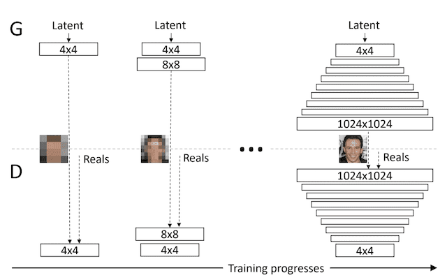
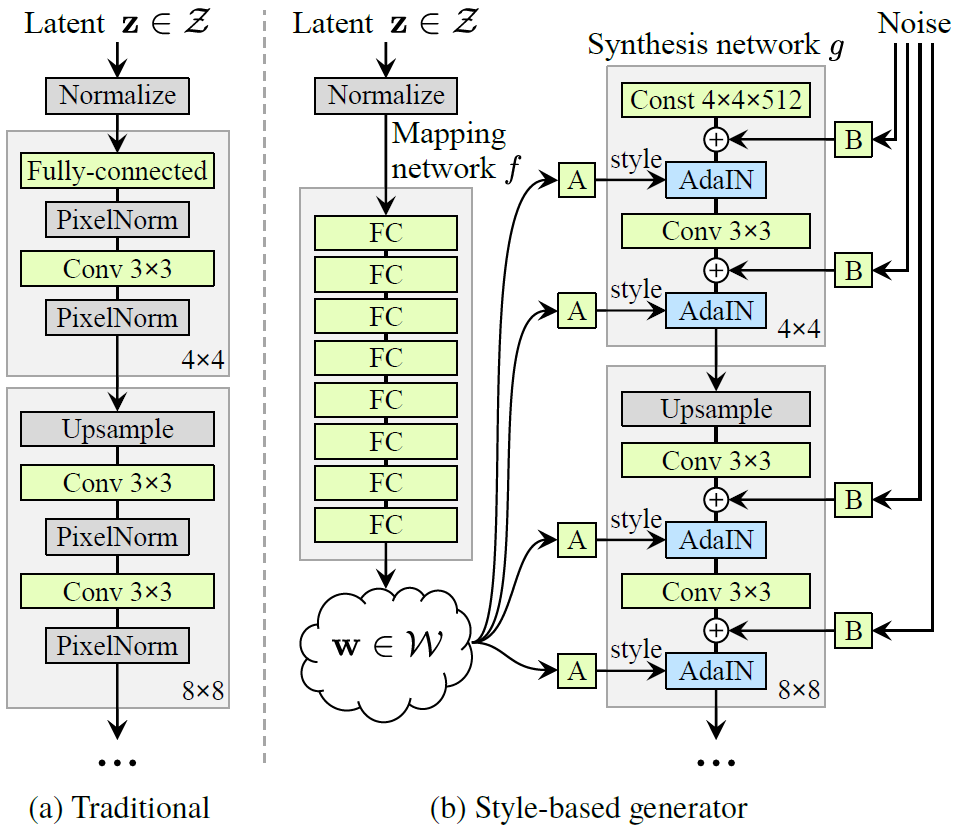
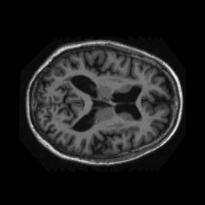
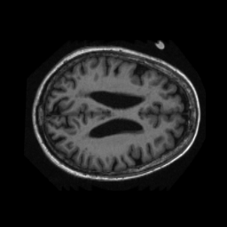
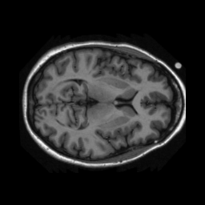
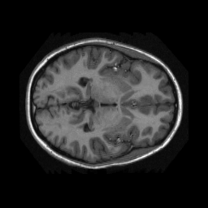
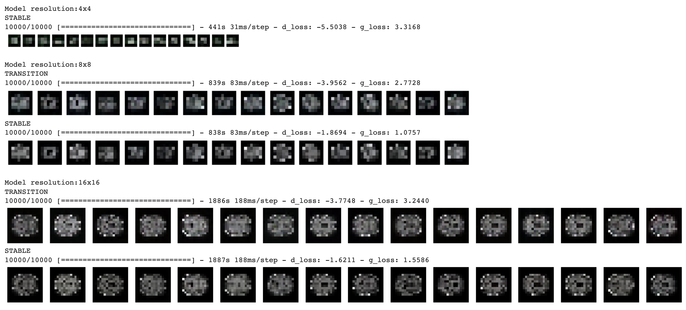
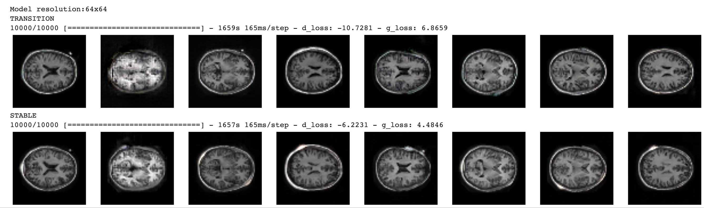
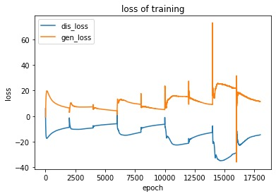

# Generator Model of the OASIS Brain dataset Using StyleGAN

This project aims to use the OASIS brain dataset to train StyleGAN and generate clear images.
It is worth noting that the given dataset has been divided into training set, test set and validation set.

## Introduction

### GAN

Generative Adversarial Networks, are an effective approach for training deep convolutional neural network models for generating synthetic images.

Training a GAN model involves two models: a generator used to output synthetic images, and a discriminator model used to classify images as real or fake, which is used to train the generator model. The two models are trained together in an adversarial manner, seeking an equilibrium.

### Progressive growing GAN

Progressive Growing GAN uses a generator and discriminator model with the same general structure. The key of progressive growing GAN is it starts with small images, like 4×4 pixels. This is because training results on small images are more stable.

New convolutional layers are systematically added to generator model and discriminator models during training.

The incremental addition of the layers allows the models to effectively learn coarse-level detail and later learn ever finer detail, both on the generator and discriminator side.

    
     
    <em>Example of Progressively Adding Layers to Generator and Discriminator Models.</em>

### StyleGAN

- The StyleGAN uses generator and discriminator models of the progressive growing GAN training method when training, so it also starts with small images.

- The first point of deviation in the StyleGAN is that bilinear upsampling layers are unused instead of nearest neighbor which progressive growing GAN uses.

- Next, a standalone mapping network is used that takes a randomly sampled point from the latent space as input and generates a style vector.
The style vector is then transformed and incorporated into each block of the generator model after the convolutional layers via an operation called adaptive instance normalization or AdaIN.
The AdaIN layers involve first standardizing the output of feature map to a standard Gaussian, then adding the style vector as a bias term.

-  The model has size of input is 4x4x512 in order to begin the process of image synthesis.

- Add noise to each activation map.  Different noise is generated for each block and is interpreted using per-layer scaling factors. These noises will generate some random variation to make the generated image more realistic

    
     
    <em> traditional GAN generator vs StyleGAN generator.</em>

## Requirments

- Windows or Linux OS
- python 3.8
- tensorflow 2.9.2
- matplotlib 2.2.3
- numpy 1.23.1
- good gpu, what I used is colab premium gpu.

## OASIS brain dataset

The Open Access Series of Imaging 's neuroimaging dataset of the brain.

Below are some examples.

## Executing Code

### Files include

- modules.py: The model itself, including the utility function discriminator and generator, etc.
- train.py: All code for training the model.
- predict.py: Take input and give visualisations of result with trained model.

### Train the model:
    python train.py 

### Use the model to predict:
    python predict.py [input_path] 

where the [input_path] is the path of the input.

## Result

### Training process

It can be observed that with the gradual increase in resolution and continuous training, the resulting images become more and more stable.

### Final image with 64x64 resolution

### Losses
Due to the limitation of the machine, I cannot use more epochs in the higher resolution case. However, from the limited data we can conclude that with continuous training, the loss of the generator discriminator converges.Note that the epochs number of each resolution of this chart is 2000

## References

https://machinelearningmastery.com/introduction-to-style-generative-adversarial-network-stylegan/

https://machinelearningmastery.com/introduction-to-progressive-growing-generative-adversarial-networks/

https://github.com/keras-team/keras-io

https://github.com/NVlabs/stylegan

http://www.oasis-brains.org/

