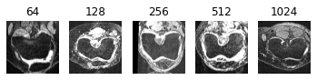
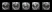
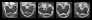
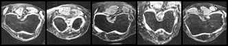
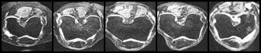
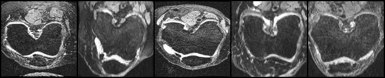
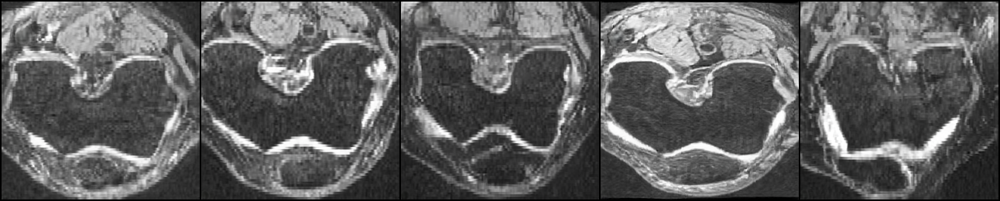
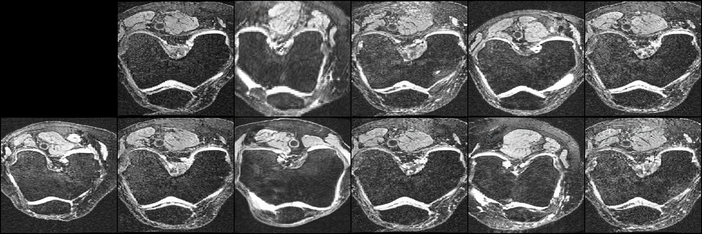

# StyleGAN in Pytorch on AKOA Analysis Dataset    

This report follows the implementation of [rosinality](https://github.com/rosinality/style-based-gan-pytorch), thanks for rosinality's wonderful and detailed works. It helps me understand a lot of details of StyleGAN.  

[[1] A Style-Based Generator Architecture for Generative Adversarial Networks](https://arxiv.org/abs/1812.04948)  
[[2] Progressive Growing of GANs for Improved Quality, Stability, and Variation](https://arxiv.org/abs/1710.10196)  
[[3] Improved Training of Wasserstein GANs](https://arxiv.org/abs/1704.00028)  
## Introduction to StyleGAN<sup>[1]</sup>   

    

StyleGAN focuses on modifying the generator, the discriminator used is almost the same with Progressive GAN<sup>[2]</sup>.  
### B Bilinear Interpolation
Based on Progressive GAN, StyleGAN uses bilinear interpolation in both generator and discriminator instead of the nearest interpolation. In implementation, a combination of bilinear interpolation and deconvolution is used in generator, a combination of bilinear interpolation and convolution is used in discriminator. By these combinations, StyleGAN can be faster and more memory-efficient.  
### C Mapping Network and Styling   
In traditional GAN (a), when the network goes deeper, the performance of the latent code z will fade away and the feature space will entangle. Since the latent code z is a random tensor generated by Gaussian distribution, if we directly use this to upsample from feature space through generator, the result image may combine some non-existing feature pairs. Consequently, StyleGAN firstly introduces the mapping network which is 8 fully-connected layers in (b) to map z into an intermediate feature space and disentangle them. In implementation, the mapping network consists of __PixelNorm + 8 * (EqualLinear + LeakyReLU)__. To capture the style of the latent code, StyleGAN introduces Adaptive Instance Normalization (AdaIN). Intuitively, it will replace parameters gamma and beta learned by affine transform in Instance Normalization with the mean and the variance of the style image(s). It is like StyleGAN will not need to learn gamma and beta directly, in implementation, AdaIN consists of __InstanceNorm + EqualLinear__.       

    

### D Constant Input of Synthesis Network    
In the experiment of StyleGAN, it is proven that the input of the first layer will not influence the result. So, the input is set as Gaussian noise with dimension __batch size * 4 * 4 * 512__, that is [ConstantInput in model.py](model.py#L297)  
### E Noise of Stochastic Variation    
StyleGAN adds a noise scaled to all layers to generate some stochastic variation which will influence some details. But it will not influence the whole style.   
### F Mix Regularization   
As the first image shown, only one latnet code is input to the mapping network, but we can have two inputs and mix their styles. StyleGAN uses one latent code w1 to generate and apply style in lower resolution, after alpha reaches 1 and it moves to next higher resolution, the other latent code w2 will be applied to add another style. In implementation, we can set "--mixing" to use two latent codes during training.   

    

## Introduction to WGAN-GP Loss<sup>[3]</sup>    
A common problem of GAN is instability during training. WGAN proposed Wasserstein-1 distance is suitable for GAN, this requires the discriminator to meet Lipschitz constraint which means the gradient cannot exceed to a certain constant. To guarantee this constraint, WGAN applies weight clipping. However, this weight clipping sometimes makes discriminator fails to converge. Consequently,  WGAN with gradient penalty (WGAN-GP) is proposed. WGAN-GP adds a gradient penalty based on WGAN, this penalty can enforce L2 norm of the discriminator approximates to L1 norm. In original StyleGAN, they apply WGAN-GP loss on CELEBA-HQ dataset, another loss on FFHQ dataset. Here, I used WGAN-GP.       

## Usage  
- ### Requirements 
  |       | preprocessing.py | train.py | test.py |
  | ------ | ----------- | --------|---------|
  | Library | zipfile <br> io <br> multiprocessing<br> functools<br> PIL<br> lmdb<br> tqdm <br>torchvision |io<br> lmdb<br> PIL<br> os<br> argparse<br> random<br> math<br> tqdm<br> torch<br> time |torch<br> torchvision<br> matplotlib<br> math<br> argparse|
- ### Preprocessing   
  StyleGAN will firstly train images with lower resolutions, with the growth of epoch (or phase in this implementation), alpha rises gradually. After alpha reaches 1, StyleGAN can smoothly and steadily move to training next higher resolution. Consequently, the dataset should have all images with all resolutions (8,16,32,64,128,256,512,1024). Here, use Lightening Memory Mapped Database Manager to store the preprocessed images.   
  - input: a __zip__ file of AKOA Analysis png images, each one is about 128 KB.  
  - output: a folder named __AKOA_PRE__ containing two files, data.mdb and lock.mdb.  
  ```python
  python preprocessing.py
  ```
- ### Training   
  Before training, preprocessing.py must be executed. The path to dataset should be the output of preprocessing.py.  
  - input: path ot dataset, when training on high resolutions, "--sched" should be considered, this argument is to reduce batch size and adjust learning rate of higher resolutions. "--mixing" is to use mix regularization during training.  
  - output: checkpoint folder: training model with different step (e.g. train_step-2 for resolution 8); g_running model, because training model is only stored when this resolution is done, higher resolution will take much more time, this model can be as a checkpoint for discrete training.  
            sample folder: sample images generated during training.  
  ```python
  python train.py [path/to/dataset] --sched --mixing
  ```
  or training from a checkpoint,  
  ```python
  python train.py [path/to/dataset] --sched --init_size [resolution of ckpt] --ckpt [path/to/ckpt] --mixing
  ```
- ### Testing    
  - input: path to a checkpoint, the resolution must match the resolution of checkpoint.  
  - output: two grid images with/without mixing regularization.  
  ```python
  python test.py [path/to/checkpoint] --size [resolution]
  ```

## Result   
Original Real Images  
  
Fake Images  
resolution 8: 2KB  
   
resolution 16: 4KB  
   
resolution 32: 41KB  
    
resolution 64: 41KB  
  
resolution 128: 139KB  
   
resolution 256: 409KB

style mixing on resolution 256  


