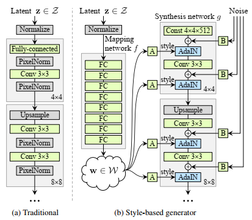
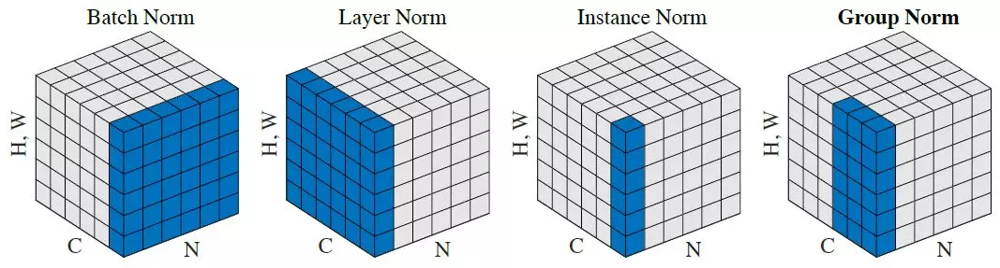
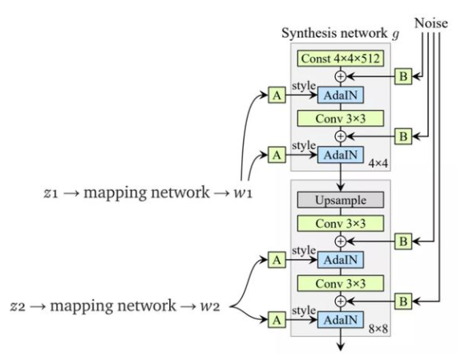

# StyleGAN in Pytorch on AKOA Analysis Dataset    

This report follows the implementation of [rosinality](https://github.com/rosinality/style-based-gan-pytorch), thanks for rosinality's wonderful and detailed works. It helps me understand a lot of details of StyleGAN.  

[[1] A Style-Based Generator Architecture for Generative Adversarial Networks](https://arxiv.org/abs/1812.04948)  
[[2] Progressive Growing of GANs for Improved Quality, Stability, and Variation](https://arxiv.org/abs/1710.10196)  
[[3] Improved Training of Wasserstein GANs](https://arxiv.org/abs/1704.00028)  
## Introduction to StyleGAN<sup>[1]</sup>   

    

StyleGAN focuses on modifying the generator, the discriminator used is almost the same with Progressive GAN<sup>[2]</sup>.  
### B Bilinear Interpolation
Based on Progressive GAN, StyleGAN uses bilinear interpolation in both generator and discriminator instead of the nearest interpolation. In implementation, a combination of bilinear interpolation and deconvolution is used in generator, a combination of bilinear interpolation and convolution is used in discriminator. By these combinations, StyleGAN can be faster and more memory-efficient.  
### C Mapping Network and Styling   
In traditional GAN (a), when the network goes deeper, the performance of the latent code z will fade away and the feature space will entangle. Since the latent code z is a random tensor generated by Gaussian distribution, if we directly use this to upsample from feature space through generator, the result image may combine some non-existing feature pairs. Consequently, StyleGAN firstly introduces the mapping network which is 8 fully-connected layers in (b) to map z into an intermediate feature space and disentangle them. In implementation, the mapping network consists of __PixelNorm + 8 * (EqualLinear + LeakyReLU)__. To capture the style of the latent code, StyleGAN introduces Adaptive Instance Normalization (AdaIN). Intuitively, it will replace parameters gamma and beta learned by affine transform in Instance Normalization with the mean and the variance of the style image(s). It is like StyleGAN will not need to learn gamma and beta directly, in implementation, AdaIN consists of __InstanceNorm + EqualLinear__.       

    

### D Constant Input of Synthesis Network    
In the experiment of StyleGAN, it is proven that the input of the first layer will not influence the result. So, the input is set as Gaussian noise with dimension __batch size * 4 * 4 * 512__, that is [ConstantInput in model.py](model.py#L297)  
### E Noise of Stochastic Variation    
StyleGAN adds a noise scaled to all layers to generate some stochastic variation which will influence some details. But it will not influence the whole style.   
### F Mix Regularization   
As the first image shown, only one latnet code is input to the mapping network, but we can have two inputs and mix their styles. StyleGAN uses one latent code w1 to generate and apply style in lower resolution, after alpha reaches 1 and it moves to next higher resolution, the other latent code w2 will be applied to add another style. In implementation, we can set "--mixing" to use two latent codes during training.   

    

## Introduction to WGAN-PG Loss<sup>[3]</sup>    
WGAN-PG is based on WGAN 
## Usage  
- ### Requirements 
    
- ### Preprocessing  
  ```python
  python preprocessing.py
  ```
- ### Training 
  ```python
  python train.py [path/to/dataset] --sched --mixing
  ```
  Or training from a chekcpoint,  
  ```python
  python train.py [path/to/dataset] --sched --init_size [resolution of ckpt] --ckpt [path/to/ckpt] --mixing
  ```
- ### Testing  
  ```python
  python test.py [path/to/checkpoint] --size [resolution]
  ```

## Result  
