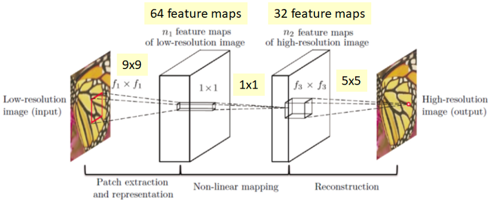
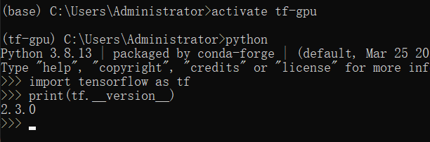
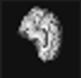
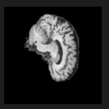
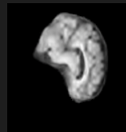
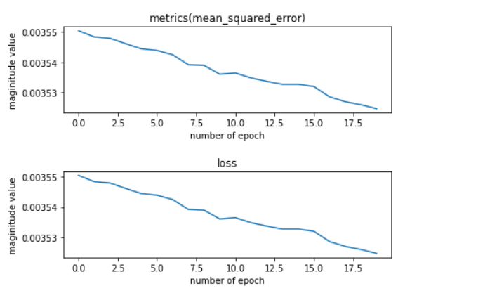

# Super-resolution network

## SRCNN Brief with the problem
SRCNN is a deep learning method (super resolution CNN) for reconstructing original image with high-resolution. I implemented SRCNN which takes down-sampled MRI images with factors of 4 (low-resolution images) and produce a "reasonably clear image of original size".

### SRCNN theory and structure
####  SRCNN theory
The key for SRCNN is that it used CNN to learn the pixel mapping from low-resolution image to high-resolution image. The actual CNN model is not complex and deep comparing with other more advance model as it is one of the initial proposed model using CNN to do the image reconstruction. It contains three layers that each handles a different task which will be shown in the structure part below. Basically, it takes a resized image and upscale to the original size using bicubic interpolation, then feed into the model of SRCNN. Since upscaled-image is indistinct but the size is same as original, SRCNN will conduct patch extraction from this image and using non-linear mapping，finally reconstruct the high-resolution image as output 
#### SCRNN Structure	

**Layer1: 64, (9,9)**
**Layer2: 32, (1,1)**
**Layer3: 3,(5,5)**

## Setting up
### Environment Guide
1. open up ananconda prompt shell and create tensorflow environment with version **2.3.0**, check tensorflow version as shown below

and make sure downloaded tensorflow with GPU version and check GPU existed
2. using "pip install matplotlib" 
the matplotlib verison should be **3.5.2**
and "pip install xxx" to download other missing package
or "conda install XXX" if appropriate

#### Alternative option 
This is how i did for training and testing the model, copy the code srcnn.ipynb into colab and run the code in colab to train the model and save the model to your local computer and run the predict.py to see the output image result. Or if you have a local computer with suitable GPU set up you can run the dataset1.ipynb
Rember to change the appropriate path 
## Example inputs, outputs and plot of algorithm
**Input**

UpScaled to the same size as output to feed the model

**Output**

The first one is original image and the second one is images with size downscaling by 4, the third one is resized back to original size by tensorflow function, the last one is reconstructed by SRCNN model. Since plt auto size the image, therefore the downscaling image cannot see the size is different. I took screenshot from running the the code in dataset1.ipynb file, you can find all four comparison image in predict_result folder

#### original

#### down-scaled

#### resized by tensorflow function

#### SRCNN 

From paper as iterations increases, the output image will become more clear. Due to GPU limitation, this is my model currently can reconstruct

## Pre-processing
download the dataset from blackborad course help page **ADNI MRI Dataset (2D slices)** and unzipp file, normalized the data after load the data. 
Accuracy plot

Reference: 
http://mmlab.ie.cuhk.edu.hk/projects/SRCNN.html 
https://keras.io/examples/vision/super_resolution_sub_pixel/
