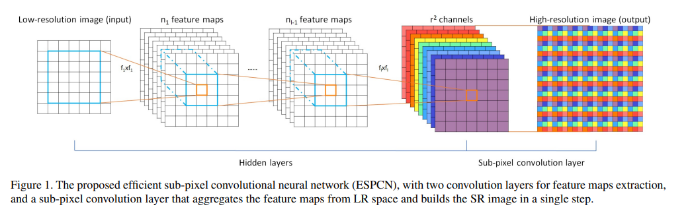
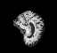
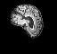
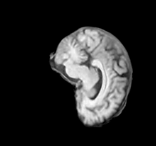
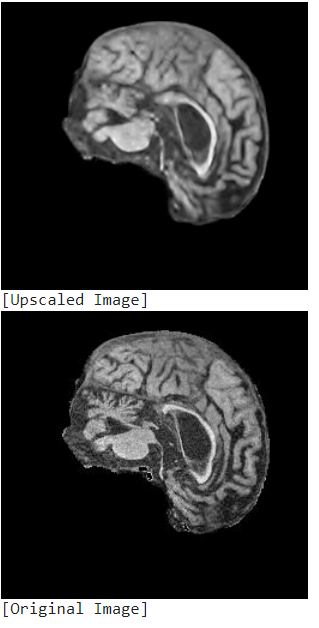
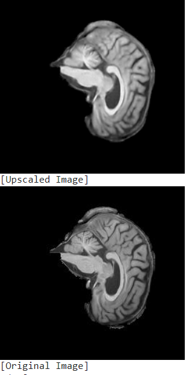
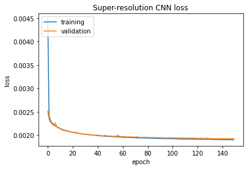

# Super resolution CNN

Author: Matthew Griffiths, s45714175

## Super-Resolution CNN Algorthm
The SRCNN (Super-Resolution CNN) is a deep learning model that reconstructs a low-resolution 
image into a high-resolution version of that image. Using efficient "sub-pixel convolution" 
layers, the model learns an array of image upscaling filters. The implementation here utilises 
three layers and takes input as an image that has been downsampled by a factor of 4. 

The dataset utilised is the ADNI MRI brain scan dataset.

## The Problem
SRCNN's have many applications, typically within imaging. Some examples include surveillance 
for performing facial recognition on low resolution images, upscaling low resolution media files 
for reducing server costs and generating high resolution MRI images for medical purposes.

This model is utilised for upscaling low resolution MRI imaging. 

## How It Works
The following figure was taken from a paper that discribes the SRCNN. It outlines the structure 
of the algorithm as well as the models convolution layers. 

The implemented SRCNN utilises a gaussian filter to convolve the initial input images and then 
downsample by a constant factor of 4, to produce a low-resolution image which will be used for 
recovering and interpolating to a super resolution image. This is underlined by applying a 
sub-pixel convolution layer which upscales the low-resolution feature map to produce a 
super-resolution image. 

The relu (Rectified Linear Unit) function was used as it was determined to achieve better 
performance with this model compared to other activation functions (such as Tanh).

The following discribes each layer of the model:
- Input: shape [60, 64, 1] (The original images' shape downscaled by 4)
- Layer 1: 64, 5, activation = 'relu'
- Layer 2: 128, 3, activation = 'relu'
- Layer 3: 128, 3, activation = 'relu'
- Layer 4: 16, 3, activation = 'relu'
- Output: Depth to space layer mapping to the original image shape

## Examples
The following are some examples of images that were input into the model and their corresponding 
output images that the model produced. 

### Inputs
Brain MRI images downscaled by a factor of 4

### Outputs
Brain MRI images output from SRCNN

Here are a few final predictions from the model comparing the output upscaled image vs the original
image. 

## Preprocessing
The dataset is from the ADNI dataset for Alzheimer's disease. The version utilised for this model 
was already preprocessed and downloaded from the UQ Blackboard site under COMP3710 Course help. 
Additional preprocessing included normalising the images from the dataset. 

This version of the dataset set was split into training and testing. For the purpsose of this 
model this was not changed, using the training and validation for each epoch. 

Accuracy plot

PSNR metric plot

# References
https://arxiv.org/pdf/1609.05158.pdf

https://cloudstor.aarnet.edu.au/plus/s/L6bbssKhUoUdTSI

https://keras.io/examples/vision/super_resolution_sub_pixel/