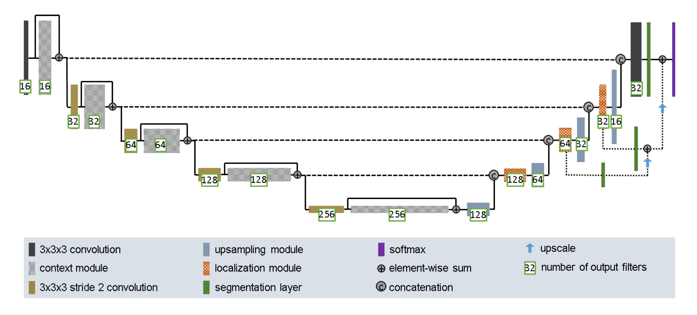
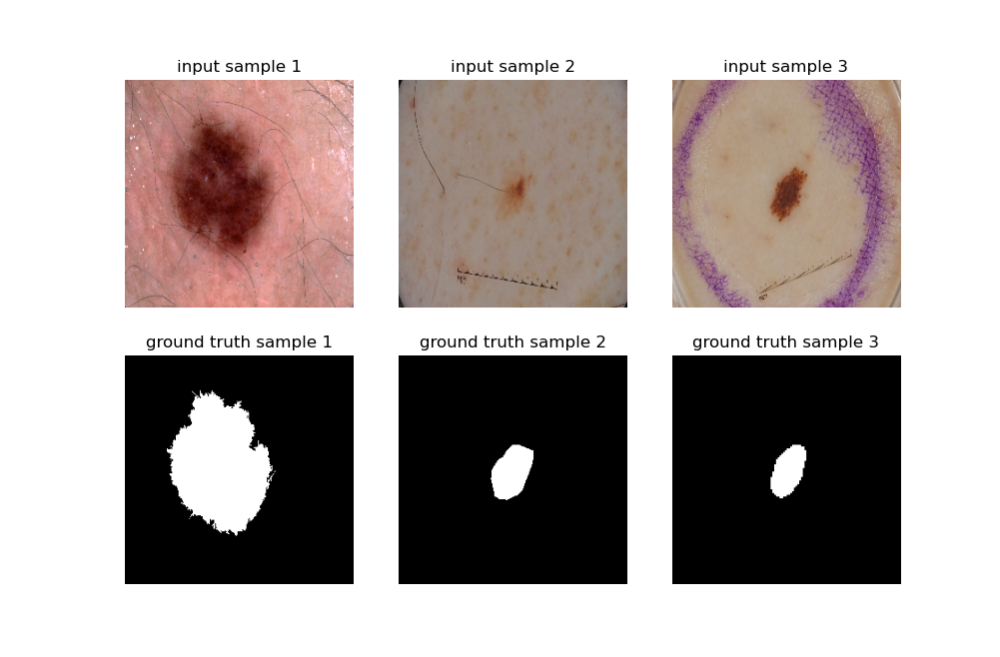
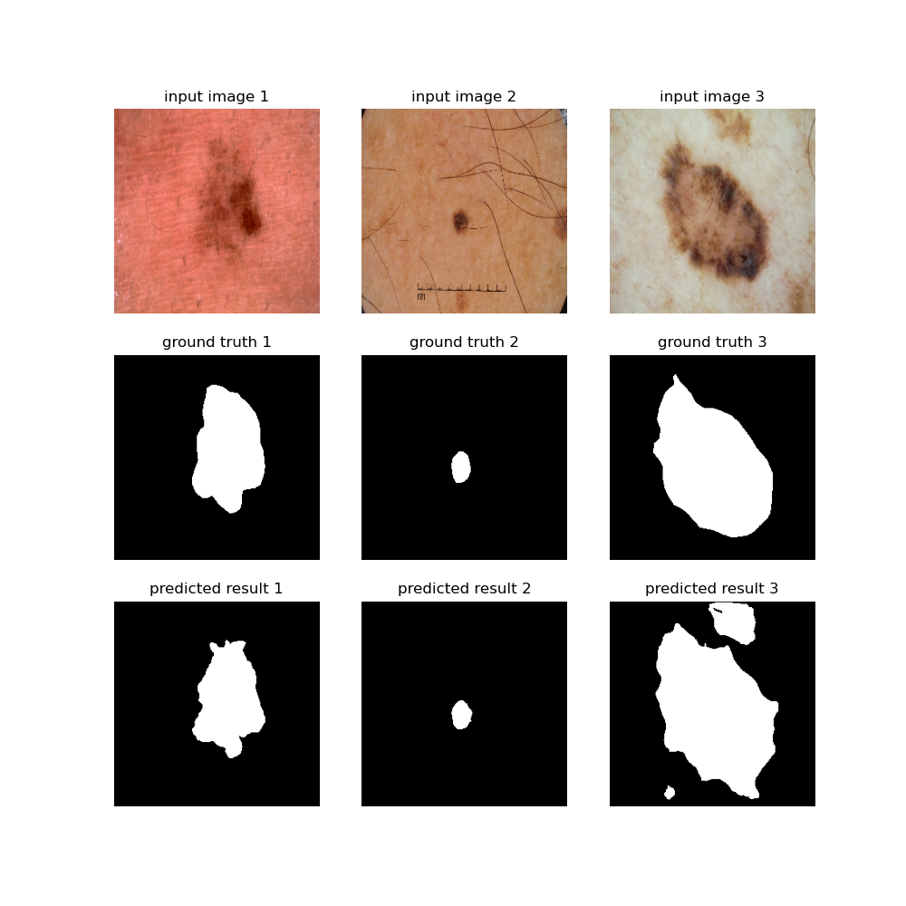

# Dermoscopic Image Segmentation using Improved U-Net Model

## Table of Contents
**[Description](#description)**<br>
**[Dependencies](#dependencies)**<br>
**[Network Architecture](#network-architecture)**<br>
**[Dataset](#dataset)**<br>
**[Getting Started](#getting-started)**<br>
**[Reference](#reference)**<br>


## Description

This project aims to build a improved U-Net model [[1]](#Reference) for 2D dermoscopic image segmentation. The `model.py` file implements the components of the improved U-Net model as a function, the `driver.py` file shows an example usage of the module which solves a dermoscopic image segmentation problem. In the example usage, the test result achieves a [dice similarity coefficient](https://en.wikipedia.org/wiki/S%C3%B8rensen%E2%80%93Dice_coefficient) (DSC) of around **0.85**.  

More details about the network architecture and the dataset will be discussed later.
  
  
## Dependencies
- Python 3.9.6
- NumPy 1.20.3
- Matplotlib 3.4.2
- TensorFlow 2.6.0
- TensorFlow Addons 0.14.0  

Similar versions of packages might be able to work as well. All the packages can be installed by the package manager [pip](https://pip.pypa.io/en/stable/):
```bash
$ pip install numpy==1.20.3
$ pip install matplotlib==3.4.2
$ pip install tensorflow==2.6.0
$ pip install tensorflow-addons==0.14.0
```

## Network Architecture  
  
<p align="center">  
	
</p>  

<p align="center">  
	Figure 1. improved U-Net network architecture [1]
</p>  
  

The improved U-Net architecture is proposed by Isensee et al. in paper [[1]](#Reference), and was inspired by the original U-Net architecture [[2]](#Reference). As shown in figure 1, the network includes a context pathway (left) and a localization pathway (right). The network architecture is originally used for solving 3D image segmentation problems while here in this project, I modified it for 2D image usage.  

The details of modules in the network are shown as below:  

---  
**Context Module**  

Implemented as function `context_module()` in `model.py`.  

- Instance Normalization Layer 
- Leaky ReLU Layer
- 2D Convolution Layer (3 x 3)
- Dropout Layer
- Instance Normalization Layer 
- Leaky ReLU Layer
- 2D Convolution Layer (3 x 3)
---  

**Upsampling Module**  

Included in the function `improved_UNet()` in `model.py`.

- 2D UpSampling Layer
- 2D Convolution Layer (3 x 3)

---  

**Localization Module**  

Implemented as function `localization_module()` in `model.py`.  

- 2D Convolution Layer (3 x 3)
- Leaky ReLU Layer
- Instance Normalization Layer
- 2D Convolution Layer (1 x 1)
- Leaky ReLU Layer
- Instance Normalization Layer

---  

**Segmentation Layer**  

Included in the function `improved_UNet()` in `model.py`.

- 2D Convolution Layer (1 x 1)
- 2D UpSampling Layer (bilinear interpolation)

---  

Throughout the network, leaky ReLU nonlinearities with a negative slope of `1e-2`
is used for all feature map computing convolutions. See also the improved U-Net paper [[1]](#Reference) for more details.  

## Dataset  

<p align="center"> 
	
</p>

<p align="center"> 
	Figure 2. image samples
</p>  

The dataset used in this project comes from [ISIC 2018 challenge data](https://challenge2018.isic-archive.com/task1/) [[3, 4]](#Reference). As shown in figure 2, the dataset includes input images and the corresponding ground truth images. The white part in the ground truth image indicates **skin lesion**, which is segmented from the dermoscopic image. There are overall 2594 input images with their ground truth images.  

## Getting Started

### Data Pre-processing  

For data pre-processing, I first resized both input images and ground truth images to shape `(256, 256)`, and devided the data by 255 to reduce the range of value to be between `0-1`. Then, the dataset is splited into training/validation/test sets with the ratio `8:1:1`. Generally, with more training data, the model sees more examples and is more likely to find a better solution. Also, more training data can help prevent overfitting. Finally, the batch size is set to be `32`.

### Model Training and Testing  

For model compiling, I used `Adam` with default learning rate `0.001` as the optimizer, and used [`DSC`](https://en.wikipedia.org/wiki/S%C3%B8rensen%E2%80%93Dice_coefficient) and `accuracy` as metric. Since we want to maximize the dice score, I used `1 - DSC` as the loss function.  

The model is trained with the training set for `5 epoches`. During the training process, the validation set is used to validate the model performance. The test set is used for testing the model performance at the end.  

### Usage and Example Output

In order to re-produce the work, you need to download:
1) the dataset from [here](https://cloudstor.aarnet.edu.au/sender/?s=download&token=723595dd-15b0-4d1e-87b8-237a7fe282ff)
2) the `driver.py` file
3) the `model.py` file  

The directory of the files should be:  

<pre>
 ┬  
 ├ driver.py  
 ├ model.py 
 ├ ISIC2018_Task1-2_Training_Data  
     ┬  
     ├ ISIC2018_Task1_Training_GroundTruth_x2  
     └ ISIC2018_Task1-2_Training_Input_x2  
</pre>  
  
Then, you could either simply run the `driver.py` or run the following command:
```bash
$ python driver.py
```

The output of the program would includes: a progress of the process, the DSC of the test set, and a figure shown some example prediceted results (see figure 3):
```
============= Data Files Loading =============
[done] load data files and sanity check.

============= Data Preprocessing =============  
[done] read images and split into training/validation/test sets.

=============== Model Training ===============
Epoch 1/5
65/65 [==============================] - 365s 5s/step - loss: 0.2503 - dice_coef: 0.7499 - accuracy: 0.8889 - val_loss: 0.1645 - val_dice_coef: 0.8374 - val_accuracy: 0.9247
Epoch 2/5
65/65 [==============================] - 380s 6s/step - loss: 0.1723 - dice_coef: 0.8278 - accuracy: 0.9296 - val_loss: 0.1610 - val_dice_coef: 0.8337 - val_accuracy: 0.9275
Epoch 3/5
65/65 [==============================] - 390s 6s/step - loss: 0.1555 - dice_coef: 0.8446 - accuracy: 0.9367 - val_loss: 0.1675 - val_dice_coef: 0.8330 - val_accuracy: 0.9198
Epoch 4/5
65/65 [==============================] - 392s 6s/step - loss: 0.1426 - dice_coef: 0.8575 - accuracy: 0.9418 - val_loss: 0.1393 - val_dice_coef: 0.8619 - val_accuracy: 0.9365
Epoch 5/5
65/65 [==============================] - 401s 6s/step - loss: 0.1342 - dice_coef: 0.8659 - accuracy: 0.9452 - val_loss: 0.1527 - val_dice_coef: 0.8418 - val_accuracy: 0.9264
[done] train the improved U-Net model.

================ Model Testing ================
Test data contains 259 images.
The testing dice similarity coefficient is: 0.847
```  

<p align="center"> 
	
</p>

<p align="center"> 
	Figure 3. example prediceted results
</p>   

The example result shows that the training DSC is about **0.866** and the validate DSC is **0.842**. In addition, it achieves **0.847** DSC of the test set.

Note: if you want to get the plot like figure 2 as well, you could uncomment the code snippet:
```python
for input_img, gtruth_img in val_ds.take(1):
    preprocessed_visualization(input_img.numpy(), gtruth_img.numpy())
    break
```  
in the `main()` function of `driver.py`.

## Reference
[1] Isensee, Fabian, Philipp Kickingereder, Wolfgang Wick, Martin Bendszus, and Klaus H. Maier-Hein. “Brain Tumor Segmentation and Radiomics Survival Prediction: Contribution to the Brats 2017 Challenge.” Brainlesion: Glioma, Multiple Sclerosis, Stroke and Traumatic Brain Injuries, 2018, 287–97. https://doi.org/10.1007/978-3-319-75238-9_25. 

[2] Ronneberger, O., Fischer, P., &amp; Brox, T. (2015). U-Net: Convolutional Networks for Biomedical Image Segmentation. Lecture Notes in Computer Science, 234–241. https://doi.org/10.1007/978-3-319-24574-4_28

[3] Noel Codella, Veronica Rotemberg, Philipp Tschandl, M. Emre Celebi, Stephen Dusza, David Gutman, Brian Helba, Aadi Kalloo, Konstantinos Liopyris, Michael Marchetti, Harald Kittler, Allan Halpern: “Skin Lesion Analysis Toward Melanoma Detection 2018: A Challenge Hosted by the International Skin Imaging Collaboration (ISIC)”, 2018; https://arxiv.org/abs/1902.03368

[4] Tschandl, P., Rosendahl, C. & Kittler, H. The HAM10000 dataset, a large collection of multi-source dermatoscopic images of common pigmented skin lesions. Sci. Data 5, 180161 doi:10.1038/sdata.2018.161 (2018).

