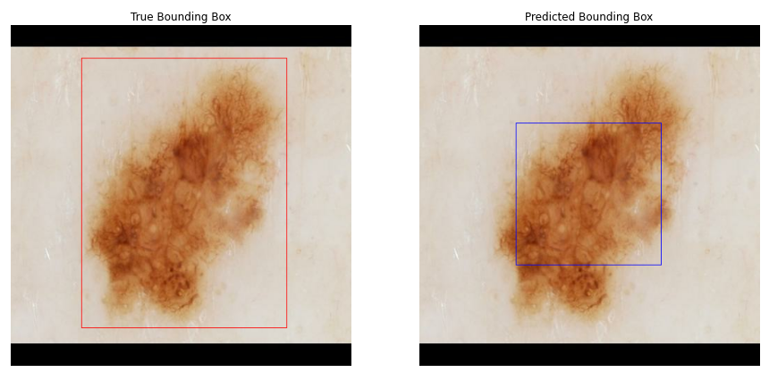
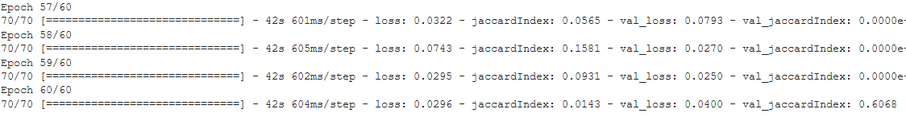
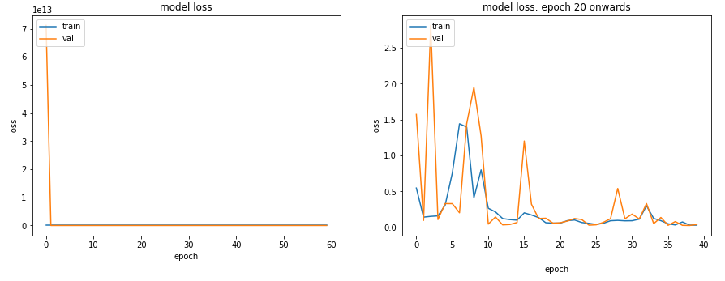
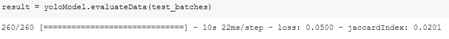

# Lesion Detection with YoloV1
This is a python based package that utilizes a custom [YoloV1](https://arxiv.org/abs/1506.02640v5) model to detect skin lesions.
## Description
#### Background 
Australia has one of the highest rates of deaths by skin cancer in the world[1]. Detecting problematic skin lesions early is one of the best preventative methods for stopping the progression of life threating cancer. The most common method for individuals detecting skin lesions is too visit a dermatologist[2]. Unfortunately this depends on the ability of the dermatologist and accuracy can be varied[3]. 

#### Solution
This module(in its current form) gives a partial solution to this problem. Using the help of Convolutional Neural Networks, this module provides the ability for skin lesions to be detected using image detection, this can aid a dermatologist in their search for cancerous skin lesions. Further work will go into classifying these lesions in the hope that dermatologists or even individuals can detect cancerous lesions using their phones.  

### Model Architecture:
This module utilizes a slight variation on the YoloV1 Architecture. 
<p align="center"></p>
In contrary to the original architecture, batch normalisation has been introduced as a way of speeding up the training process. 

### Loss Function:
As specified in the YoloV1 paper, the yolov1 uses a custom loss function: 
<p align="center"></p>
There is quite a bit to unpack here, so I suggest reading into it [here](https://jonathan-hui.medium.com/real-time-object-detection-with-yolo-yolov2-28b1b93e2088) 

### Metric:
The yolo paper uses the mean average precision (so called mAP) for its metric. This implementation instead uses the Jaccard Index (as known as 'IoU'). The jaccard index is calcaluted between the highest confidence predicted bounding box and ground truth. Below is visual representation of the Jaccard Index:
<p align="center"></p>

### Dataset:
This model is trained on the [ISIC 2018](https://challenge2018.isic-archive.com/) Dataset. This dataset includes skin lesions and their respective ground truth segmentations. 
<p align="center"></p>

## Results:
The results in the current version are optimal, achieving ~80% accuracy on the test set. This will be improved upon further. An example:
<p align="center"></p>
Below will discuss a few notable points of interest the results from the current version.<br/>
1) The model converges around the 60 epoch mark. Tested until 200 epochs but no improvement in loss.
<p align="center"></p>
2) There is a sudden drop off in loss from 1-10 epochs, as the model quickly optimises the bounding boxes (the result of no sigmoid activation function in the dense layer).
<p align="center"></p>
3) Accuracy seemed to bounce around significantly, this is namely due to the jaccard Index not being optimised to work correctly with batches.
<p align="center"></p>
4) Model.evaluate shows a mere 2% score for the test set, this is infact a lie, the model achieves an average jaccard Index of 79.39% on the test set. The jaccard Index as noted above isn't currently working with batches. 
<p align="center"></p>
<p align="center"></p>  

## Usage:  
The model.py contains the class YOLOV1 which contains all the neccessary information to train a new model or load existing weights. 

### Loading Provided Weights:
1) Create a new YoloV1 object:
```
from model import YoloV1
yolo = YoloV1()
```
2) Load the weights (checkpoint in repo)
```
yolo.loadWeights('./checkpoint')
```
3) Make a prediction
```
result = yolo.predictData(testSet)
```
### Training on new data
An example of training on the ISIC dataset is in the driver.py file, this covers and provides useful functions in data preprocessing for yolo. To train a new model:
1) First create a new YoloV1 object and declare the constants. 
    ```
    from model import YoloV1
    yolo = YoloV1(imageWidth=300, imageHeight=212, S=12, B=2, C=20)
    ```
    YoloV1 accepts 7 optional parameters, of which the first five are important and dependant on your data. They are as follows:
    - imageWidth: The width of all of your images. Noting that this number needs to be the same for every image in your dataset.
    - imageHeight: The height of all of your images. Noting that this number needs to be the same for every image in your dataset.
    - S: The number of cells to divide your image into. Divides your image into a S*S cell.
    - B: The number of bounding boxes to be predicted per cell. 
    - C: The number of classes that are contained in your dataset. This should match the number of classes in your bounding boxes. 
2) Compile your model, tuning any optional paramters. By default clipnorm is introduced at -1,1 too keep the network stable.
```
yolo.compile()
```
3) Run the model and supply your data in the correct format:
```
yolo.runModel(training_data, validation_data, epochs=200)
```
The model accepts training and validation data in the form (image, groundTruth). Where:
- image is: (imageWidth, imageHeight, channels)
- groundTruth is: (S, S, 1, 5+num_classes). Noting... that the groundTruth can only contain one true bounding box inserted at the correct S,S position. Every where else can be all zeros. 

4) Make a prediction:
```
result = yolo.predictData(testSet)
```

## References:
1. Sinclair, C. and Foley, P. (2009). Skin cancer prevention in Australia. British Journal of Dermatology, 161, pp.116–123.
2. Aitken, J.F., Janda, M., Lowe, J.B., Elwood, M., Ring, I.T., Youl, P.H. and Firman, D.W. (2004). Prevalence of Whole-Body Skin Self-Examination in a Population at High Risk for Skin Cancer (Australia). Cancer Causes & Control, 15(5), pp.453–463.
3. Jerant, A.F., Johnson, J.T., Sheridan, C.D. and Caffrey, T.J. (2000). Early Detection and Treatment of Skin Cancer. American Family Physician, [online] 62(2), pp.357–368. Available at: https://www.aafp.org/afp/2000/0715/p357.html?searchwebme [Accessed 9 Oct. 2020]