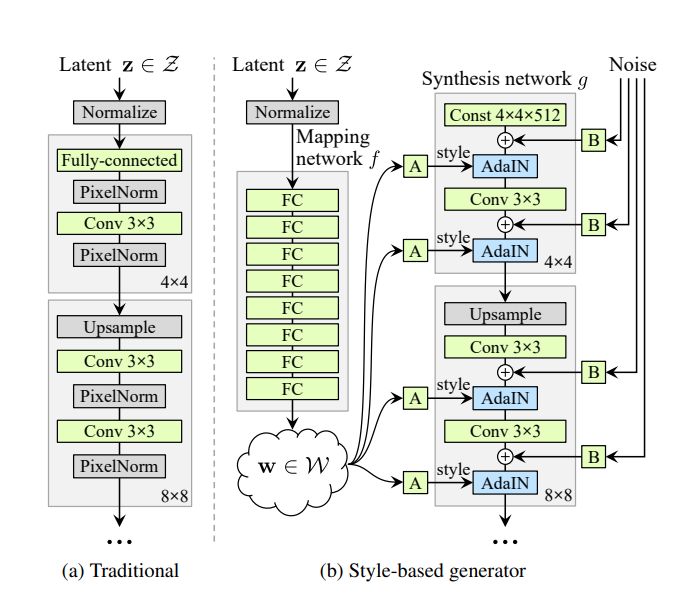
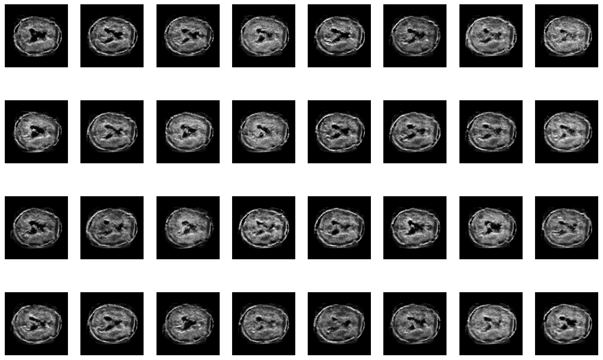
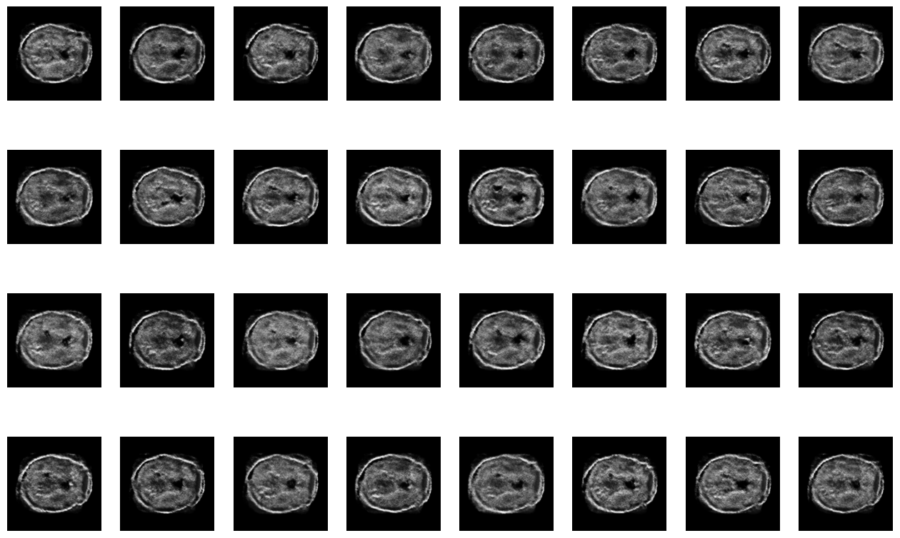
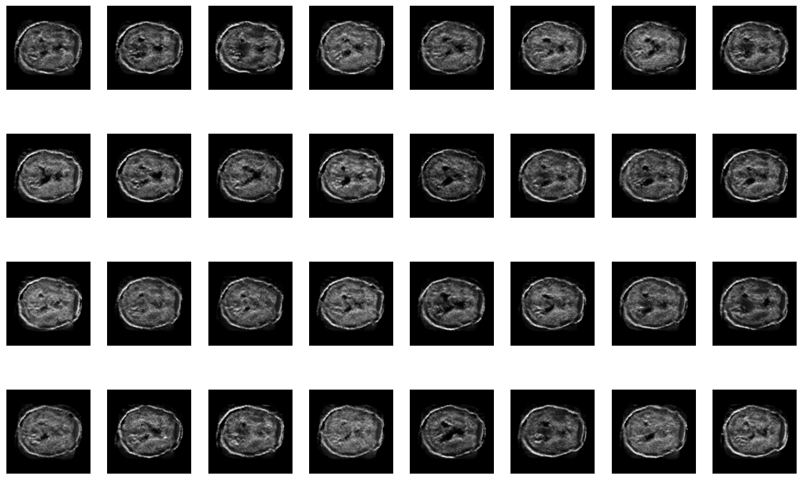
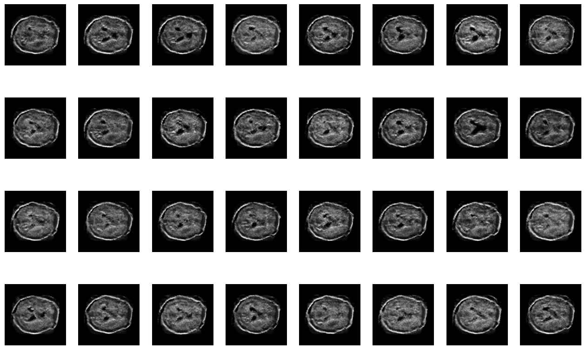
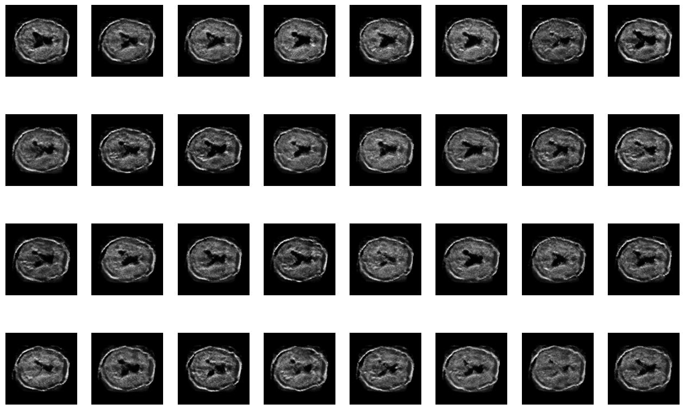
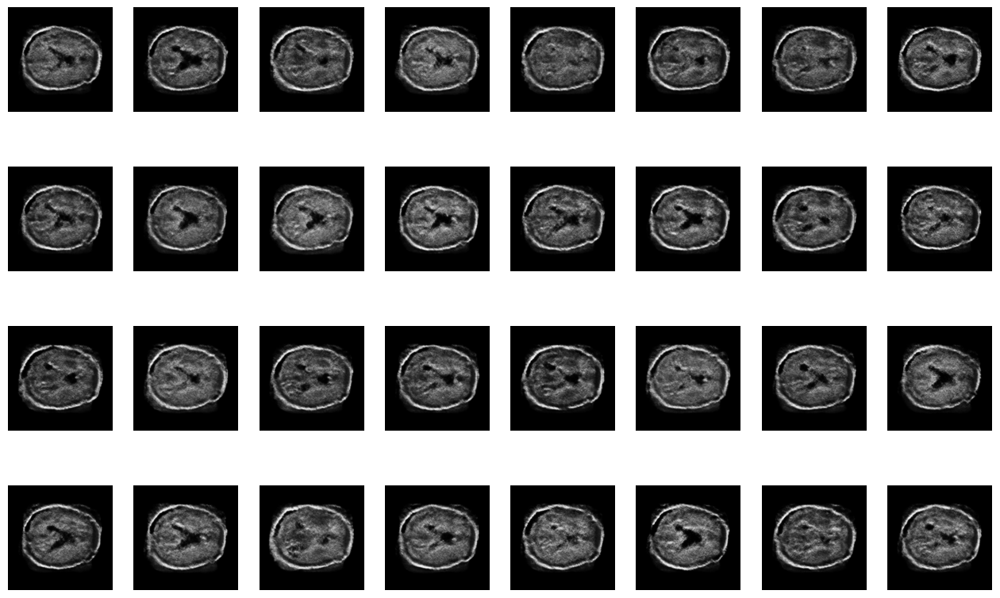
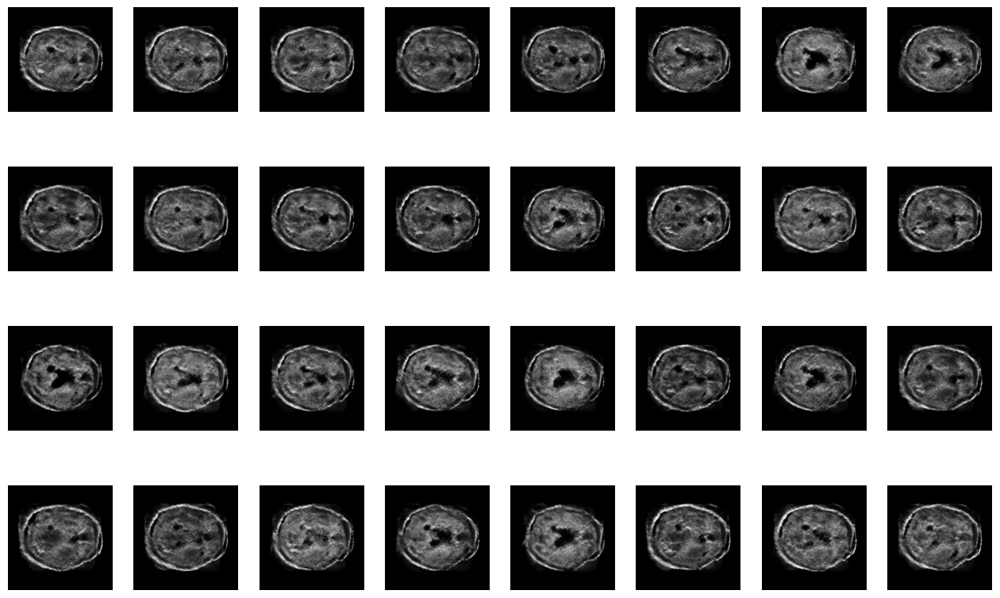
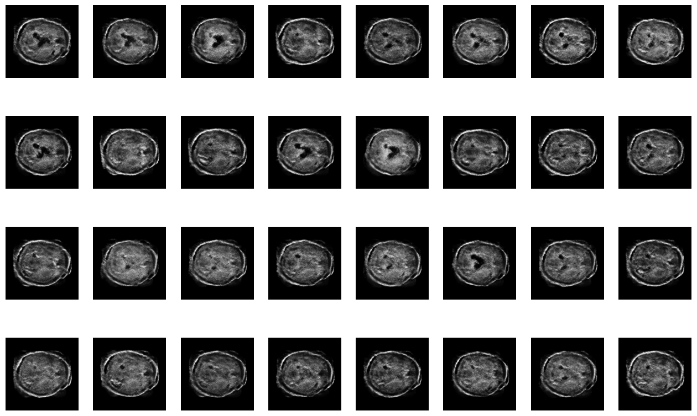

# Pattern Recognition: StyleGAN for the OASIS brain dataset

## Problem Overview

GANs allow for the generation of synthetic but real looking data. The most common use case of GANs are images, which is also being tackled here. A GAN model following the StyleGAN architecture must be used to generate real looking MRIs of a brain. The OASIS brain dataset had already been preprocessed and is ready to be used as training data for the GAN. Ideally, the GAN would be able to generate MRIs with features similar to those in the OASIS dataset.

## Description of StyleGAN

### What is a GAN?

A GAN or Generative Adversarial Model consists of two neural networks, called the discriminator and the generator. The job of the discriminator is to guess whether or not the image it is given is real or fake, while its the generator's job to fool the discriminator into believing the generated image is real. The adversarial aspect of GANs comes from the discriminator and generator constantly trying to beat one another. Additionally, the real images are never seen by the generator, but learns from the discriminator's incorrect guesses on the fake images.

### What are some GANs?

Some well-known GANs are DCGGAN, ProGAN and StyleGAN. DCGAN (Deep Convolutional GAN) is simply a GAN that uses a deep convolutional neural network for both the discriminator and generator. Both the ProGAN and StyleGAN build upon this architecture to generate more realistic looking images. ProGAN (Progressively Growing GAN) builds upon the DCGAN by progressively growing the resolution the GAN is trained on, which allowed the network to capture broader details first and slowly add more details as the resolution increases.

### How is StyleGAN different?

StyleGAN builds upon ProGAN by introducing a mapping network for the latent vector, which feeds into the Adaptive Instance Normalisation layers throughout the generator, and the addition of noise throughout the generator. The introduction of a mapping network removes the need to directly feed the latent code to the generator, rather a constant value is used instead as the input of the generator.

    
    
 General architecture of GAN (left) and StyleGAN (right). Obtained from https://arxiv.org/abs/1812.04948  

As briefly described above, the latent vector is fed into the mapping network rather than the synthesis network. From the output of the mapping network, the learned affine transform, represented as "A", is obtained. This affine transform is used to generate the weight and bias terms, $\gamma$ abd $\beta$ respectively, for Adaptive Instance Normalisation (AdaIN). The equation of AdaIN is given by:

$$
\text{AdaIN}(x_i, \gamma, \beta) = \gamma \frac{x_i-\mu(x_i)}{\sigma(x_i)} + \beta
$$

The use of AdaIN replaces the need for any other normalisation layers as it provides control over the style.

The other input receives single-channel images of uncorrelated Gaussian noise with the same resolution as the convolution results it is being added to. But before the noise is added to the convolution result, the noise weighted via learned per-feature scaling factors. This allows slight variations in the noise image to adjust minor details of the image without changing the overall appearance of the image.

## Dependencies

Python version: 3.9.7

| Library    | Version |
| ---------- | ------- |
| TensorFlow | 2.6.0   |
| Matplotlib | 3.4.2   |
| Tqdm       | 4.62.2  |

The versions listed above are the versions used to test/run the scripts would be the most stable.

TensorFlow was used to construct and train the GAN and load the training data.  
Matplotlib was used to visualise the model losses and the generator's images.  
Tqdm was used to provide visualisation of the training epoch's progress.

## Methodology

### Data loading

The images were loaded using the TensorFlow Keras API, which allowed the images to be directly imported into a TensorFlow dataset in the greyscale format (1 colour channel as opposed to RGB with 3 colour channels). These images are normalised from [0, 255] to [0, 1].

### Training, validation, test split

Although it is typical to separate data into training, validation and test dataset when training neural networks, it does not provide much value when it comes to GANs as a whole. The data split may be useful if the performance of the discriminator is the most important. However, for this task, the images generator by the generator is more important than the capabilities of the discriminator. Thus, it was decided that all the data would be used for training and no splitting would be performed.

### Data augmentation

To increase the range of possible MRI brains generated, the training data is randomly flipped across the horizontal axes. This retains the position of where the front and back of the path are, while flipping the left and right hemispheres of the brain. This essentially doubles the training domain, as it is unlikely a perfectly matching brain is part of the dataset. This random flipping is performed after the dataset has been exhausted, which can aid in preventing the discriminator from overfitting and reduce the training time of each epoch.

### Model architecture and construction

### Visualisation

## Results

### Recommended Environment

| Training environment | Recommendations              | Reasoning                                                                                                                                                                                                                                                                      |
| -------------------- | ---------------------------- | ------------------------------------------------------------------------------------------------------------------------------------------------------------------------------------------------------------------------------------------------------------------------------ |
| 32GB of RAM          | Minimum 16GB of RAM          | Training uses 10GB+ of RAM                                                                                                                                                                                                                                                     |
| Nvdia RTX2070 8GB    | Nvidia GPU with 8GB+ of VRAM | Training uses 7GB+ of VRAM. More VRAM would also allow for higher resolution images and batch sizes. A GPU is MANDATORY to be able to train in a timely manner. Although an AMD GPU can be used, additional libraries need to be instead and has not been tested to be stable. |

### Training Parameters

<table class="side-by-side">
    <tr> 
        <td>
            <table>
                <thead>
                    <tr>
                        <th>Hyperparameter</th>
                        <th>Generator</th>
                        <th>Discriminator</th>
                    </tr>
                </thead>
                <tbody>
                    <tr>
                        <td>Optimizer</td>
                        <td colspan=2>Adam</td>
                    </tr>
                    <tr>
                        <td>Learning Rate</td>
                        <td>8e-7</td>
                        <td>1e-7</td>
                    </tr>
                    <tr>
                        <td>Beta 1</td>
                        <td colspan=2>0.5</td>
                    </tr>
                    <tr>
                        <td>Beta 2</td>
                        <td colspan=2>0.999</td>
                    </tr>
                </tbody>
            </table>
        </td>
        <td>
            <table>
                <thead>
                    <tr>
                        <th>Parameter</th>
                        <th>Value</th>
                    </tr>
                </thead>
                <tbody>
                    <tr>
                        <td>Image Size</td>
                        <td>256</td>
                    </tr>
                    <tr>
                        <td>Batch Size</td>
                        <td>32</td>
                    </tr>
                    <tr>
                        <td>Number of filters</td>
                        <td> 512</td>
                    </tr>
                    <tr>
                        <td>Latent dimension</td>
                        <td>512</td>
                    </tr>
                    <tr>
                        <td>Kernel size</td>
                        <td>3</td>
                    </tr>
                    <tr>
                        <td>Total Epochs</td>
                        <td>200</td>
                    </tr>
                </tbody>
            </table>
        </td>
    </tr>
</table>

After many trials, the hyperparameters above would be able to produce the results below. Increasing the learning rate to around 1e-5 would most likely cause the generator to suffer from mode collapse after 50 epochs. A learning rate ratio of 8:1 (generator : discriminator) seemed to provide enough detail, lowering this ratio appeared to cause finer details to be smeared.

### Training Results

The following are some samples of the results achieved when training the model on the parameters listed above.

<table class="image-grid">
    <tr>
        <td>
            Epoch 154
        </td>
        <td>
            Epoch 158
        </td>
    </tr>
    <tr>
        <td>
            
        </td>
        <td>
            
        </td>
    </tr>
    <tr>
        <td>
            Epoch 159
        </td>
        <td>
            Epoch 161
        </td>
    </tr>
    <tr>
        <td>
            
        </td>
        <td>
            
        </td>
    </tr>
    <tr>
        <td>
            Epoch 162
        </td>
        <td>
            Epoch 167
        </td>
    </tr>
    <tr>
        <td>
            
        </td>
        <td>
            
        </td>
    </tr>
    <tr>
        <td>
            Epoch 195
        </td>
        <td>
            Epoch 200
        </td>
    </tr>
    <tr>
        <td>
            
        </td>
        <td>
            
        </td>
    </tr>
</table>

<table class="image-grid">
    <tr>
        <td>Training Samples</td>
    </tr>
    <tr>
        <td>
            
        </td>
    </tr>
</table>

Although samples are not perfect, the shape and some details of the brain MRIs can be seen. Some higher quality images could possibly be generated by lowering the learning rate further then training for more epochs or adding more training data.

<table class="image-grid">
    <tr>
        <td>GAN Loss</td>
    </tr>
    <tr>
        <td>
            
        </td>
    </tr>
</table>

## Usage

## References

- StyleGAN paper, Available at: https://arxiv.org/abs/1812.04948
- GAN Training, Available at: https://towardsdatascience.com/10-lessons-i-learned-training-generative-adversarial-networks-gans-for-a-year-c9071159628
- StyleGAN Keras implementation, Available at: https://github.com/manicman1999/StyleGAN-Keras
