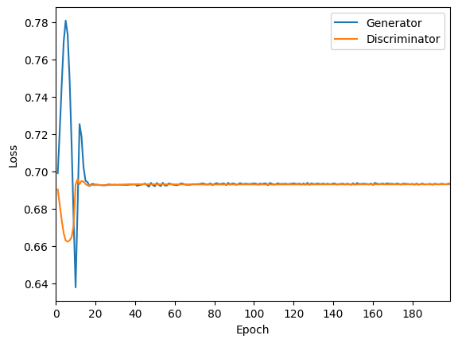

# Pattern Recognition: StyleGAN for the OASIS brain dataset

## Problem Overview

GANs allow for the generation of synthetic but real looking data. The most common use case of GANs are images, which is also being tackled here. A GAN model following the StyleGAN architecture must be used to generate real looking MRIs of a brain. The OASIS brain dataset had already been preprocessed and is ready to be used as training data for the GAN. Ideally, the GAN would be able to generate MRIs with features similar to those in the OASIS dataset.

## Description of StyleGAN

### What is a GAN?

A GAN or Generative Adversarial Model consists of two neural networks, called the discriminator and the generator. The job of the discriminator is to guess whether or not the image it is given is real or fake, while its the generator's job to fool the discriminator into believing the generated image is real. The adversarial aspect of GANs comes from the discriminator and generator constantly trying to beat one another. Additionally, the real images are never seen by the generator, but learns from the discriminator's incorrect guesses on the fake images.

### What are some GANs?

Some well-known GANs are DCGGAN, ProGAN and StyleGAN. DCGAN (Deep Convolutional GAN) is simply a GAN that uses a deep convolutional neural network for both the discriminator and generator. Both the ProGAN and StyleGAN build upon this architecture to generate more realistic looking images. ProGAN (Progressively Growing GAN) builds upon the DCGAN by progressively growing the resolution the GAN is trained on, which allowed the network to capture broader details first and slowly add more details as the resolution increases.

### How is StyleGAN different?

StyleGAN builds upon ProGAN by introducing a mapping network for the latent code, which feeds into the Adaptive Instance Normalisation layers throughout the generator, and the addition of noise throughout the generator. The introduction of a mapping network removes the need to directly feed the latent code to the generator, rather a constant value is used instead as the input of the generator.

## Dependencies

Python version: 3.9.7

| Library    | Version |
| ---------- | ------- |
| TensorFlow | 2.6.0   |
| Matplotlib | 3.4.2   |
| tqdm       | 4.62.2  |

The versions listed above are the versions used to test/run the scripts would be the most stable.

TensorFlow was used to construct and train the GAN and load the training data.  
Matplotlib was used to visualise the model losses and the generator's images.  
Tqdm was used to provide visualisation of the training epoch's progress.

## Methodology

### Data loading

The images were loaded using the TensorFlow Keras API, which allowed the images to be directly imported into a TensorFlow dataset in the greyscale format (1 colour channel as opposed to RGB with 3 colour channels). These images are normalised from [0, 255] to [0, 1].

### Training, validation, test split

Although it is typical to separate data into training, validation and test dataset when training neural networks, it does not provide much value when it comes to GANs as a whole. The data split may be useful if the performance of the discriminator is the most important. However, for this task, the images generator by the generator is more important than the capabilities of the discriminator. Thus, it was decided that all the data would be used for training and no splitting would be performed.

### Data augmentation

To increase the range of possible MRI brains generated, the training data is randomly flipped across the horizontal axes. This retains the position of where the front and back of the path are, while flipping the left and right hemispheres of the brain. This essentially doubles the training domain, as it is unlikely a perfectly matching brain is part of the dataset. This random flipping is performed after the dataset has been exhausted, which can aid in preventing the discriminator from overfitting and reduce the training time of each epoch.

### Model architecture and construction

### Visualisation

## Experiments

### Training Environment

### Recommended Environment

16GB RAM, 8GB VRAM

### Trial 1

| Parameter                   | Value |
| --------------------------- | ----- |
| Generator Learning Rate     | 1e-6  |
| Discriminator Learning Rate | 4e-6  |
| Image Size                  | 256   |
| Batch Size                  | 32    |
| Number of Filters           | 512   |
| Latent dimension            | 512   |
| Kernel Size                 | 4     |
| Total Epochs                | 100   |

Using the old data augmentation method.

### Trial 2

| Parameter                   | Value |
| --------------------------- | ----- |
| Generator Learning Rate     | 1e-6  |
| Discriminator Learning Rate | 4e-6  |
| Image Size                  | 256   |
| Batch Size                  | 32    |
| Number of Filters           | 512   |
| Latent dimension            | 512   |
| Kernel Size                 | 4     |
| Total Epochs                | 100   |

### Trial 3

| Parameter                   | Value |
| --------------------------- | ----- |
| Generator Learning Rate     | 1e-6  |
| Discriminator Learning Rate | 4e-6  |
| Image Size                  | 256   |
| Batch Size                  | 32    |
| Number of Filters           | 512   |
| Latent dimension            | 512   |
| Kernel Size                 | 3     |
| Total Epochs                | 100   |

### Trial 4

| Parameter                   | Value |
| --------------------------- | ----- |
| Generator Learning Rate     | 2e-6  |
| Discriminator Learning Rate | 4e-6  |
| Image Size                  | 256   |
| Batch Size                  | 32    |
| Number of Filters           | 512   |
| Latent dimension            | 512   |
| Kernel Size                 | 3     |
| Total Epochs                | 100   |

### Trial 5

| Parameter                   | Value |
| --------------------------- | ----- |
| Generator Learning Rate     | 2e-6  |
| Discriminator Learning Rate | 3e-6  |
| Image Size                  | 256   |
| Batch Size                  | 32    |
| Number of Filters           | 512   |
| Latent dimension            | 512   |
| Kernel Size                 | 3     |
| Total Epochs                | 100   |

### Trial 6

| Parameter                   | Value |
| --------------------------- | ----- |
| Generator Learning Rate     | 2e-6  |
| Discriminator Learning Rate | 2e-6  |
| Image Size                  | 256   |
| Batch Size                  | 32    |
| Number of Filters           | 512   |
| Latent dimension            | 512   |
| Kernel Size                 | 3     |
| Total Epochs                | 100   |

### Trial 7

| Parameter                   | Value |
| --------------------------- | ----- |
| Generator Learning Rate     | 1e-6  |
| Discriminator Learning Rate | 1e-6  |
| Image Size                  | 256   |
| Batch Size                  | 32    |
| Number of Filters           | 512   |
| Latent dimension            | 512   |
| Kernel Size                 | 3     |
| Total Epochs                | 100   |

### Trial 8

| Parameter                   | Value |
| --------------------------- | ----- |
| Generator Learning Rate     | 1e-6  |
| Discriminator Learning Rate | 5e-7  |
| Image Size                  | 256   |
| Batch Size                  | 32    |
| Number of Filters           | 512   |
| Latent dimension            | 512   |
| Kernel Size                 | 3     |
| Total Epochs                | 100   |

### Trial 9

| Parameter                   | Value |
| --------------------------- | ----- |
| Generator Learning Rate     | 2e-6  |
| Discriminator Learning Rate | 1e-6  |
| Image Size                  | 256   |
| Batch Size                  | 32    |
| Number of Filters           | 512   |
| Latent dimension            | 512   |
| Kernel Size                 | 3     |
| Total Epochs                | 50    |

### Trial 10

| Parameter                   | Value |
| --------------------------- | ----- |
| Generator Learning Rate     | 4e-6  |
| Discriminator Learning Rate | 1e-6  |
| Image Size                  | 256   |
| Batch Size                  | 32    |
| Number of Filters           | 512   |
| Latent dimension            | 512   |
| Kernel Size                 | 3     |
| Total Epochs                | 50    |

### Trial 11

| Parameter                   | Value |
| --------------------------- | ----- |
| Generator Learning Rate     | 8e-6  |
| Discriminator Learning Rate | 2e-6  |
| Image Size                  | 256   |
| Batch Size                  | 32    |
| Number of Filters           | 512   |
| Latent dimension            | 512   |
| Kernel Size                 | 3     |
| Total Epochs                | 50    |

### Trial 12

| Parameter                   | Value |
| --------------------------- | ----- |
| Generator Learning Rate     | 8e-6  |
| Discriminator Learning Rate | 1e-6  |
| Image Size                  | 256   |
| Batch Size                  | 32    |
| Number of Filters           | 512   |
| Latent dimension            | 512   |
| Kernel Size                 | 3     |
| Total Epochs                | 50    |

### Trial 13

| Parameter                   | Value |
| --------------------------- | ----- |
| Generator Learning Rate     | 8e-6  |
| Discriminator Learning Rate | 1e-6  |
| Image Size                  | 256   |
| Batch Size                  | 32    |
| Number of Filters           | 512   |
| Latent dimension            | 512   |
| Kernel Size                 | 3     |
| Total Epochs                | 50    |

Using uniform distribution to generate noisy image.

### Trial 14

| Parameter                   | Value |
| --------------------------- | ----- |
| Generator Learning Rate     | 8e-5  |
| Discriminator Learning Rate | 1e-5  |
| Image Size                  | 256   |
| Batch Size                  | 32    |
| Number of Filters           | 512   |
| Latent dimension            | 512   |
| Kernel Size                 | 3     |
| Total Epochs                | 50    |

### Trial 15

| Parameter                   | Value |
| --------------------------- | ----- |
| Generator Learning Rate     | 8e-7  |
| Discriminator Learning Rate | 1e-7  |
| Image Size                  | 256   |
| Batch Size                  | 32    |
| Number of Filters           | 512   |
| Latent dimension            | 512   |
| Kernel Size                 | 3     |
| Total Epochs                | 50    |

Loss history was lost.

### Trial 16

| Parameter                   | Value |
| --------------------------- | ----- |
| Generator Learning Rate     | 4e-7  |
| Discriminator Learning Rate | 1e-7  |
| Image Size                  | 256   |
| Batch Size                  | 32    |
| Number of Filters           | 512   |
| Latent dimension            | 512   |
| Kernel Size                 | 3     |
| Total Epochs                | 50    |

### Trial 17

| Parameter                   | Value |
| --------------------------- | ----- |
| Generator Learning Rate     | 1e-7  |
| Discriminator Learning Rate | 1e-7  |
| Image Size                  | 256   |
| Batch Size                  | 32    |
| Number of Filters           | 512   |
| Latent dimension            | 512   |
| Kernel Size                 | 3     |
| Total Epochs                | 50    |

### Trial 18

| Parameter                   | Value  |
| --------------------------- | ------ |
| Generator Learning Rate     | 1.5e-7 |
| Discriminator Learning Rate | 1e-7   |
| Image Size                  | 256    |
| Batch Size                  | 32     |
| Number of Filters           | 512    |
| Latent dimension            | 512    |
| Kernel Size                 | 3      |
| Total Epochs                | 50     |

### Trial 19

| Parameter                   | Value |
| --------------------------- | ----- |
| Generator Learning Rate     | 4e-7  |
| Discriminator Learning Rate | 5e-8  |
| Image Size                  | 256   |
| Batch Size                  | 32    |
| Number of Filters           | 512   |
| Latent dimension            | 512   |
| Kernel Size                 | 3     |
| Total Epochs                | 50    |

### Trial 20

| Parameter                   | Value |
| --------------------------- | ----- |
| Generator Learning Rate     | 4e-7  |
| Discriminator Learning Rate | 5e-8  |
| Image Size                  | 256   |
| Batch Size                  | 32    |
| Number of Filters           | 512   |
| Latent dimension            | 512   |
| Kernel Size                 | 3     |
| Total Epochs                | 50    |

Increase the dropout rate from 0.2 to 0.5.

### Trial 21

| Parameter                   | Value |
| --------------------------- | ----- |
| Generator Learning Rate     | 4e-7  |
| Discriminator Learning Rate | 5e-8  |
| Image Size                  | 256   |
| Batch Size                  | 32    |
| Number of Filters           | 512   |
| Latent dimension            | 512   |
| Kernel Size                 | 5     |
| Total Epochs                | 50    |

Epoch 35 is ok

### Trial 22

| Parameter                   | Value |
| --------------------------- | ----- |
| Generator Learning Rate     | 1e-7  |
| Discriminator Learning Rate | 4e-7  |
| Image Size                  | 256   |
| Batch Size                  | 32    |
| Number of Filters           | 512   |
| Latent dimension            | 512   |
| Kernel Size                 | 3     |
| Total Epochs                | 50    |

### Trial 23

| Parameter                   | Value |
| --------------------------- | ----- |
| Generator Learning Rate     | 1e-7  |
| Discriminator Learning Rate | 2e-7  |
| Image Size                  | 256   |
| Batch Size                  | 32    |
| Number of Filters           | 512   |
| Latent dimension            | 512   |
| Kernel Size                 | 3     |
| Total Epochs                | 50    |

### Trial 24

| Parameter                   | Value      |
| --------------------------- | ---------- |
| Generator Learning Rate     | 1e-7       |
| Discriminator Learning Rate | 1e-8       |
| Image Size                  | 256        |
| Batch Size                  | 32         |
| Number of Filters           | 512        |
| Latent dimension            | 512        |
| Kernel Size                 | 3          |
| Total Epochs                | 50x2 = 100 |

### Trial 25

| Parameter                   | Value  |
| --------------------------- | ------ |
| Generator Learning Rate     | 2e-7   |
| Discriminator Learning Rate | 2.5e-8 |
| Image Size                  | 256    |
| Batch Size                  | 32     |
| Number of Filters           | 512    |
| Latent dimension            | 512    |
| Kernel Size                 | 3      |
| Total Epochs                | 50     |

### Trial 26

| Parameter                   | Value  |
| --------------------------- | ------ |
| Generator Learning Rate     | 1.5e-7 |
| Discriminator Learning Rate | 1e-8   |
| Image Size                  | 256    |
| Batch Size                  | 32     |
| Number of Filters           | 512    |
| Latent dimension            | 512    |
| Kernel Size                 | 3      |
| Total Epochs                | 50     |

### Trial 27

| Parameter                   | Value |
| --------------------------- | ----- |
| Generator Learning Rate     | 1e-7  |
| Discriminator Learning Rate | 4e-7  |
| Image Size                  | 256   |
| Batch Size                  | 32    |
| Number of Filters           | 512   |
| Latent dimension            | 512   |
| Kernel Size                 | 3     |
| Total Epochs                | 50    |

Increased LeakyReLU alpha to 0.2

### Trial 28

| Parameter                   | Value |
| --------------------------- | ----- |
| Generator Learning Rate     | 1e-7  |
| Discriminator Learning Rate | 2e-7  |
| Image Size                  | 256   |
| Batch Size                  | 32    |
| Number of Filters           | 512   |
| Latent dimension            | 512   |
| Kernel Size                 | 3     |
| Total Epochs                | 50    |

Increased LeakyReLU alpha to 0.2

### Trial 29

| Parameter                   | Value |
| --------------------------- | ----- |
| Generator Learning Rate     | 1e-7  |
| Discriminator Learning Rate | 1e-7  |
| Image Size                  | 256   |
| Batch Size                  | 32    |
| Number of Filters           | 512   |
| Latent dimension            | 512   |
| Kernel Size                 | 3     |
| Total Epochs                | 50    |

### Trial 30

| Parameter                   | Value  |
| --------------------------- | ------ |
| Generator Learning Rate     | 2e-7   |
| Discriminator Learning Rate | 2.5e-8 |
| Image Size                  | 256    |
| Batch Size                  | 32     |
| Number of Filters           | 512    |
| Latent dimension            | 512    |
| Kernel Size                 | 3      |
| Total Epochs                | 50     |

Removed Dropout and Average pooling from the discriminator.
Added Resizing to downsample using bilinear interpolation.
Added some more LeakyReLUs to the generator.

### Trial 31

| Parameter                   | Value |
| --------------------------- | ----- |
| Generator Learning Rate     | 2e-7  |
| Discriminator Learning Rate | 1e-7  |
| Image Size                  | 256   |
| Batch Size                  | 32    |
| Number of Filters           | 512   |
| Latent dimension            | 512   |
| Kernel Size                 | 3     |
| Total Epochs                | 50    |

### Training Parameters (Trial 32)

<table class="side-by-side">
    <tr> 
        <td>
            <table>
                <thead>
                    <tr>
                        <th>Parameter</th>
                        <th>Generator</th>
                        <th>Discriminator</th>
                    </tr>
                </thead>
                <tbody>
                    <tr>
                        <td>Optimizer</td>
                        <td colspan=2>Adam</td>
                    </tr>
                    <tr>
                        <td>Learning Rate</td>
                        <td>8e-7</td>
                        <td>1e-7</td>
                    </tr>
                    <tr>
                        <td>Beta 1</td>
                        <td colspan=2>0.5</td>
                    </tr>
                    <tr>
                        <td>Beta 2</td>
                        <td colspan=2>0.999</td>
                    </tr>
                </tbody>
            </table>
        </td>
        <td>
            <table>
                <thead>
                    <tr>
                        <th>Parameter</th>
                        <th>Value</th>
                    </tr>
                </thead>
                <tbody>
                    <tr>
                        <td>Image Size</td>
                        <td>256</td>
                    </tr>
                    <tr>
                        <td>Batch Size</td>
                        <td>32</td>
                    </tr>
                    <tr>
                        <td>Number of filters</td>
                        <td> 512</td>
                    </tr>
                    <tr>
                        <td>Latent dimension</td>
                        <td>512</td>
                    </tr>
                    <tr>
                        <td>Kernel size</td>
                        <td>3</td>
                    </tr>
                    <tr>
                        <td>Total Epochs</td>
                        <td>200</td>
                    </tr>
                </tbody>
            </table>
        </td>
    </tr>
</table>

### Training Results

The following are some samples of the results achieved when training the model on the parameters listed above.

<table class="image-grid">
    <tr>
        <td>
            Epoch 154
        </td>
        <td>
            Epoch 158
        </td>
    </tr>
    <tr>
        <td>
            
        </td>
        <td>
            
        </td>
    </tr>
    <tr>
        <td>
            Epoch 159
        </td>
        <td>
            Epoch 161
        </td>
    </tr>
    <tr>
        <td>
            
        </td>
        <td>
            
        </td>
    </tr>
    <tr>
        <td>
            Epoch 162
        </td>
        <td>
            Epoch 167
        </td>
    </tr>
    <tr>
        <td>
            
        </td>
        <td>
            
        </td>
    </tr>
    <tr>
        <td>
            Epoch 195
        </td>
        <td>
            Epoch 200
        </td>
    </tr>
    <tr>
        <td>
            
        </td>
        <td>
            
        </td>
    </tr>
</table>

<table class="image-grid">
    <tr>
        <td>Loss</td>
        <td>Training Samples</td>
    </tr>
    <tr>
        <td>
            
        </td>
        <td>
            
        </td>
    </tr>
</table>

## Usage

## References
