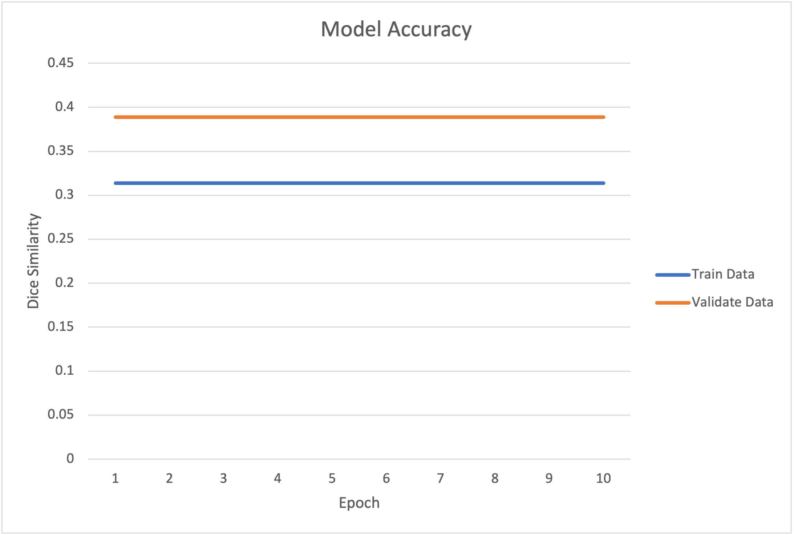

# Segmentation of the ISIC Dataset with the Improved UNet

---

Author: Jessica Sullivan

Student id: 45799930

Assignment: COMP3710 Report Semester 2, 2022

---

## Description of the Algorithm and Problem it Solves

The ISIC dataset contains images of skin lesions created by the International Skin Imaging collection (ISIC). They come out with a new dataset every year, which has become a major machine learning task to help identify skin cancer and to attempt to define whether the skin lesions are malignant (as stated [here](https://pubmed.ncbi.nlm.nih.gov/34852988/#:~:text=The%20International%20Skin%20Imaging%20Collaboration,cancer%20detection%20and%20malignancy%20assessment.)). The task given was to segment this data using the improved UNet and to ensure that all labels have a minimum dice coefficient of 0.8. UNet is an algorithm that segments the data using a convolutional neural network, which means that it categorises parts of an image based on what the algorithm has learned by training itself. The ISIC dataset comes with training data and ground truth training data. The ground truth shows the mask we want the training data to be once it has passed through the neural network. An example of this is:

 

where in the second image (mask) the black is the background and the white is the skin lesion. Now the minimum dice coefficient represents how accurate our model is. In this case, it would be how much the segmented regions created by the model overlap with the mask (ground truth data). Therefore, the higher the dice coefficient, the greater the accuracy of the model, and a dice coefficient of greater the 0.8 means that more than 80% of the time, the model is correct. The benefit of this model is that being able to detect skin lesions through images accurately would help further advances in medicine, allowing the model to identify the problem areas on the skin.

## How the Algorithm Works

The model is based of the improved unet structure. This structure, based upon the original UNet structure has been updated in an attempt to make the model more accurate. The structure of the  unet model looks like:


This model demonstrates a 'U' shape, where going down at the beginning of the U is contracting the image and the upside is expanding the image back out (based on [this](https://towardsdatascience.com/unet-line-by-line-explanation-9b191c76baf5)). The contraction of the image reduces the size of the image to classify the pixels. It does this by doing multiple 2D convolutions with a 3x3 kernel. Once two convolutions have been done per layer, a max pooling is added to reduce the dimensions. Once the base layer has been reached, after the two convolutions, an upsampling is done to increase the dimensions back up. Once you have reached the top layer, convolution with a kernel size of 1x1 is done to finish the process. When downsizing the sample (max pooling), information will be lost, so to reduce the information that is lost when you go up a layer (upsampling), the output of the convolutions of the same layer while downsizing the model is concatenated to the current layer before completing the two convolutions.

Whereas the imroved UNet structure is:


Now, this is very similar. However, there are a couple of key things that have been modified. The first of the major things that have been modified is the localisation module. The localisation model in the improved UNet is how a lower level is manipulated to a higher spatial resolution (referenced from [here](https://arxiv.org/pdf/1802.10508v1.pdf)) by upsampling and then having a convolution model afterwards. The second major difference is the segmentation layers. The purpose of these is to try to retain as. much information as we can from the lower levels while we move upwards. This involved performing a convolution with a 3x3 kernel and upsampling before doing an element-wise sum with the beginning of the segmentation layer above.

---

## Dependencies

### Versions Required:

```commandline
Tensorflow: 2.10.0
Matplotlib: 3.5.3
```

### Address Reproducibility:

To ensure that the code can run, you will need to download the training dataset and the truth training dataset, where you should download the one in the first row, which has the binary masks in PNG format. These can be downloaded from [here](https://challenge.isic-archive.com/data/#2017). Once downloaded, these folders should be moved to the recognition/45799930 directory, keeping the same names made when created. Therefore the directories that should have been added are:

* ISIC-2017_Training_Data
* ISIC-2017_Training_Part1_GroundTruth

### Running The Code:

Once the dependancies have been set up and the files have been addedas described in Address Reproducibility then the code can be run by running the predict file. Please be aware that when i run the code, about 50% of the time it comes up with an error, however re-running the program will fix it. 

---

## Justification

### Specific Pre-Processing

Some pre-processing was done on the data to ensure that the images were downloaded and processed correctly, that they were the same size and that the colouring was correct. This was all done in the `dataset.py`file. Once the image was read by using the correct pathway if it was decoded depending on the file type (jpeg for images and png for the truth images), this was processed to ensure that all images were of the size (256, 256). After ensuring that we were only dealing with elements of type`tensorflow.float32`, the image was normalised by dividing by 255.

### Training, Validation and Testing Splits

As only the training data from the link provided was downloaded (and its corresponding truth values), the data with split into training, validation and testing sets. The ratio chosen was 80% of the data allocated to training the data, 10% allocated to validating the data, and the final 10% to testing the data. The initial dataset was shuffled (combined with the truth so that they are still at corresponding parts of their respective tensors) so that it was a random 80% of the data selected for the training, and the 10% allocated to the validation and testing data. This ratio was chosen as it is ideal to have as much data as possible to train the model so that the model can become as accurate as possible.

---

## Examples

### Example Input:

No input is needed for this model at the moment as this is to train, validate and test the model, all from the ISIC 2018 dataset, so nothing needs to be input. However, a future adaption of this code could be that once the model is trained and tested, input in the form of an image or a dataset of images could be asked for, which the mask would then be predicted. This would give it a more real-world application and could begin its use within the medical field.

### Example Output:

When running the predict method the output of the epoch was:


which led to these graphs:


 

Now it is quite clear here that the implementation of the Dice Similarity Coefficient is incorrect. It should not be constant for all the epoches. However when looking at the model loss its clearly visible that as the model is more trained, the information that is lost after processing is less and less. 

---
