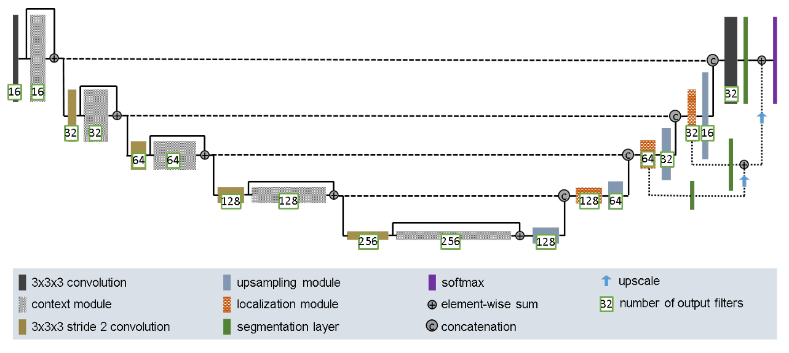

# Image Segmentation of the ISIC dataset using Improved UNet

by Jaleel Abdur-Raheem, 458054448

## Introduction

### ISIC dataset

The ISIC challenge is a yearly event with the goal of developing imaging tools for diagnosis of skin cancer (i.e. melanoma). The challenge provides a dataset of coloured images of skin lesions, alongside a two-coloured mask (i.e. ground truth) dataset that labels where the lesion is in the image. The aim of this task is to create an algorithm that takes the image dataset and transforms it as close as it can to the mask dataset. This is known as image segmentation.

The [dataset used](https://isic-challenge-data.s3.amazonaws.com/2016/ISBI2016_ISIC_Part1_Training_Data.zip) and [relevant ground truths](https://isic-challenge-data.s3.amazonaws.com/2016/ISBI2016_ISIC_Part1_Training_GroundTruth.zip) come from the 2016 challenge, which had a much more reasonable downloading duration and size given the time constraints of the COMP3710 report.

### Image Segmentation using Improved UNet

In 2017, [1] created the Improved UNet, which borrows from the original UNet architecture and applies the following changes:

- customised data augmentation (standardisation and cropping)
- using twice the number of filters in the localization pathway (upsampling half of the network)
- applied Leaky ReLU activation to intermediate layers
- adapted the dice loss function for multiple classes

The full structure of the Improved UNet can be seen below:

In the first half of the network known as the "context aggregation pathway", the network encodes the information using convolutional and adding layers to extract features. Every time this is done, the network enters a new "level" where the output tensor is saved for later usage in the other half of the network.

In the second half of the network known as the "localization pathway", the network upsamples back to the original image size, while localizing the samples by incorporating the features extracted at every intermediate level in the first half. Additionally, this Improved UNet utilises deep supervision by integrating the segmentation layers alongside some of the upsampling modules, introducing nonlinearity to the network. The upsampling and segmentation paths finally combine at the end to produce the final segmentation results.

## Methods

### Preprocessing

## Results

## Dependencies

## References

[[1]](https://arxiv.org/pdf/1802.10508) F. Isensee, P. Kickingereder, W. Wick, M. Bendszus, K. H. Maier-Hein, "Brain Tumor Segmentation and Radiomics Survival Prediction: Contribution to the BRATS 2017 Challenge", (2017)
